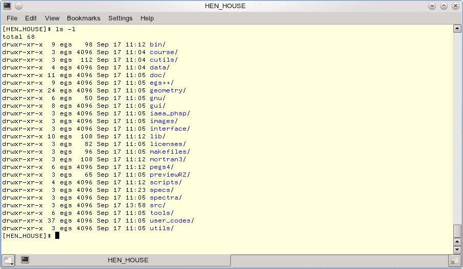

# Introduction to GNU/Linux and EGSnrc <!-- omit in toc -->

- [Command-line basics](#command-line-basics)
- [EGSnrc system basics](#egsnrc-system-basics)

## Command-line basics

For this course you will be working on a GNU/Linux system equipped with a
desktop manager where you can navigate in similar fashion as on Windows or
macOS.

However, you will probably find it useful in this course to be able to work in a
*shell*, that is, typing in commands in a terminal window. We don`t provide a
detailed course on GNU/Linux commands, but below are the bare essentials to get
you started. Note that the commands reviewed here work across Linux
distributions, as well as in the macOS Terminal.

### Typing in commands

Locate and launch a terminal application on your system (for example, *Konsole*
in KDE, or the *Terminal* app on macOS). In the terminal, you are actually
running a program called the *shell* which offers a *command prompt*, waiting
for your command. A command is everything you type at the prompt until you hit
the return or enter key. There are different possible shell *flavours*, and the
default one we use in this course is the `bash` shell.

Note that everything you type in the shell — commands, file names, etc. — is
**case sensitive.**

Bash offers *command completion*, so if you type the first few letters of a
command or file name and then hit the `tab` key, Bash will fill in the rest if
there is only one possible completion, or else it will list the possible
completions. This saves a lot of typing!

### The file system

The file system is organized as a hierarchy of *directories* and *files*, as on
other computer systems. A specific location in the file system is referred to by
a *path*, which is written as `path/to/directory/filename`, where the forward
slashes separate directory names to get to the file. This is a *relative path*,
which is understood to start from your current location (an *absolute path*
starts with a `/`, which refers to the root directory of your computer system).

Note that the special directory name `.` (dot) refers to the current directory,
and `..` (double dot) to the parent directory. The tilde character `~` is a
shorthand notation to refer to your home directory.

The shell also understands a number of *glob* characters, the most useful of
which is `*`, which stands for *everything that matches*. For example, `*.txt`
means *all files that end with the `txt` suffix*. By the way, GNU/Linux does not
care about file name extensions at all, but they are still very useful way to
designate the file type. **Note that the EGSnrc system itself *does* rely
extensively on specific extensions for different types of files.**

### Moving around

When you log in, you are in your home directory. Use the `ls` command to list
the files in the current directory;

| command            | action                                                |
| :----------------- | :---------------------------------------------------- |
| `ls              ` | list files in the current directory                   |
| `ls *.egsinp     ` | list all files with a name ending with `.egsinp`      |
| `ls -l           ` | detailed listing of current directory                 |
| `ls -al          ` | include hidden files (file names that start with `.`) |

To move around in the file system, you use the **c**hange **d**irectory command
`cd`:

| command            | action                                          |
| :----------------- | :---------------------------------------------- |
| `cd              ` | change to your home directory                   |
| `cd path/to/dir  ` | change to the directory given by `path/to/dir`  |
| `cd ..           ` | change to parent directory of current directory |

If you get lost in the file system (!), the following commands will help you get
oriented:

| command            | action                                                           |
| :----------------- | :--------------------------------------------------------------- |
| `cd              ` | change to your home directory                                    |
| `pwd             ` | show the full path to the ***p***resent ***w***orking ***d***irectory. |
| `whoami          ` | when you are so lost you don`t even remember who you are!        |

### Moving files around

Use the **c**o**p**y command `cp` to copy files. Note that wherever the command
expects a file name, you can use a full path to copy the files to other
locations in the file system.

| command            | action                                       |
| :----------------- | :------------------------------------------- |
| `cp fileA fileB  ` | copy `fileA` to `fileB`                      |
| `cp fileA dir    ` | put a copy of `fileA` inside directory `dir` |
| `cp fileA .      ` | copy `fileA` to the current directory        |

If you specify more than two arguments, the command will understand that you
want to copy the given files to a directory, given as the last argument.

| command            | action                                                |
| :----------------- | :---------------------------------------------------- |
| `cp f1 f2 f3 dir ` | copy `f1`, `f2` and `f3` to directory `dir`           |
| `cp *.egsinp dir ` | copy all files ending in `.egsinp` to directory `dir` |

By default, the `cp` command will not copy entire directories. To copy an entire
directory and all its content (including subdirectories etc.), you have to use
the `-r` flag (for *recursive*):

| command            | action                                 |
| :----------------- | :------------------------------------- |
| `cp -r dir1 dir2 ` | copy entire directory `dir1` to `dir2` |

To **move** files instead of copying them, replace the `cp` command with the
**m**o**v**e command `mv` in the examples above, as in `mv file1 file2`. By
default, the `mv` command moves entire directories (so there is no need for a
`-r` flag).

### Creating files and directories

Usually, files are created from within applications, but you can use the `touch`
command to create an empty file (if the file exists already, the `touch` command
will simply update its modification time). To **m**a**k**e **dir**ectories, use
`mkdir`.

| command            | action                                                           |
| :----------------- | :--------------------------------------------------------------- |
| `touch file      ` | create empty file (or update modification time of existing file) |
| `mkdir newdir    ` | create an empty directory `newdir`                               |

### Removing files and directories

Be careful when you type in a command to remove files. Once the command executes
there is no simple way to recover the deleted files! This is especially true
when you use this command with a glob character like `*`. In fact it is almost
always best to use the `-i` flag to to confirm each removal (in fact `rm` is
usually aliased to `rm -i` to prevent accidents).

| command            | action                                         |
| :----------------- | :--------------------------------------------- |
| `rm file         ` | remove `file` without warning                  |
| `rm -i file      ` | remove `file` after confirmation (recommended) |

By default, the `rm` command will not remove directories: you must use the
`rmdir` command for that. However, `rmdir` only removes *empty* directories. To
remove a directory and *all* its content you have to use the `rm` command with
the recursive `-r` flag:

| command             | action                                                                 |
| :------------------ | :--------------------------------------------------------------------- |
| `rmdir trash     `  | remove empty directory named trash                                     |
| `rm -r trash     `  | remove trash and all its content                                       |
| `rm -rf trash     ` | the `-f` flag forces deletion, *without warning*: **be very careful!** |

### Basic file permissions

Files have *permissions* associated with them, to control who may read them,
modify them, or execute them as programs. These permissions can be changed with
the `chmod` command (if you are the owner of the file). This is a complex topic,
but in this course you will probably only encounter a need to perform the
following operations:

| command            | action                                                                |
| :----------------- | :-------------------------------------------------------------------- |
| `chmod +r myfile ` | give everyone the right to read `myfile`                              |
| `chmod +w myfile ` | give the file owner the right to write to `myfile`                    |
| `chmod +x myfile ` | give everyone the permission to execute `myfile` (useful for scripts) |

### Editing text files

There are many powerful text editors available on GNU/Linux: `Visual Studio
Code`, `kate`, `nano`, `vi`, `gvi`, `gedit`, `emacs`, and more. If you are not
familiar with any tool in particular, look for a simple gui text editing
application provided by your system.

If you merely need to see what is in a text file, it is often convenient to just
print its content to the terminal using the `more` or `less` pager programs.

| command            | action                                          |
| :----------------- | :---------------------------------------------- |
| `more beer       ` | prints the content of file `beer` to the screen |
| `less beer       ` | less is like `more`, but it does *more* !       |

Use the space bar to page down if there is more than one screen worth of
content. Within the `less` pager, you can type `h` to access the help screen.

### Running programs in the background

When you start a program in the shell, it normally does not return to the
command prompt until the program terminates. This can be annoying by forcing you
to start another shell to enter further commands, for example, after you launch
a text editor or any other graphical application.

To avoid locking up the shell when running a long command or launching a
graphical application, you can launch programs *in the background* by appending
an ampersand character `&` after the command:

| command            | action                                   |
| :----------------- | :--------------------------------------- |
| `kate &          ` | launch the kate editor in the background |
| `egs_gui &       ` | launch the EGSnrc GUI in the background  |

### Getting help

GNU/Linux is a vast collection of commands, most of which accept a large number
of different arguments and flags to modify their behaviour. It is hopeless to
give a complete account here. However, most commands are well-documented in the
form of *manual pages*, which you can access via the `man` command:

| command            | action                                                       |
| :----------------- | :----------------------------------------------------------- |
| `man ls          ` | detailed information on the `ls` command                     |
| `man bash        ` | detailed documentation on the Bash shell (very long!)        |
| `man nano        ` | documentation for the invocation options for the nano editor |

### Type less, do more

The Bash shell offers many ways to save you some typing. As mentioned already,
hitting the **tab** key when typing on the command-line will complete the
command if unique, or else show the possible completions.

You can also use the $\uparrow$ and $\downarrow$ keys to navigate
through previous commands that you entered. The $\leftarrow$ and $\rightarrow$
keys let you move within a typed command to edit it.

Selecting any text in the terminal by dragging the mouse over it (or
double-clicking on a word) will copy the text to the system clipboard, and you
can then click on the **middle mouse button** (or wheel) to paste it on the
command line. This is useful to copy-paste long file names to the command-line,
for example. In fact, this quick copy-paste method is a feature of the operating
system and it works in all applications and across them.

You can use the `history` command to review previous commands you entered, which
are printed as a numbered list. To re-run any previous command, just type in
`!#` where `#` is the history number of the
command. Alternatively, you can also simply copy-paste any listed command with
the mouse, as mentioned above.

Yet a more efficient trick to recall a previous command in Bash is to press
`Ctrl-r` to enter `(reverse-i-search)` mode. Bash will then search previous
commands for any text that you type in. Press `Ctrl-r` repeatedly to retrieve
older commands. Press return or enter to run the command right away, or the tab
key to retrieve it on the command-line for editing (or else type `Ctrl-C` to
cancel).

### Aliases

Command *aliases* are useful to simplify commands or getting around the file
system. Many aliases are declared within EGSnrc, and you may want to review them
periodically during the course to understand what they mean.

| command                | action                                               |
| :--------------------- | :--------------------------------------------------- |
| `alias               ` | list command aliases currently defined               |
| `alias lsh='ls -lh'  ` | define a new alias `lsh` as a shorthand for `ls -lh` |

### Environment variables

So-called *environment variables* can also be defined to hold given text
strings. Such variables are extremely useful because in turn you can use them in
your commands, e.g., `cd $EGS_HOME`. Note that in Bash command completion works
with environment variables too! For example, type `echo $EGS_` and then hit the
`tab` key twice to see possible completions.

| command                | action                                                    |
| :--------------------- | :-------------------------------------------------------- |
| `env                 ` | list environment variables currently defined              |
| `echo $EGS_HOME      ` | view the value of the variable `EGS_HOME` (mind the `$`!) |
| `export var="my val" ` | define a new variable `var`, holding the string `my val`  |
| `export var=         ` | remove the variable `var` from the environment            |

### Processes

The commands `ps` and `top` present useful summaries of what processes are
currently running on your machine:

| command  | action                                              |
| :------- | :-------------------------------------------------- |
| `ps`     | display information about your active processes     |
| `ps u`   | provide more details about your active processes    |
| `ps -au` | list processes for all users on the system          |
| `top`    | interactively list all processes (type `q` to quit) |

### Standard output redirection

Many programs — especially command-line tools — simply print their output to the
terminal, the so-called *standard output*. If you want to save the program
output for future use, you can copy-paste the text in a file, but this is
impractical, especially when output becomes lengthy.

A more convenient way to print the output of a program to a file instead of the
terminal is to resort to the `>` standard output *redirection* symbol. Be
careful though, this will erase any prior file of that name, without warning! A
useful alternative is to *pipe* the output with `|` to the `tee` command, which
redirects output to both the terminal and a file:

| command                 | action                                                             |
| :---------------------- | :----------------------------------------------------------------- |
| `ls -al > save.txt`     | dump the result of the `ls -al` command to file `save.txt`         |
| `date \| tee save.txt ` | dump the result of `date` to the terminal *and* to file `save.txt` |

## EGSnrc system basics

You are not expected to know how to use EGSnrc at this point — that is the
purpose of this course! — but it may prove useful at the outset to become
familiar with the directory structure of the EGSnrc system, review the `xmgrace`
data plotting and analysis software, and ensure you know where to look for
EGSnrc documentation.

### Directory structure

The directory structure of EGSnrc is described in more detail near the end of
the [EGSnrc Manual](https://nrc-cnrc.github.io/EGSnrc/doc/pirs701-egsnrc.pdf).
The command `tree`, *if it is available on your system,* renders a tree of the
current directory structure. For example, go into the top EGSnrc directory with
`cd $HEN_HOUSE` and type `tree` to view the EGSnrc file structure; compare your
output with the manual.

### Graphical user interfaces (GUIs)

Fundamentally, the EGSnrc codes rely on text files for input, which is useful
when you want to edit them by hand, or write scripts that can manipulate your
inputs. However, for convenience we have developed over the years graphical user
interfaces (GUIs) for the main applications, to facilitate preparing those text
input files, as well as launching simulations themselves. We will review the
relevant GUIs during the course.

A very powerful program for generating 2D data plots is
[Grace](https://plasma-gate.weizmann.ac.il/Grace/), which you can launch with
the command `xmgrace`. Notably, `xmgrace` can cope with a very large number of
data points efficiently (as in *millions!*). The output from some EGSnrc program
is already formatted for `xmgrace` (with proper axis labels, title, etc.).

Explore `xmgrace` a little. Note that double-clicking on some items — an axis, a
data point, the graph title, etc. — brings up a window to edit the properties
associated with this item.

### Manuals

The EGSnrc manuals are available online in the [EGSnrc repository](https://github.com/nrc-cnrc/EGSnrc).
