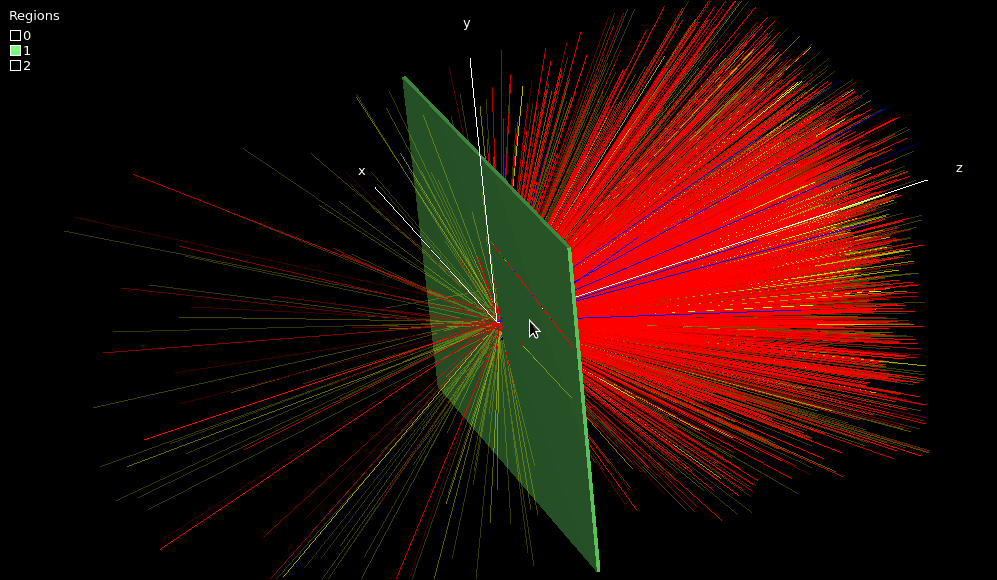

# 1. Getting started: run your first EGSnrc simulation <!-- omit in toc -->

- [1.1. Install EGSnrc](#11-install-egsnrc)
- [1.2. Create a new egs++ application](#12-create-a-new-egs-application)
- [1.3. Add a dose scoring object](#13-add-a-dose-scoring-object)
- [1.4. Change the type of incident particles](#14-change-the-type-of-incident-particles)
- [1.5. Change the energy of incident particles](#15-change-the-energy-of-incident-particles)
- [1.6. Change the material of the plate](#16-change-the-material-of-the-plate)
- [1.7. Monitor a simulation in detail](#17-monitor-a-simulation-in-detail)



## 1.1. Install EGSnrc

The very first step in this course is to get the EGSnrc software from
`github.com` and configure it automatically using a script. EGSnrc can be
installed anywhere in your *home directory* (given by the environment variable
`$HOME`) as long as there are no spaces in any folder name leading to the
installation location (the installation *path*). To find out the absolute path
to your home directory, issue the command:

```bash
echo $HOME
```

For this course, install EGSnrc directly in your `$HOME` directory by entering
the following commands in a terminal.

```bash
cd $HOME
git clone https://github.com/nrc-cnrc/EGSnrc.git
cd EGSnrc/
git checkout develop
HEN_HOUSE/scripts/configure.expect course 3
```

Follow the instructions at the end of the configuration to add the following
three lines at the bottom of the `.bashrc` file in your `$HOME` directory
(create the file if it does not exit).

```bash
export EGS_HOME=$HOME/EGSnrc/egs_home/
export EGS_CONFIG=$HOME/EGSnrc/HEN_HOUSE/specs/course.conf
source $HOME/EGSnrc/HEN_HOUSE/scripts/egsnrc_bashrc_additions
```

To edit text files, you may use any of the available text editors: `kate`,
`code`, `featherpad`, `vim`, etc. Note that you can launch the editor (or any
other program) from the terminal by typing the program name, for example:

```bash
code &                  # launch the Visual Studio Code editor
```

Optionally, you can add the name of the file you want to edit after the program
name, as in:

```bash
code $HOME/.bashrc &    # edit the .bashrc file in Visual Studio Code
```

The `&` symbol at the end of command launches the program in the background, so
you can continue to type commands in your terminal session while the program is
open.

Any changes to `~/.bashrc` will only be applied to new terminal sessions. To get
the changes, either close and open a new terminal window, or type the following
to force the terminal to read the file:

```bash
source $HOME/.bashrc
```

### Build the graphical user interfaces (GUIs)

EGSnrc includes some GUIs that prove useful to create input or to render your
geometries in 3D, along with particle tracks. In order to compile the GUI
software, issue the following commands in your terminal:

```bash
cd $HEN_HOUSE/gui/egs_gui/
make
cd $HEN_HOUSE/egs++/view/
make
```

They are not needed yet, but the commands to launch each of these GUIs are
`egs_gui` and `egs_view`, respectively.

## 1.2. Create a new egs++ application

Let’s create a new egs++ application from scratch called `myapp`. All EGSnrc
applications — including the ones you write yourself — must reside in a folder
named after the application, within `$EGS_HOME/`. Hence, go inside the
`$EGS_HOME/` directory and create a new `myapp/` directory; go inside it:

```bash
cd $EGS_HOME
mkdir myapp/
cd myapp/
```

### Write the C++ source code

First, add the following source code in a new filed named `array_sizes.h`, to
define a couple of required parameters:

```c++
#define MXMED 100
#define MXSTACK 10000
```

Next, create your new application by copying the following C++ source code in a
new file named `myapp.cpp`:

```c++
#include "egs_advanced_application.h"
APP_MAIN (EGS_AdvancedApplication);
```

This is the smallest, fully functional EGSnrc application you can write! The
reason this is so short is that most of the work to run a simulation will in
fact be handled behind the scenes by the egs++ library.

### Write a Makefile

To leverage the egs++ library, you need to provide instructions to the compiler
to find and link all the necessary egs++ bits. Create a new file named
`Makefile` and copy the following lines in it; this is all boilerplate code,
except for the `myapp` string, which is your application name:

```makefile
include $(EGS_CONFIG)
include $(SPEC_DIR)egspp1.spec
include $(SPEC_DIR)egspp_$(my_machine).conf

USER_CODE = myapp

EGS_BASE_APPLICATION = egs_advanced_application
CPP_SOURCES = $(C_ADVANCED_SOURCES)
other_dep_user_code = $(ABS_EGSPP)egs_scoring.h
include $(HEN_HOUSE)makefiles$(DSEP)cpp_makefile
```

### Build it

You can now build your application with the `make` command, which creates the
executable `myapp` (and saves it under `$EGS_HOME/bin/`). You need to run `make`
whenever you modify the source code, to recompile the application.

```bash
make
```

### Write an input file

To run a simulation, you need to define the simulation geometry and other
parameters. You will learn how to write egs++ input files later in the course.
But for the sake of trying it out, copy the following input in a new file named
`slab.egsinp`. It models **a thousand 20 MeV electrons incident on a 1 mm thick
tantalum plate.**

```ruby
################################################################################
#
# Simple slab simulation
#
################################################################################

#===============================================================================
# Run control
#===============================================================================
:start run control:
    ncase = 1000
:stop run control:

#===============================================================================
# Geometry
#===============================================================================
:start geometry definition:

    ### plate
    :start geometry:
        name     = slab
        library  = egs_ndgeometry
        type     = EGS_XYZGeometry
        x-planes = -5, 5                    # in cm
        y-planes = -5, 5                    # in cm
        z-planes = -10, 0, 0.1, 10          # in cm
        :start media input:
            media = vacuum tantalum
            set medium = 1 1
        :stop media input:
    :stop geometry:

    ### use this geometry for the simulation
    simulation geometry = slab

:stop geometry definition:

#===============================================================================
# Media
#===============================================================================
:start media definition:

    ### cutoff energies
    ae  = 0.521
    ap  = 0.010
    ue  = 50.511
    up  = 50

    ### tantalum
    :start tantalum:
        density correction file = tantalum
    :stop tantalum:

    ### lead
    :start lead:
        density correction file = lead
    :stop lead:

    ### water
    :start water:
        density correction file = water_liquid
    :stop water:

:stop media definition:

#===============================================================================
# Source
#===============================================================================
:start source definition:

    ### pencil beam
    :start source:
        name      = pencil_beam
        library   = egs_parallel_beam
        charge    = -1
        direction = 0 0 1
        :start spectrum:
            type = monoenergetic
            energy = 20                     # in MeV
        :stop spectrum:
        :start shape:
            type     = point
            position = 0 0 -10
        :stop shape:
    :stop source:

    ### use this source for the simulation
    simulation source = pencil_beam

:stop source definition:

#===============================================================================
# Viewer control
#===============================================================================
:start view control:
    set color = lead      120 120 200 200
    set color = tantalum  120 255 120 255
    set color = water       0 220 255 200
:stop view control:

#===============================================================================
# Ausgab objects
#===============================================================================
:start ausgab object definition:

    ### particle tracks
    :start ausgab object:
        name    = tracks
        library = egs_track_scoring
    :stop ausgab object:

:stop ausgab object definition:
```

### Run it

Now launch your simulation:

```bash
myapp -i slab.egsinp
```

Here  `myapp`  is the executable name,  `-i`  is an *option flag* to specify the
input file  `slab.egsinp`. This simulation runs in a few seconds and prints
results on the terminal. It also saves information about the simulated particle
tracks in the file  `slab.ptracks`.

Load the  `slab.egsinp`  input file and  `slab.ptracks`  in  `egs_view` utility
to understand the geometry of the simulation. Click the **Show tracks**
checkbox, rotate around the scene (left mouse button in the image window), zoom
in and out (scroll wheel), and shift the geometry within the view (Ctrl + left
mouse button).

```bash
egs_view slab.egsinp slab.ptracks
```

Congratulations, you created your first egs++ application and ran your first
simulation!

### Question

- Aside from particle tracks, does the  `myapp`  application provide any useful
information when it runs, such as energy deposited, dose, spectrum, etc.?

## 1.3. Add a dose scoring object

The little application  `myapp`  does not really report any quantity of
interest: by default the egs++ application just transports the particles in the
geometry. It is up to the user to implement methods to extract information from
the simulation.

The easiest way to get results is by adding a *dose scoring object* in your
input file. For example, to get a report of the dose deposited in each region of
the geometry at the end of the simulation, **add** a dose scoring object
**inside** the existing `ausgab object definition` input block near the end of
your input file, which should then look like this:

```ruby
#===============================================================================
# Ausgab objects
#===============================================================================
:start ausgab object definition:

    ### generate particle tracks
    :start ausgab object:
        name    = tracks
        library = egs_track_scoring
    :stop ausgab object:

    ### report dose in region 1 (the plate)
    :start ausgab object:
        name         = dose
        library      = egs_dose_scoring
        dose regions = 1
        volume       = 10
    :stop ausgab object:

:stop ausgab object definition:
```

Run the simulation again, and find the “Summary of region dosimetry” in the
output:

```bash
myapp -i slab.egsinp
```

### Questions

- How much energy is deposited inside the tantalum plate ? What is the dose?

- Can you manually convert the value of deposited energy to dose?

- What is the relative uncertainty on energy and dose, and why is it the same
for both?

- Figure out how to increase the number of electrons by a factor 10 in the input
file and run the simulation again. Why has the deposited energy not increased by
a factor 10? What happened to the uncertainty?

## 1.4. Change the type of incident particles

Figure out how to change the incident particle type to *photons* instead of
electrons in  `slab.egsinp`. Save and run the simulation again for $\large 10^4$
incident photons. Load the particle tracks in  `egs_view`.

### Questions

- Is the simulation faster with electrons or with photons?

- How did the dose change compared to electrons?

- Are positrons generated in this simulation? Is this expected?

## 1.5. Change the energy of incident particles

Figure out how to change the incident particle energy to 1 MeV in `slab.egsinp`.
Save and run the simulation again for $\large 10^4$ incident photons. Load the
particle tracks in  `egs_view`.

### Questions

- What is the biggest qualitative difference with the 20 MeV scenario?

- Did the dose increase or decrease?

- How about simulation time?

## 1.6. Change the material of the plate

Figure out how to change the material of the plate to  `lead`  in `slab.egsinp`.
Use **100 keV electrons** and run the simulation again for $\large 10^4$
incident electrons. Load the particle tracks in  `egs_view`.

### Questions

- What is happening to the electrons hitting the lead plate?

- Is that consistent with the deposited energy?

- What is the file size of `slab.ptracks` on disk?

- Run 20 MeV electrons striking a  `water`  plate and interpret the results. Is
deposited energy consistent with the known stopping power value of
2.45 MeV·cm²/g for 20 MeV electrons in liquid water?

## 1.7. Monitor a simulation in detail

You are going to use the `tutor4pp` application to follow a simulation in
detail, interaction by interaction. First, make sure `tutor4pp` has been 
compiled:

```bash
cd $EGS_HOME/tutor4pp
make
```

Run the  `tutor4pp`  application, which provides step-by-step information about
the transport processes through the geometry. For each incident particle, the
program echoes to the terminal the sequence of interactions, along with particle
parameters, and the status of the particle stack after each interaction.

```bash
tutor4pp -i slab.egsinp
```

The  `slab.egsinp`  input file is the same one as before, but with `ncase = 1`
 to run a single 20 MeV electron incident on a 1 mm tantalum plate. Look at the
terminal output to understand what happened in the particle shower. You can also
compare this data with the tracks you see in  `egs_view`.

Increase the number of histories to 10 and run the simulation again. The output
is quite long, so you might want to redirect it to a file and inspect this file
in a text editor or page through it with the  `less` command.

```bash
tutor4pp -i slab.egsinp > output.dat
less output.dat
```

### Questions

- What is the most common type of interaction overall in this simulation?

- How many incident electrons create an initial bremsstrahlung photon vs a
knock-on electron (via Møller scattering)?

- What is the largest number of particles on the stack at once and how did it
occur?

- Are most particles discarded because they fall below an energy cutoff, or
because they leave the geometry?

---

### [Solutions laboratory 1](Lab-01-solutions.md)
