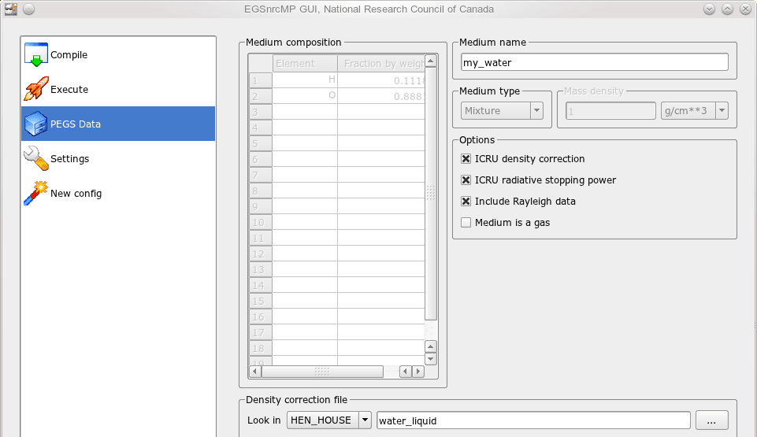
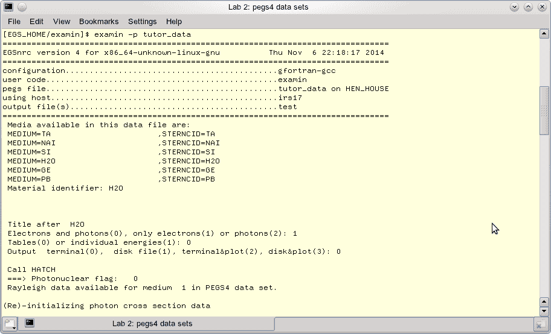
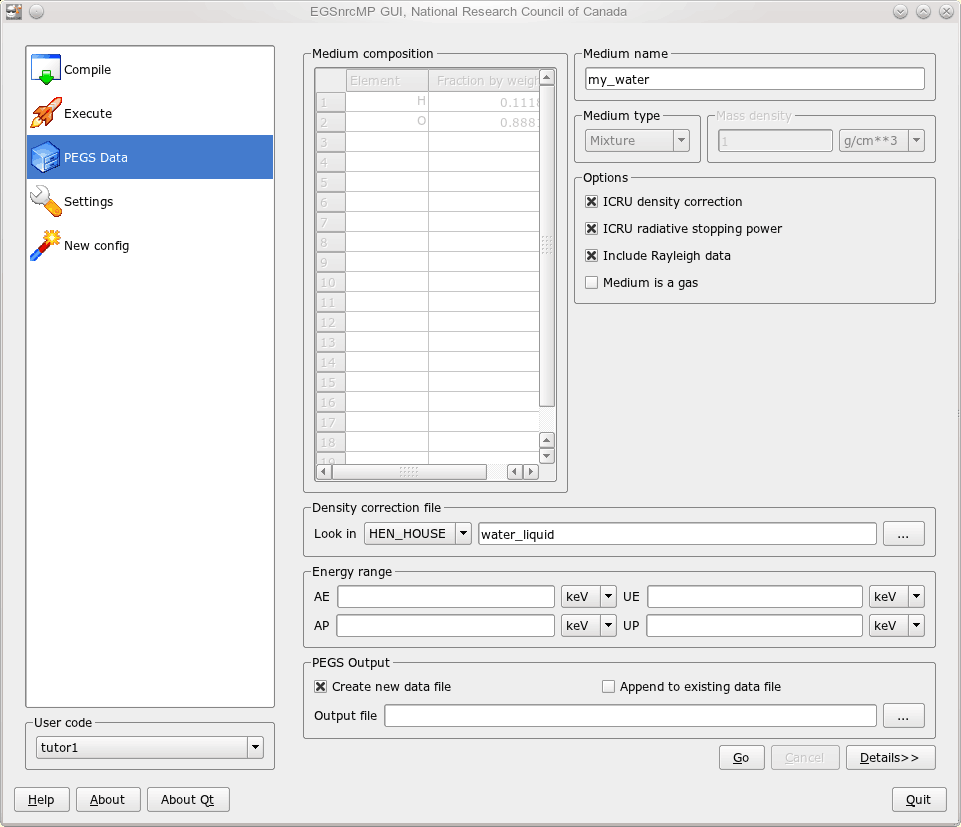

<!-- # 1. lab  -->

# 2. Create and examine PEGS4 data sets <!-- omit in toc -->

- [2.1. The `examin` application](#21-the-examin-application)
- [2.2. Available pegs data sets](#22-available-pegs-data-sets)
- [2.3. Creating your own pegs data sets](#23-creating-your-own-pegs-data-sets)



## 2.1. The `examin` application

The `examin` application allows you to *inspect* the cross-section data used by
EGSnrc. It is a regular EGSnrc application, but instead of performing a particle
transport simulation it simply outputs information about its cross-sections for
media defined in a PEGS4 data file. Later in [Section
2.3](#23-creating-your-own-pegs-data-sets) `examin` will be used to inspect
newly defined media.

As with any EGSnrc application, one must first compile the program as done in
the previous laboratory session. When running `examin`, the name of the pegs
data set to be inspected must be supplied, for example the data in the file
`tutor_data.pegs4dat`:

```bash
cd $EGS_HOME/examin
make
examin -p tutor_data
```

The `examin` program then asks questions interactively about your query: the
*material*, the *title* (optional), the *particles type*, the *energies* and the
*output* channel. You select from the listed options by entering numbers as
indicated. Further interactive inputs might be required depending on your
choices. To use the default options, just hit enter for each prompt.

*For now just get a feel for the program, we will come back to it in the
following sections.*

> 
>
> **Figure 2.1** A snapshot of a terminal while running `examin -p tutor_data`.
> Here we have opted to look at `H20`, only electrons, for a default table of
> energies and output the result to the terminal.

The output can be sent to a disk file, which by default is named `test.examin`,
overwriting it if it already exists. You can direct output to another file name,
say `myfile.examin`, by adding `-o myfile` to your command line.

```bash
examin -o myfile -p tutor_data
```

On Linux systems you can also ask examin to plot the output, and it will launch
the `xmgrace` application to display the results graphically. The output can be
tabulated for a default set of energy values, or for individual energies
specified interactively.

## 2.2. Available pegs data sets

The default pegs data files `521icru.pegs4dat` and `700icru.pegs4dat`
distributed with EGSnrc include materials defined in the ICRU Report 37 on
collision stopping powers, for AE values of 521 keV and 700 keV, respectively.
Additionally, three data sets were prepared specifically for this course:
`tutor_data.pegs4dat`, `ge.pegs4dat` and `pb.pegs4dat`. All these pegs data
files reside in `$HEN_HOUSE/pegs4/data/`.

The utility program `show_data` provided with EGSnrc lists all the materials
available in the pegs data file passed as argument without extension. For
example, to find out what materials are defined in `tutor_data.pegs4dat`, **run
the following command and interpret its output:**

```bash
show_data tutor_data
```

```text
show_data will list materials in
/home/username/HEN_HOUSE//pegs4/data/tutor_data.pegs4dat

 MEDIUM=TA                      ,STERNCID=TA
 MEDIUM=NAI                     ,STERNCID=NAI
 MEDIUM=SI                      ,STERNCID=SI
 MEDIUM=H2O                     ,STERNCID=H2O
 MEDIUM=GE                      ,STERNCID=GE
 MEDIUM=PB                      ,STERNCID=PB

 MEDIUM=TA                      ,STERNCID=TA
 ELEM,RHO= 1.6600E+01,NE= 1
 ASYM=TA,Z=73.,A=  180.948,PZ= 1.00000E+00,RHOZ= 1.80948E+02
3. 4.10759E-01 7.00000E-01 1.00000E-02 5.05110E+01 5.00000E+01
--
 MEDIUM=NAI                     ,STERNCID=NAI
 COMP,RHO= 3.6700E+00,NE= 2
 ASYM=NA,Z=11.,A=   22.990,PZ= 1.00000E+00,RHOZ= 2.29898E+01
 ASYM=I ,Z=53.,A=  126.904,PZ= 1.00000E+00,RHOZ= 1.26904E+02
4. 2.58633E+00 7.00000E-01 1.00000E-02 5.05110E+01 5.00000E+01
--
 MEDIUM=SI                      ,STERNCID=SI
 ELEM,RHO= 2.4000E+00,NE= 1
 ASYM=SI,Z=14.,A=   28.088,PZ= 1.00000E+00,RHOZ= 2.80880E+01
5. 9.09454E+00 7.00000E-01 1.00000E-02 5.00000E+01 5.00000E+01
--
 MEDIUM=H2O                     ,STERNCID=H2O
 COMP,RHO= 1.0000E+00,NE= 2
 ASYM=H ,Z= 1.,A=    1.008,PZ= 2.00000E+00,RHOZ= 2.01594E+00
 ASYM=O ,Z= 8.,A=   15.999,PZ= 1.00000E+00,RHOZ= 1.59994E+01
6. 3.60863E+01 7.00000E-01 1.00000E-02 5.05110E+01 5.00000E+01
--
 MEDIUM=GE                      ,STERNCID=GE
 ELEM,RHO= 5.3600E+00,NE= 1, IUNRST=0, EPSTFL=1, IAPRIM=1
 ASYM=GE,Z=32.,A=   72.590,PZ= 1.00000E+00,RHOZ= 7.25900E+01
7. 2.28490E+00 5.12000E-01 1.00000E-03 2.51100E+00 2.00000E+00
--
 MEDIUM=PB                      ,STERNCID=PB
 ELEM,RHO= 1.1340E+01,NE= 1, IUNRST=0, EPSTFL=1, IAPRIM=1
 ASYM=PB,Z=82.,A=  207.190,PZ= 1.00000E+00,RHOZ= 2.07190E+02
5.61722E-01 5.12000E-01 1.00000E-03 2.51100E+00 2.00000E+00
```

For every medium defined in the pegs file, `show_data` lists the density, the
chemical composition and the energy range available. [Table 2.1](#table-21)
summarizes the cutoff energies in the pegs sets provided for this course.
[Table 2.2](#table-22) lists the materials available in the default `521icru`
and `700icru` pegs data sets provided as part of EGSnrc.

## 2.3. Creating your own pegs data sets

The pegs data set `521icru` and `700icru` include the materials defined in ICRU
Report 37. They are certainly a useful collection of common materials, but if
you need other materials or other values of AE, then you have to generate *your
own* pegs data sets.

### Get familiar with the `egs_gui` front-end

It is possible to run the `pegs4` program from the command-line, but it is far
easier to use the EGSnrc GUI to create new pegs data sets. Launch it from the
command-line by entering:

```bash
egs_gui
```

> 
>
> **Figure 2.2** The `egs_gui` graphical user interface. The `PEGS Data` page
> allows you to create new data sets for EGSnrc simulation by specifying the
> medium name, the chemical composition (or a density correction file which
> specifies composition), the energy range and the name of the pegs data file to
> create or append to.

### Create pegs data sets for water and lead

Create a new pegs file containing the data for water according to ICRU Report 90
recommendations. In the `Density correction file` section, click `...` to select
the density correction file `water_icru90.density`. Define the energy interval
for electrons and photons using `AE = 521 keV`, `AP = 10 keV`, and upper
energies of `UE = 50.511 MeV`, `UP = 50 MeV`. Call this material `water521` (in
the `Medium name` section). Under `PEGS Output`, type a file name, such as
`lab02.pegs4dat`, and click on the `Go` button.

Next, *append* to your new pegs file the data for a new material called
`water700`, for which `AE = 700 keV`. Finally, append to your pegs file a data
set for lead using a value of `AE = 521 keV`; call it `lead521`. **Make sure to
change the density correction file accordingly!**

**Note:** Loading the density correction file populates the chemical composition
table and sets the density automatically._

Use the `examin` program on your new pegs file to answer the following
questions.

### Questions

- Compare the following data between the 521 keV and 700 keV pegs data sets for
  water:

  - the lowest electron and photon energies for which data are available;
  - the restricted stopping powers at 200 keV;
  - the restricted stopping powers at 2 MeV;
  - the mean free path to a discrete interaction at 200 keV;
  - the mean free path to a discrete interaction at 10 MeV.

- In water and lead, and for different AE values, what fraction of energy does
  an electron lose in going the mean distance to a discrete interaction at
  0.5 MeV, 1.0 MeV and 10 MeV ?

- Explain the difference between the $\large e^-$ and $\large e^+$ data sets for
  any material.

- Using the lead data set, estimate the average photon energy outside a very
  thick lead shield which surrounds an intense source of 20 MeV electrons
  (*Hint:* bremsstrahlung is important).

### Table 2.1

**Materials available in the default pegs data sets, along with their respective
energy limits, in MeV.**

| **File name**         | **Medium**             | **AE** | **UE** | **AP** | **UP** |
| :-------------------- | :--------------------- | -----: | -----: | -----: | -----: |
| `tutor_data.pegs4dat` | `TA`                   |  0.700 | 50.511 |  0.010 |   50.0 |
|                       | `NAI`                  |  0.700 | 50.511 |  0.010 |   50.0 |
|                       | `SI`                   |  0.700 | 50.000 |  0.010 |   50.0 |
|                       | `H2O`                  |  0.700 | 50.511 |  0.010 |   50.0 |
|                       | `PB`                   |  0.512 |  2.511 |  0.001 |    2.0 |
| `pb.pegs4dat`         | `PB`                   |  0.512 |  2.511 |  0.001 |    2.0 |
| `ge.pegs4dat`         | `GE`                   |  0.512 |  2.511 |  0.001 |    2.0 |
| `521icru.pegs4dat`    | [Table 2.2](#table-22) |  0.521 | 55.511 |  0.010 |   55.0 |
| `700icru.pegs4dat`    | [Table 2.2](#table-22) |  0.700 | 55.511 |  0.010 |   55.0 |

### Table 2.2

**Materials available in the default `521icru` and `700icru` pegs data sets.**

| **Material**                         | **521icru**          | **700icru**          |
| :----------------------------------- | :------------------- | :------------------- |
| Silver                               | `AG521ICRU`          | `AG700ICRU`          |
| Air, dry, near sea level             | `AIR521ICRU`         | `AIR700ICRU`         |
| Aluminum oxide                       |                      | `ALUMINA700ICRU`     |
| Aluminum                             | `AL521ICRU`          | `AL700ICRU`          |
| Gold                                 | `AU521ICRU`          | `AU700ICRU`          |
| Beryllium                            | `BE521ICRU`          | `BE700ICRU`          |
| Cerrobend                            | `CERROBEND521`       | `CERROBEND700`       |
| Copper                               | `CU521ICRU`          | `CU700ICRU`          |
| Iron                                 | `FE521ICRU`          | `FE700ICRU`          |
| Germanium                            | `GE521ICRU`          | `GE700ICRU`          |
| Carbon ($\large \rho$ = 2.265 g/cm³) | `C87ICRU521`         |                      |
| Carbon ($\large \rho$ = 1.7 g/cm³)   | `170C521ICRU`        | `170C700ICRU`        |
| Carbon ($\large \rho$ = 2.26 g/cm³)  |                      | `226C700ICRU`        |
| Water                                | `H2O521ICRU`         | `H2O700ICRU`         |
| Helium                               | `HE521ICRU`          | `HE700ICRU`          |
| ICRP bone                            | `ICRPBONE521ICRU`    | `ICRPBONE700ICRU`    |
| ICRU tissue                          | `ICRUTISSUE521ICRU`  | `ICRUTISSUE700ICRU`  |
| Kapton                               | `KAPTON521ICRU`      | `KAPTON700ICRU`      |
| Lung                                 | `LUNG521ICRU`        | `LUNG700ICRU`        |
| Magnesium                            | `MG521ICRU`          | `MG700ICRU`          |
| Mica                                 | `MICA521`            | `MICA700`            |
| Mild steel                           | `MILDSTEEL521`       | `MILDSTEEL700`       |
| Mylar                                | `MYLAR521ICRU`       | `MYLAR700ICRU`       |
| Sodium iodide                        | `NAI521ICRU`         | `NAI700ICRU`         |
| Nickel                               | `NI521ICRU`          | `NI700ICRU`          |
| Nylon                                | `NYLON6AND66521ICRU` | `NYLON6AND66700ICRU` |
| Lead                                 | `PB521ICRU`          | `PB700ICRU`          |
| Lead antimony alloy                  | `PBSBICU521`         | `PBSBICU700`         |
| PMMA                                 | `PMMA521ICRU`        | `PMMA700ICRU`        |
| Polyethylene                         | `POLYETH521ICRU`     | `POLYETH700ICRU`     |
| Polystyrene                          | `POLYSTY521ICRU`     | `POLYSTY700ICRU`     |
| Silicon                              | `SI521ICRU`          | `SI700ICRU`          |
| Silicon oxide                        |                      | `SIO2700ICRU`        |
| Steel                                | `STEEL521ICRU`       | `STEEL700ICRU`       |
| Tantalum                             | `TA521ICRU`          | `TA700ICRU`          |
| Titanium                             | `TI521ICRU`          | `TI700ICRU`          |
| Tungsten                             | `W521ICRU`           | `W700ICRU`           |
| Tungsten nickel copper alloy         | `WNICU521`           | `WNICU700`           |
| Tungsten rhenium alloy               | `WRE521`             | `WRE700`             |
| Yellow brass                         | `YELBRASS521ICRU`    | `YELBRASS700ICRU`    |
| Zinc                                 | `ZN521ICRU`          | `ZN700ICRU`          |
| Pyrex                                | `PYREX521ICRU`       |                      |
| Lithium fluoride                     | `LIF521ICRU`         |                      |
| RMI solid water                      | `RMISW521`           |                      |
| Tin                                  |                      | `SN700ICRU`          |

---

### [Solutions laboratory 2](Lab-02-solutions.md)
