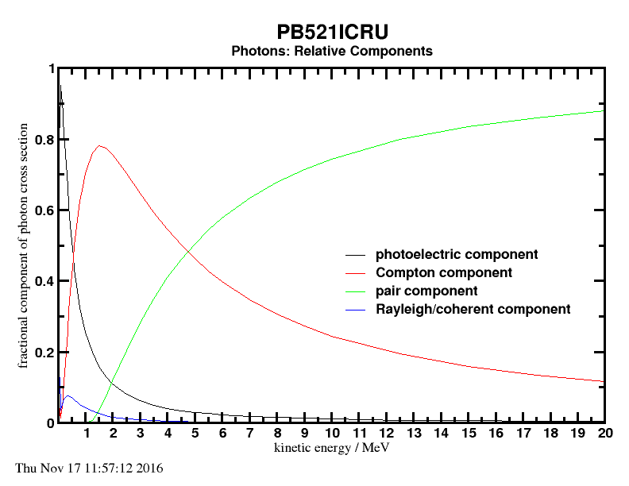
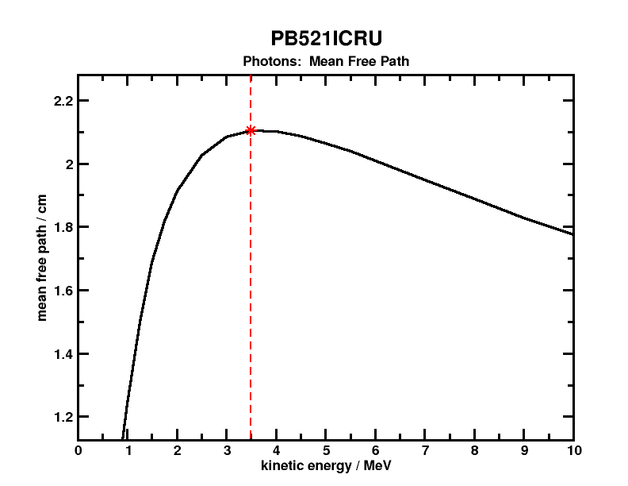
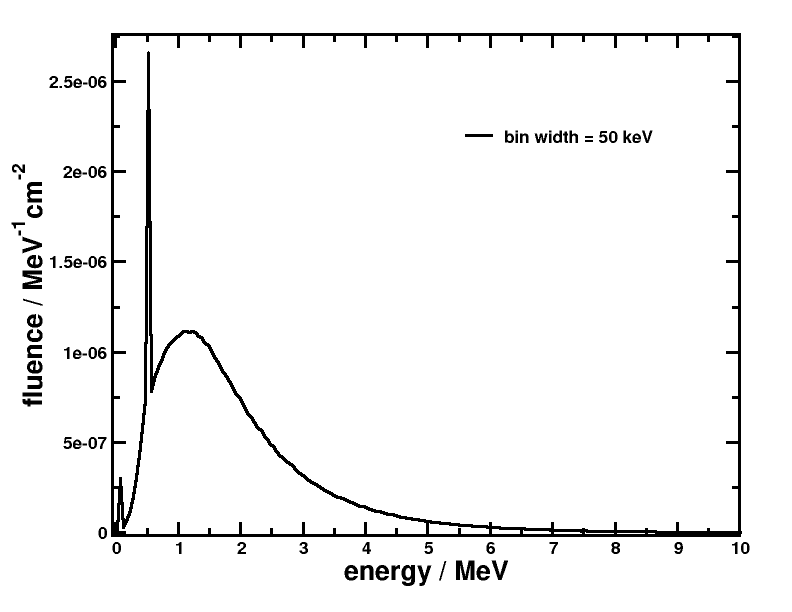

<!-- # 1. 1. -->

# 2. PEGS4 data sets: solutions <!-- omit in toc -->

- [2.3. Create pegs data sets for water and lead](#23-create-pegs-data-sets-for-water-and-lead)

<!-- ## 2.1. -->
<!-- ## 2.2. -->

## 2.3. Create pegs data sets for water and lead

Define water using the ICRU90 recommended value of I = 78 eV and a density of
0.998 g/cm³ at 20 °C by using the density correction file
`water_icru90.density`. This highlights capability of EGSnrc to generate
stopping powers for air, graphite, and water according to ICRU90
recommendations.

### Compare the following data between the 521 keV and 700 keV pegs data sets for water

> - The lowest electron and photon energies:
>
>   `water521`: 10 keV for photons and electrons \
>   `water700`: 10 keV for photons, 189 keV for electrons
>
> - The restricted stopping powers at 200 keV:
>
>   The `examin` application prints out restricted *mass-stopping-powers* from
>   which restricted *stopping powers* can be obtained by multiplying them
>   with the medium density:
>
>   `water521`: $\large L_{e^-}$ = 2.4177$ MeV/cm, $\large L_{e^+}$ = 2.4180 MeV/cm \
>   `water700`: $\large L_{e^-}$ = 2.7741 MeV/cm, $\large L_{e^+}$ = 2.8151 MeV/cm
>
> - The restricted stopping powers at 2 MeV:
>
>   `water521`: $\large L_{e^-}$ = 1.3974 MeV/cm, $\large L_{e^+}$ = 1.3967 MeV/cm \
>   `water700`: $\large L_{e^-}$ = 1.6558 MeV/cm, $\large L_{e^+}$ = 1.6432 MeV/cm
>
> - The mean free path to a discrete interaction at 200 keV:
>
>   `water521`: $\large\lambda_{\gamma}$ = 7.308374 cm, $\large\lambda_{e^-}$ = 6.937E-02 cm, $\large\lambda_{e^+}$ = 6.752E-02 cm \
>   `water700`: $\large\lambda_{\gamma}$ = 7.308374 cm, $\large\lambda_{e^-}$ = 11.14 cm, $\large\lambda_{e^+}$ = 4.508 cm
>
> - The mean free path to a discrete interaction at 10 MeV:
>
>   `water521`: $\large\lambda_{\gamma}$ = 45.26768 cm, $\large\lambda_{e^-}$ = 1.145E-01 cm, $\large\lambda_{e^+}$ = 1.157E-01 cm
>   `water700`: $\large\lambda_{\gamma}$ = 45.26768 cm, $\large\lambda_{e^-}$ = 1.534 cm, $\large\lambda_{e^+}$ = 1.626 cm

### What fraction of energy does an electron lose (...) at 0.5 MeV, 1.0 MeV and 10 MeV?

> - The energy lost by an electron, $\large \Delta E$ when going a distance
>   $\large \lambda$ can be obtained by multiplying this distance by the restricted >
>   stopping power $\large L$.
>
>
>   |   medium   | $\large \rho$ | $\large E$ | $\large L/\rho$ | $\large \lambda$ | $\large \Delta E / E$ |
>   | :--------: | :-----------: | :--------: | :-------------: | :--------------: | :------------: |
>   |            |     g/cm³     |    MeV     |   MeV · cm²/g   |        cm        |       —        |
>   | `water521` |     0.998     |    0.5     |     1.6768      |    9.396E-02     |     0.3145     |
>   |            |               |    1.0     |     1.4708      |    1.065E-01     |     0.1563     |
>   |            |               |    10.0    |     1.4060      |    1.145E-01     |     0.0161     |
>   | `water700` |     0.998     |    0.5     |     1.9910      |    4.070E+00     |    16.1743     |
>   |            |               |    1.0     |     1.7459      |    2.342E+00     |     4.0807     |
>   |            |               |    10.0    |     1.6570      |    1.534E+00     |     0.2537     |
>   | `lead521`  |     11.35     |    0.5     |     0.8081      |    1.036E-02     |     0.1900     |
>   |            |               |    1.0     |     0.7300      |    1.156E-02     |     0.0958     |
>   |            |               |    10.0    |     0.8029      |    1.191E-02     |     0.0109     |
>
>   **Notes:** An energy loss fraction larger than 1 means electrons lose all >
>   their energy before the next discrete interaction since the CSDA range is >
>   smaller. Distance to next discrete interaction sampled from exponential >
>   distribution, it means there will be less discrete interactions.

### Explain the difference between the $\large e^-$ and $\large e^+$ data sets

> - Below 0.5 MeV the positron stopping powers are higher than electron stopping
>   powers; the reverse is true at higher energies. This is due to the
>   differences in collision stopping powers of these particles. The collision
>   stopping power is obtained by adding Bethe’s soft collision formula with a
>   hard collision expression based on the Møller cross sections for electrons
>   and on the Bhabha cross sections for positrons.
>
> - Below 2 $\large \times AE_\text{kin}$ the bremsstrahlung fraction is unity for
>   electrons because the outgoing electrons are not distinguishable. Here,
>   $\large AE_\mathrm{kin} = AE - {m_0c^2}$ (where $\large m_0c^2$ is the
>   electron rest mass) is the *kinetic part* of the production threshold $\large AE$.
>   By *convention,* the *secondary* electron is the one with the lowest energy.
>
>   Now imagine an incident electron with a kinetic energy of 1.5 $\large \times
>   AE_\mathrm{kin}$ is incident. For production to occur, the secondary must
>   have at least $\large AE_\mathrm{kin}$ kinetic energy. However, since there is
>   only 1.5 $\large \times AE_\mathrm{kin}$ worth of energy to divide between the two
>   particles, and more energy must go to the primary particle, it is not
>   possible to produce a new secondary that also has a larger kinetic energy
>   than $\large AE_\mathrm{kin}$. This is not the case for incident positrons,
>   because there are no target positrons in atoms.
>
> - At low energies the mean free path of the positrons is smaller than the
>   electrons. This is because positrons can also interact via annihilation
>   events. As the kinetic energy of the positron, $\large E_\mathrm{kin}$, goes
>   to 0, the annihilation cross section tends to infinity, hence their
>   interaction cross section will be larger at low energies. As $\large
>   E_\mathrm{kin}$ increases, the annihilation cross section decreases as
>   $\large\ln({E_\mathrm{kin}}/E_\mathrm{kin})$, and the differences between
>   electrons and positrons are given by the differences in the bremsstrahlung
>   and inelastic collision cross sections.

### Estimate the average photon energy outside a very thick lead shield which surrounds an intense source of 20 MeV electrons

> At high energies, bremsstrahlung production is significant, while for photons,
> pair production is the dominant interaction. For a source of 20 MeV electrons
> the most likely sources of photons emerging from a thick lead shield are:
>
> - Bremsstrahlung photons created by the initial electrons, and by higher order
>   generations of charged particles created via pair production (electrons,
>   positrons).
>
> - Annihilation photons from the positrons generated via pair production.
>
> This is evident from the fact that the bremsstrahlung contribution at 20 MeV
> is about 20% as seen in the `examin` output file for lead. On the other hand,
> if one looks at the relative contribution from the different possible photon
> interactions in lead (shown below), one can see that pair production dominates
> above 5 MeV.
>
> 
>
> The photon mean free path in lead has a maximum at 3.5 MeV, which means
> 3.5 MeV photons are the *most likely* to emerge from a very thick lead
> shielding. However there will be photons of other energies around 3.5 MeV as
> can be seen from the wide maximum in the figure below.
>
> 
>
> The large amount of electron-positron pairs produced will generate further
> bremsstrahlung. However, *every* positron will annihilate either in-flight or
> at-rest. Since annihilation is only important as the positron kinetic energy
> goes to zero, there will be a large amount of annihilation photons from
> positrons stopped in the shielding. Hence one should see a relatively large
> amount of 511 keV photons emerging from a very thick lead shield.
>
> An estimate of *the average energy of the photons* emerging from a very thick
> lead shield would be the arithmetic mean between 3.5 MeV and 0.511 MeV which
> amounts to about **2 MeV**.
>
> **Monte Carlo simulation**
>
> The photon fluence emerging from an 18 cm radius lead sphere with a 20 MeV
> electron point source in the center is shown in the figure below as obtained
> from a Monte Carlo simulation.
>
> 
>
> Considering that the CSDA range, $\large R_\mathrm{CSDA}$, of 20 MeV electrons
> in lead is 0.83 cm, the chosen shielding thickness is about $\large 22\times
> R_\mathrm{CSDA}$. As can be seen in the figure, photon energies range from the
> minimum energy up to about 10 MeV. A very sharp 511 keV peak can also be
> observed, as well as a small lead fluorescence peak at low energies. The
> *average photon energy* of this spectrum is about **1.9 MeV**.
>
> The lead shield thickness chosen here is only 9 photon mean free paths for 3.5
> MeV photons. A much thicker shielding will harden the spectrum shifting the
> average energy further up.
