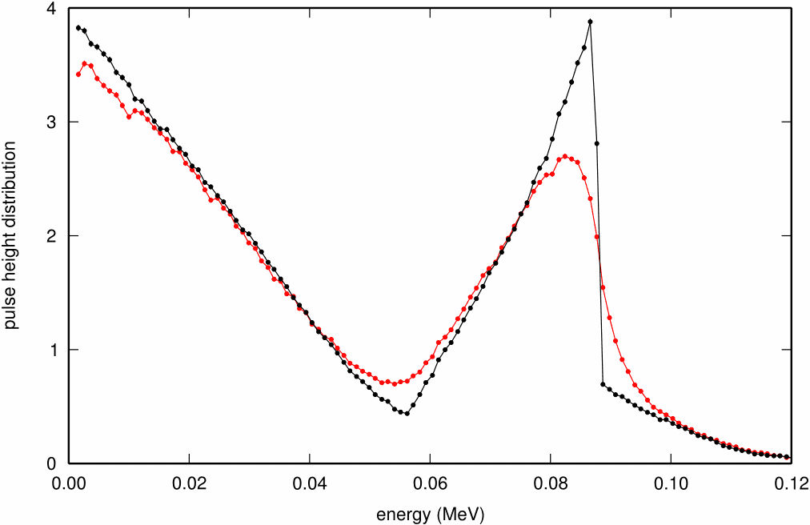

<!-- # 1. -->
<!-- # 2. -->

# 3. Vary transport parameters <!-- omit in toc -->

- [3.1. The `tutor6pp` application](#31-the-tutor6pp-application)
- [3.2. The `slab.egsinp` input file](#32-the-slabegsinp-input-file)
- [3.3. Atomic relaxations](#33-atomic-relaxations)
- [3.4. Spin effects for electron elastic scattering](#34-spin-effects-for-electron-elastic-scattering)
- [3.5. Transport algorithm](#35-transport-algorithm)
- [3.6. Binding effects in Compton scattering](#36-binding-effects-in-compton-scattering)



## 3.1. The `tutor6pp` application

You are going to use the `tutor6pp` application to investigate transport
parameters for a simple scenario: a pencil beam incident on a slab of material.
Download the [`tutor6pp.zip`](./assets/tutor6pp.zip) file to `$EGS_HOME`, then
uncompress it and build the application with the following commands :

```bash
cd $EGS_HOME
unzip tutor6pp.zip
cd tutor6pp
make
```

## 3.2. The `slab.egsinp` input file

An input file `slab.egsinp` is provided for this laboratory, to allow you to
quickly run simulations with different transport parameters (you will learn more
about the egs++ input syntax in upcoming lectures and labs).

The `slab.egsinp` input file defines a pencil beam of 1 MeV photons incident on
a 0.1 cm slab of lead in vacuum. The application reports the fraction of the
incident energy that is reflected, deposited, and transmitted by the lead plate.
Run the simulation:

```bash
tutor6pp -i slab.egsinp
```

To get a better sense of what is going on, load the geometry and a few particle
tracks in `egs_view` and interpret physically what you see:

```bash
egs_view slab.egsinp slab.ptracks
```

### Questions

- What fraction of the incident energy is **reflected**, **deposited**, and
  **transmitted** ?

- Which fraction has the highest statistical uncertainty, and why ?

- Change the plate material to germanium (you need to figure out how to define a
  germanium medium). How do the energy fractions change? Was the simulation
  faster or slower, and why ?

- Change the incident particles to electrons to model an electron beam. How do
  the energy fractions change ? Was the simulation faster or slower, and why ?

## 3.3. Atomic relaxations

- Calculate the reflected, deposited and transmitted energy fractions for a
  50 keV photon beam incident on a 1 mm plate of germanium.

- This is a low energy calculation, so in the `MC transport parameter`  section
  set `ECUT` and `PCUT` as low as possible (i.e., equal to `AE` and `AP`).
  Perform two simulations, one with atomic relaxations `On` and the other with
  atomic relaxations and `Off`. Note that bound Compton scattering must also be
  `On` and `Off`, accordingly.

### Questions

- Is more energy reflected with relaxation `On` or `Off`, and why ?

- How large is the difference in the simulation time ? Would you turn on atomic
  relaxations in your own simulations ?

## 3.4. Spin effects for electron elastic scattering

- Using `tutor6pp`, calculate the reflected, deposited and transmitted energy
  fractions for a **2 MeV** electron beam perpendicularly incident on a 1 mm
  plate of tantalum (you need to define a tantalum medium). Use `ECUT = 0.521`
  and `PCUT = 0.010`, and decrease the number of histories to `1e4` if the
  simulations is too slow.

- Investigate the influence of spin effects in electron elastic scattering by
  running two separate calculations, one with spin effects `On` and the other
  with spin effects `Off`.

### Questions

- Is more energy reflected with spin `On` or `Off`, and why ?

- How large is the difference in the simulation time ?

## 3.5. Transport algorithm

- Using `tutor6pp` and considering the same scenario (1 mm tantalum plate, 2 MeV
  incident electron beam), investigate transport algorithm parameters. Run the
  simulation with the default EGSnrc parameters, and run it again with the
  following parameters, which roughly correspond to a legacy EGS4 (`PRESTA-I`)
  calculation with default step size:

```text
Electron-step algorithm     = PRESTA-I
Boundary crossing algorithm = PRESTA-I
Skin depth for BCA          = 0
```

- Repeat the PRESTA-I calculation again with a reduced step-size, using `Ximax
  = 0.05`.

### Questions

- Is more energy reflected with `EGSnrc` transport or with `PRESTA-I`
  transport ?

- Which one do you think is more accurate ?

- How significant is the difference in the simulation time ?

- Do you recover the `EGSnrc` result when you decrease `Ximax` ? What is the
  difference in simulation time now ?

## 3.6. Binding effects in Compton scattering

Model a 200 keV photon beam incident on a thicker, **1 cm** germanium plate. You
might want to increase the number of histories to `ncase = 1e6`. To increase the
 thickness of the plate, in the geometry section of the input file, change the
`z-planes` input to read:

```ruby
z-planes = -10, 0, 1, 10
```

The `tutor6pp` application also saves (and overwrites) a `*_response.dat` file
 which contains the histogram of the total deposited energy *for each individual
history* (the pulse-height distribution of the slab, considered as a perfect
detector). You can plot this data with `xmgrace` :

```bash
xmgrace -settype xydy slab_response.dat
```

Run two simulations, one with bound Compton scattering turned `On` , the other
with bound Compton scattering turned `Off`, and compare their pulse-height
distributions. Note that atomic relaxations must also be `On` and `Off`,
 accordingly.

### Questions

- What is the Compton edge energy for a 200 keV photon ?

- What is the energy of a 200 keV photon Compton-scattered at 90 ?

- Is the Compton edge smoother with or without binding effects, and why ?

- Why is there a marked dip in the Compton profile near 56 keV ?

---

### [Solutions laboratory 3](Lab-03-solutions.md)
