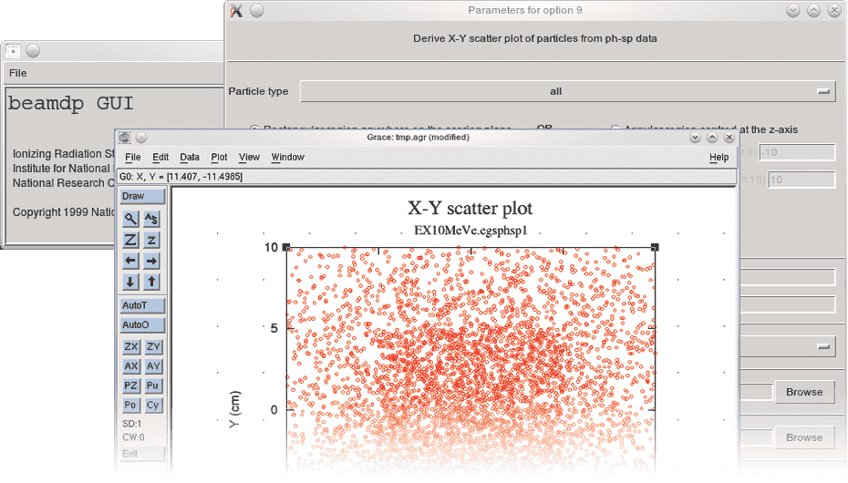

<!-- # 1. lab  -->
<!-- # 2. lab  -->
<!-- # 3. lab  -->

# 4. Analyze phase space files with `beamdp` <!-- omit in toc -->

- [4.1. `beamdp` with EX16MVp](#41-beamdp-with-ex16mvp)
- [4.2. `beamdp` with EX10MeVe](#42-beamdp-with-ex10meve)
- [4.3. `beamdp` with bit filters](#43-beamdp-with-bit-filters)
- [4.4. `beamdp` with bit filters redux](#44-beamdp-with-bit-filters-redux)
- [4.5. `beamdp` scatter plot](#45-beamdp-scatter-plot)
- [4.6. IAEA format phase space files](#46-iaea-format-phase-space-files)



## 4.1. `beamdp` with EX16MVp

For the photons and contaminant electrons in the phase space file generated by
the photon example accelerator `EX16MVp`, use `beamdp_gui` to answer the following
questions.

### Questions

- List the information for the first 50 particles scored.

- Determine the energy spectrum (spectral distribution) in the field and the
  average energy as a function of position.

- Determine the angular distribution.

- Determine the distribution of particle weights. For this, do not forget that
  weights are plotted on a logarithmic scale, so you cannot use a starting
  weight of 0. Can you explain the distribution of weights based on the variance
  reduction schemes used in this accelerator?

#### Remember

> You can run the `beamdp` graphical user interface in the background by issuing
> the command `beamdp_gui &`, or else use the command-line version, `beamdp`.

## 4.2. `beamdp` with EX10MeVe

For the the electrons and photons in the phase space file generated by the
photon example accelerator `EX10MeVe`, use `beamdp_gui` to:

### Questions

- List the information for the first 50 particles.

- Determine the energy spectrum in the field and the average energy as a
  function of position.

- Determine the angular distribution of particles in the field.

- Determine the distribution of particle weights.

## 4.3. `beamdp` with bit filters

Repeat the analysis of [Section 4.1](#41-beamdp-with-ex16mvp), but this time do
it separately for the *direct* photons and for the *scattered* photons.

Note that latch was set by interaction in the BEAMnrc simulation. The latch bit corresponding to the target is latch bit 1. You can find this information by looking in the input file, the output, or using `BEAMnrc_gui`.

### Questions

- Determine the energy spectrum in the field (spectral distribution) and average energy as a function of
  position for *direct* photons; for *scattered* photons. How many different
  ways are there to filter these? What `LATCH` bit setting option is required
  for this output to be meaningful?

- Determine the angular distribution for *direct* photons and for *scattered*
  photons.

- Determine the weight distribution for *direct* photons and for
  *scattered* photons.

## 4.4. `beamdp` with bit filters redux

Repeat the analysis of [Section 4.2](#42-beamdp-with-ex10meve), but now do it
separately for the *direct* electrons and the *scattered* electrons.

Note that in EX10MeVe, the latch is inherited and set by passage. Due to this,
consider using "Exclusive filter for regions" for direct, and "Inclusive filter
for regions" for scattered. These checkboxes correspond to region numbers, not
bits! The bits 24–28 are being used to determine whether the particles
originated in those regions.

### Questions

- Determine the energy spectrum in the field and average energy as a function of
  position for *direct* electrons; for *scattered* electrons.

- Determine the angular distribution for *direct* electrons and for *scattered*
  electrons.

- Determine the weight distribution for *direct* electrons and for *scattered*
  electrons.

## 4.5. `beamdp` scatter plot

Use `beamdp_gui` to show the scatter plot of the particles from the beams for each
example accelerator, and do so for particular components of the beam (using the
LATCH variable).

## 4.6. IAEA format phase space files

Rerun `EX16MVp` with the option to generate an IAEA format phase space file at
the scoring plane. This will generate two files, the phase space data,
`EX16MVp.1.IAEAphsp`, and a header file, `EX16MVp.1.IAEAheader`.

Ensure beamdp is compiled with the macros for handling IAEA format phase space
data by going into the `beamdp` source code directory and issuing the commands:

```bash
cd $OMEGA_HOME/progs/beamdp
make clean
make
```

### Questions

- Using a text editor, look inside the header file. What useful information is
available here that is not available in an EGSnrc format phase space file?

- What are other useful properties of an IAEA format phase space file?

- Compare the size of `EX16MVp.1.IAEAphsp` to `EX16MVp.egsphsp1`. Can you
  account for the difference in size?

- If you have time, use `beamdp_gui` to rerun some of the analyses in [Section
  4.1](#41-beamdp-with-ex16mvp) above using the IAEA format phase space data.
  Are the results identical to those when analyzing the EGS format phase space
  data?

---

### [Solutions laboratory 4](Lab-04-solutions.md)
