<!-- # 1. -->
<!-- # 2. -->
<!-- # 3. -->

# 4. Analyze phase space files: solutions <!-- omit in toc -->

- [4.1. `beamdp` with EX16MVp](#41-beamdp-with-ex16mvp)
- [4.2. `beamdp` with EX10MeVe](#42-beamdp-with-ex10meve)
- [4.3. `beamdp` with bit filters](#43-beamdp-with-bit-filters)
- [4.4. `beamdp` with bit filters redux](#44-beamdp-with-bit-filters-redux)
- [4.5. `beamdp` scatter plot](#45-beamdp-scatter-plot)
- [4.6. IAEA format phase space files](#46-iaea-format-phase-space-files)

## 4.1. `beamdp` with EX16MVp

### Determine the energy spectrum and average energy as a function of position.

> 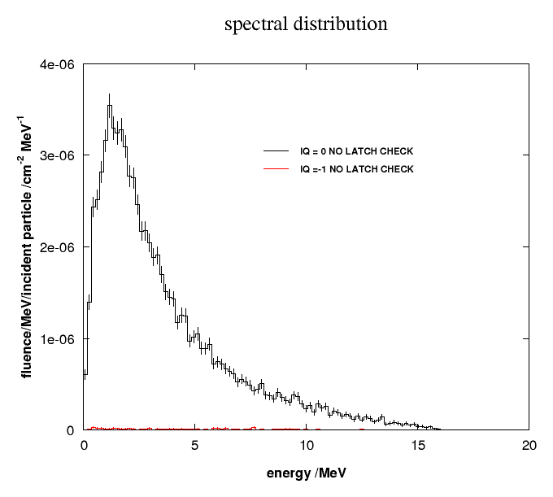 \
> 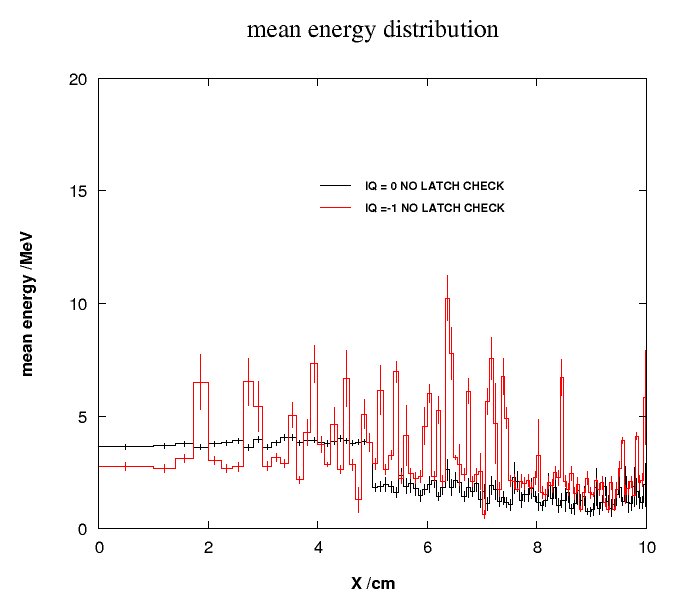

### Determine the angular distribution.

> 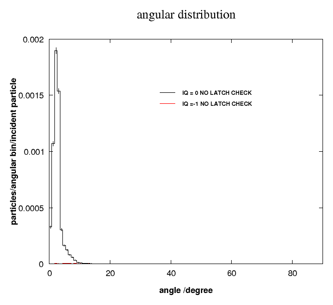

### Determine the weight distribution. Explain the distribution of weights based on the VRT used in this accelerator?

> 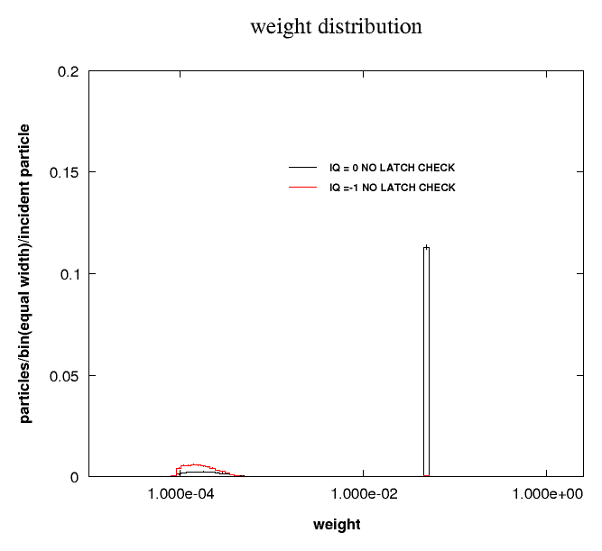
>
>
> Particles of weight = 0.05 are due to uniform bremsstrahlung splitting. Lower
> weight particles are traceable to results of photon forcing and their
> products.

## 4.2. `beamdp` with EX10MeVe

### Determine the energy spectrum and average energy as a function of position.

> 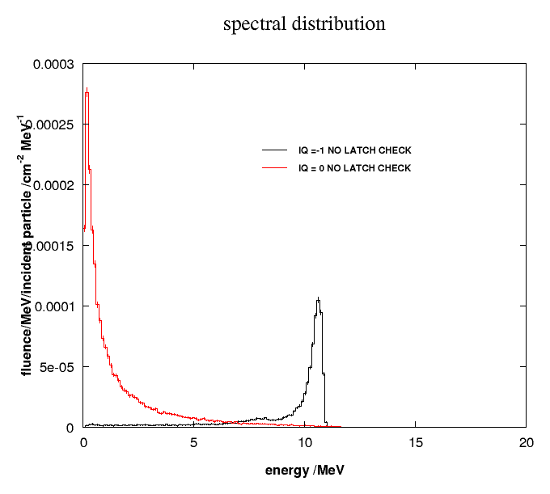 \
> 

### Determine the angular distribution.

> 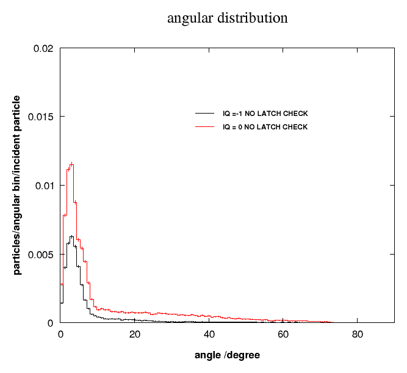

### Determine the weight distribution.

> 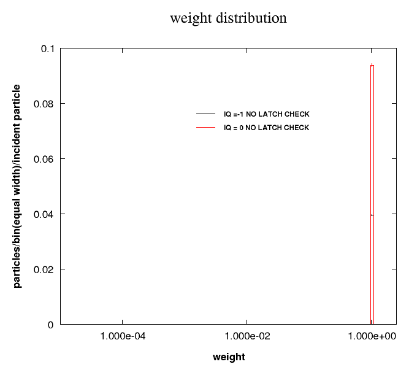

## 4.3. `beamdp` with bit filters

### Determine the energy spectrum and average energy as a function of position (...)

> 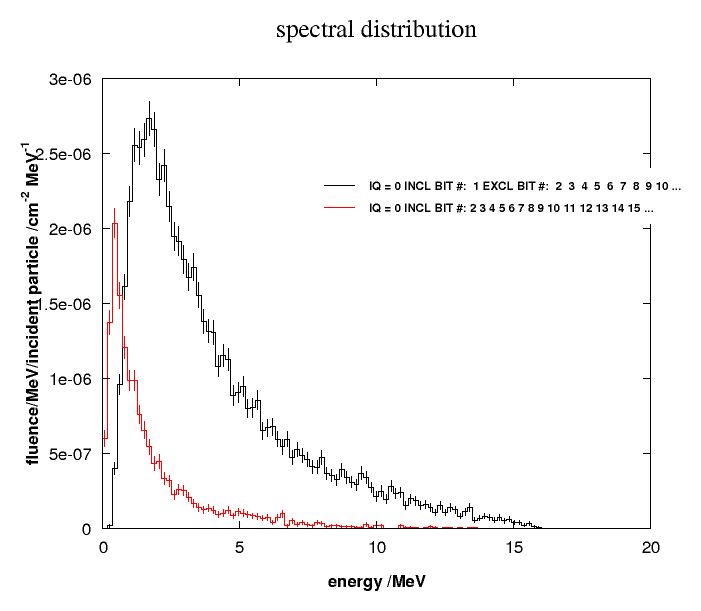 \
> 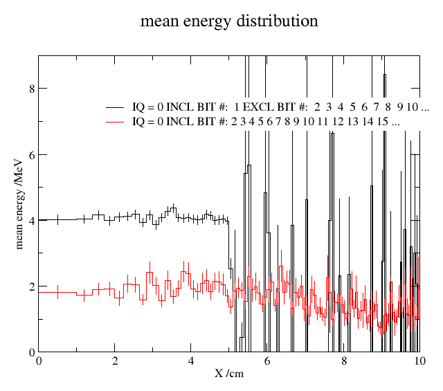
>
> (black: direct; red: scattered)
>
> There are at least two different ways to filter these bits. `LATCH` must be
> set by interaction.
>
> For direct photons, use an Inclusive/Exclusive filter. Include particles that
> interacted in the target, which is latch bit 1. Then exclude all the bits
> 2–23. This excludes any particles that interacted in the target but also
> interacted elsewhere. Bits 24–28 are ignored because these are used to denote
> the region number where a secondary was created, and are not needed.
>
> Alternatively, for direct photons, just exclude bits 2–23. This would exlude
> particles that interacted anywhere that wasn't the target.
>
> For scattered photons, check bits 2–23. This includes any particle that
> interacted in one of those regions. Since the particle had an interaction
> that wasn't in the target, it is denoted a scattered particle.

### Determine the angular distribution for *direct* and *scattered* photons.

> 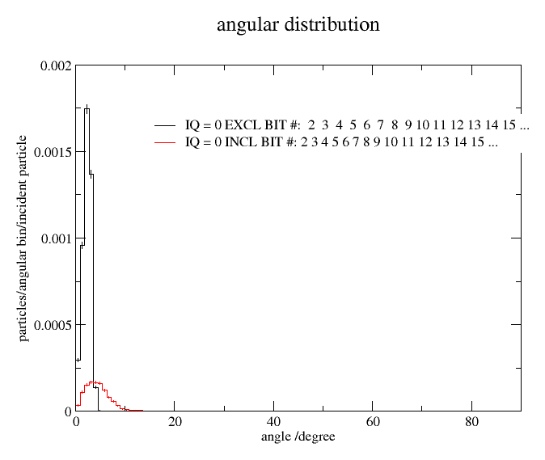
>
> (black: direct; red: scattered)

### Determine the weight distribution for *direct* and *scattered* photons.

> 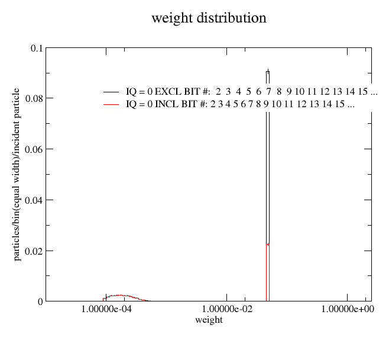
>
> (black: direct; red: scattered)

## 4.4. `beamdp` with bit filters redux

### Determine the energy spectrum and average energy as a function of position (...)

> 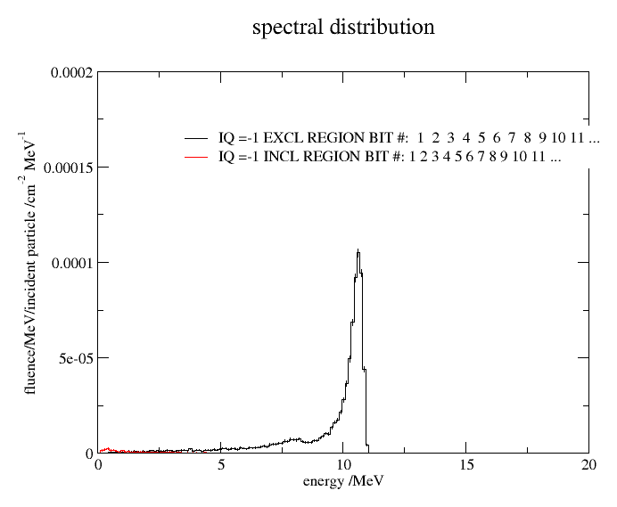 \
> 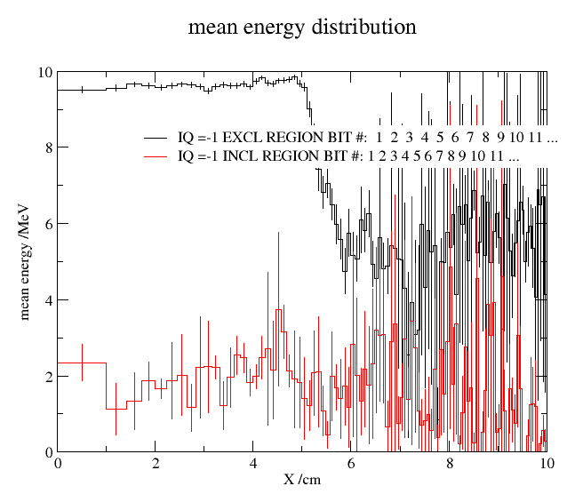
>
> (black: direct; red: scattered)
>
> For direct electrons, use "Exclusive filter for regions", and check 1–23.
> This excludes electrons that were created in any of those *region numbers*.
>
> For scattered electrons, use "Inclusive filter for regions", and check 1–23.
> This includes only electrons that were created in those regions. Note that
> you may need to run a longer simulation to get good statistics on this plot.

### Determine the angular distribution for *direct* and *scattered* electrons.

> 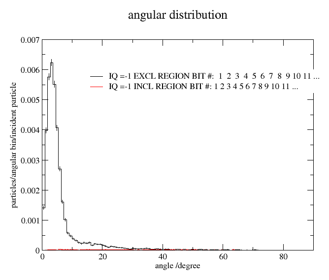
>
> (black: direct; red: scattered)

### Determine the weight distribution for *direct* and *scattered* electrons.

> 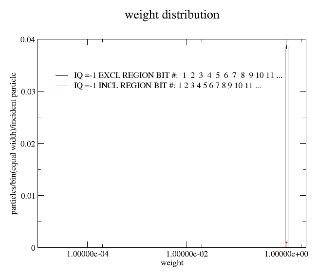
>
> (black: direct; red: scattered)

## 4.5. `beamdp` scatter plot

### Use `beamdp` to show the scatter plot of the particles

> 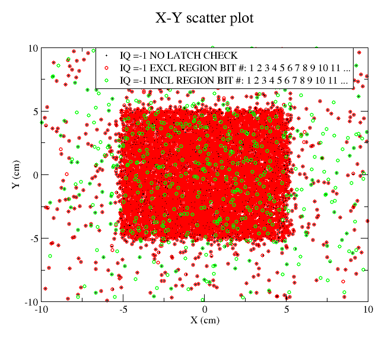 \
> 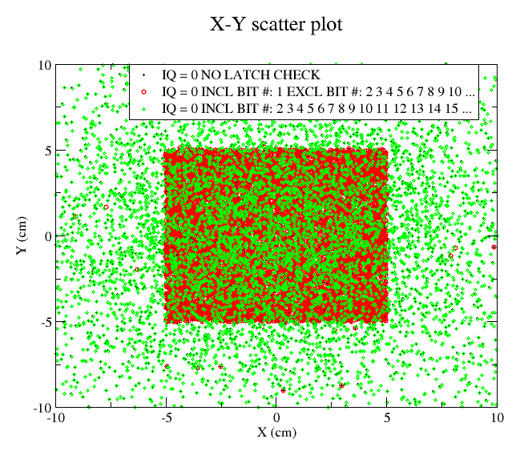
>
> (black: total; red: direct; green: scattered)

## 4.6. IAEA format phase space files

### What useful information is available here that is not available in an EGSnrc format phase space file?

- `CHECKSUM` = the size of the phase space file
- Summary of information stored in phase space file
- $\large z$ coordinate at which phase space scored
- Byte order
- Statistical information on all particle types

### What are other useful properties of an IAEA format phase space file?

> The format has the capacity to store the $\large z$ coordinate for each
> particle. It can also store extra "float" and "long" variables beyond `ZLAST`
> and `LATCH`.

### Can you account for the difference in size?

> In a file with `ZLAST`, the EGS format phase space file requires 32 bytes for
> each particle, plus another 32 bytes for the header info. The IAEA format
> phase space file requires 33 bytes for each particle (plus the header file).
> The extra byte in the IAEA format is used to store particle charge, which, in
> the EGSnrc format, is stored in bits 29–30 of `LATCH`.

### Are the results identical to those when analyzing the EGSnrc format phase space data?

They are identical.
