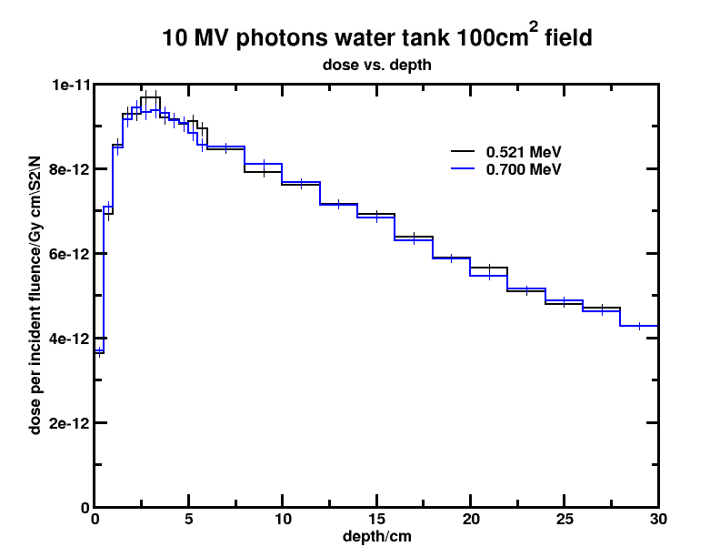
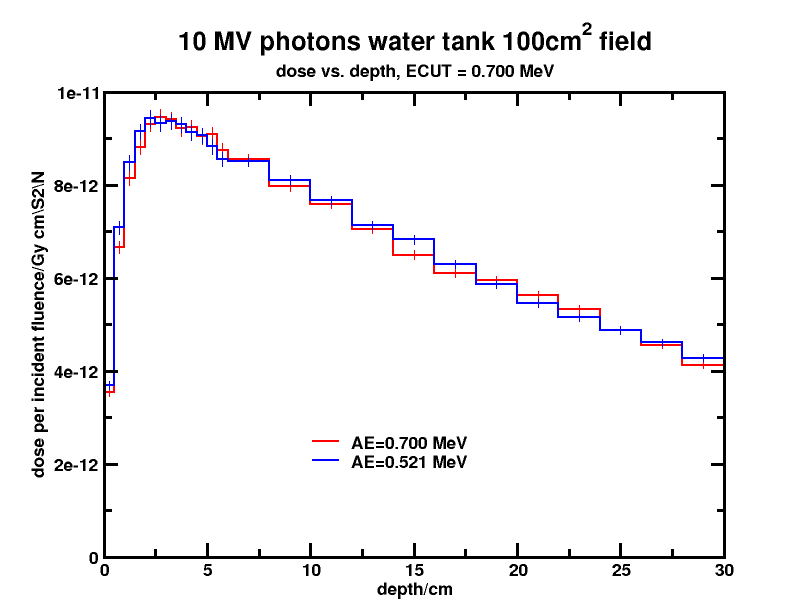
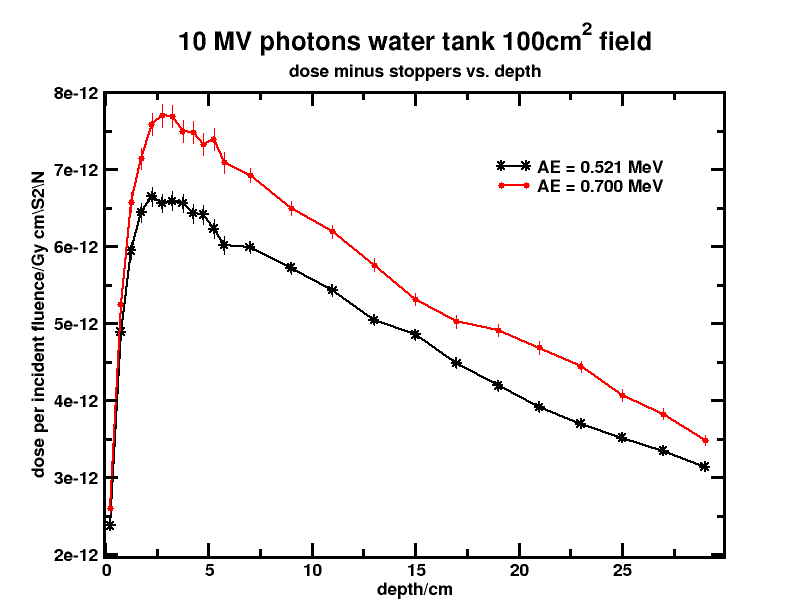
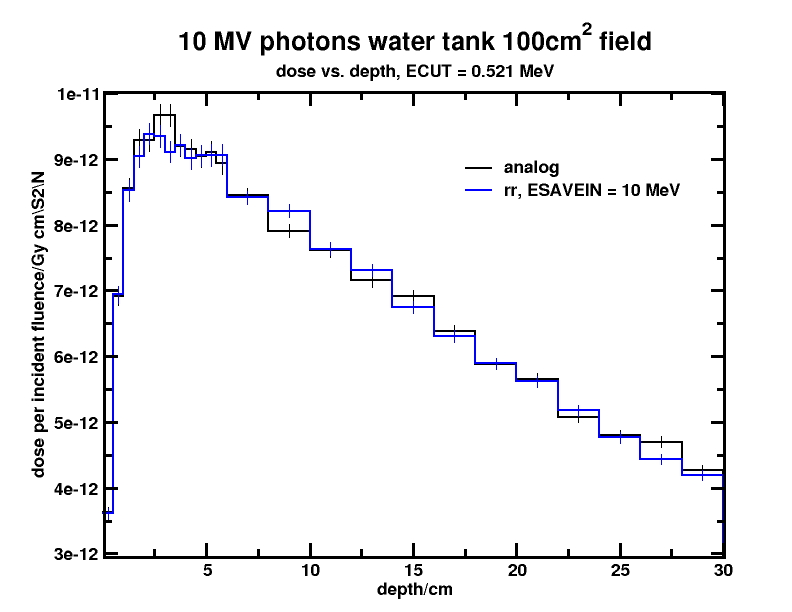
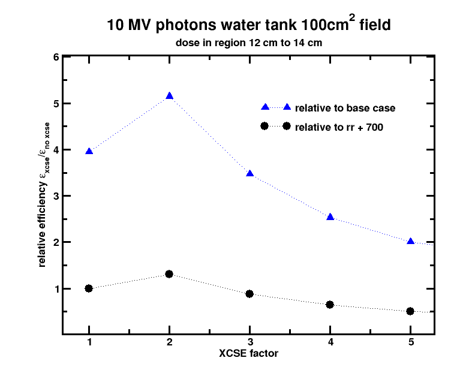

<!-- # 1. -->
<!-- # 2. -->
<!-- # 3. -->
<!-- # 4. -->

# 5. Explore calculation efficiency and variance reduction: solutions <!-- omit in toc -->

- [5.2. Depth dose calculation efficiency](#52-depth-dose-calculation-efficiency)

<!-- ## 5.1. -->

## 5.2. Depth dose calculation efficiency

Calculations were done with the `egs_inprz` GUI for convenient parameter
modifications.

### Compare the uncertainty on the ratio of scored dose $\large D$ to scored kerma $\large K$ to the uncertainty on the scored ratio $\large D/K$.

Results are shown below for 10$^6$ histories in the region of maximum dose,
$\large D_\text{max}$, and at the maximum depth along the central axis:

```text
      0.0000                 2.0
  3.0000-----------------------
       |IRL  8 IZ   7 IX   1  |
       |T  : 9.671E-12+- 1.7% |
       |K  : 9.553E-12+- 2.8% |----  T/K (3.3%)
       |D/K: 1.012E+00+- 3.0% |
 3.5000------------------------
 ...
28.0000------------------------
       |IRL 25 IZ  24 IX   1  |
       |T  : 4.267E-12+- 1.8% |
       |K  : 4.313E-12+- 2.2% |----  T/K (2.8%)
       |D/K: 9.893E-01+- 2.0% |
30.0000------------------------
```

#### Why is there a difference?

$\large D/K$ accounts for correlations while dividing $\large D$ by $\large K$
at the end of the run assumes these quantities are independent.

#### Which way is more efficient?

$\large D/K$ is more efficient since it has a smaller uncertainty than the
calculated ratio, especially in regions where there is a strong correlation
between the dose and the kerma. This can be observed for instance in region 103
where $\large D$ and $\large K$ are very close to each other.

```text
      10.0000                15.0000
 2.5000-----------------------
       |IRL103 IZ   6 IX   5 |
       |T  : 2.541E-14+- 2.0%|
       |K  : 2.551E-14+- 2.0%|----  T/K (2.83%)
       |D/K: 9.959E-01+- 0.3%|
 3.0000-----------------------
```

### Modify the base case and use `ECUT = 0.700 MeV`.

#### Does this change the calculated dose anywhere?

There is no differences within statistical uncertainties.



#### Quantify the change in efficiency!

```text
     0.0000                 2.0
3.0000------------------------
      |IRL  8 IZ   7 IX   1  |
      |T  : 9.671E-12+- 1.7% |cputime = 55.3 s
      |K  : 9.553E-12+- 2.8% |----  T/K (3.3%)
      |D/K: 1.012E+00+- 3.0% |<- ECUT = 0.521 MeV
3.5000------------------------
3.0000------------------------
      |IRL  8 IZ   7 IX   1  |
      |T  : 9.367E-12+- 1.8% |cputime = 21.1 s
      |K  : 9.581E-12+- 2.8% |----  T/K (3.3%)
      |D/K: 9.777E-01+- 3.0% |<- ECUT = 0.700 MeV
3.5000------------------------
```

Since the uncertainty is about the same, the change in efficiency is only given
by the difference in CPU time:

$$\large \frac{\varepsilon \left(0.700\ \text{MeV} \right)}{\varepsilon \left(0.521\ \text{MeV}\right)} = \frac{T_\text{CPU} \left(0.521\ \text{MeV} \right)}{T_\text{CPU} \left(0.700\ \text{MeV} \right)}= \frac{55.3\ s}{21.1\ s} = 2.6\ ,$$

### Modify the above case and use the `AE = 700` dataset for water.

#### Does this change the calculated dose anywhere?

There is no differences within statistical uncertainties.



#### Quantify the efficiency change.

```text
     0.0000                 2.0
3.0000------------------------
      |IRL  8 IZ   7 IX   1  |
      |T  : 9.367E-12+- 1.8% |cputime = 21.1 s
      |K  : 9.581E-12+- 2.8% |----  T/K (3.3%)
      |D/K: 9.777E-01+- 3.0% |<- AE = 0.521 MeV
3.5000------------------------
3.0000------------------------
      |IRL  8 IZ   7 IX   1  |
      |T  : 9.408E-12+- 1.8% |cputime = 16.7 s
      |K  : 9.122E-12+- 2.9% |----  T/K (3.4%)
      |D/K: 1.031E+00+- 3.0% |<- AE = 0.700 MeV
3.5000------------------------
```

Since the uncertainty is about the same, the change in efficiency is only given
by the difference in CPU time:

$$\large \frac{\varepsilon \left(0.700\ \text{MeV} \right)}{\varepsilon \left(0.521\ \text{MeV} \right)} = \frac{T_\text{CPU} \left(0.521\ \text{MeV} \right)}{T_\text{CPU} \left(0.700\ \text{MeV} \right)}= \frac{21.1\ s}{16.7\ s} = 1.26\ ,$$

Setting `AE = ECUT = 700 MeV` is about 30 % more efficient than just setting
`ECUT = 700 MeV`, and 3.3 times more efficient than the base case.

#### Why does the dose minus stoppers increase?

Setting `AE = ECUT = 0.700 MeV` results in less stoppers, since no knock-on
electrons below 0.7 MeV are explicitly produced. In the case of `AE = 0.521 MeV,
ECUT = 0.7 MeV`, knock-on electrons generated between 0.521 MeV and 0.7 MeV
become automatically stoppers.



The graph above shows the dose minus stoppers taken from the `*.egslst` files
and the voxel centers from the `*.egsdose` files.

Starting from the base case, turn on range rejection with `ESAVEIN = 10 MeV`.

#### Does this change the calculated dose anywhere?

There is no differences within statistical uncertainties.

 

#### Why does the dose minus stoppers decrease?

  DOSRZnrc outputs the total dose, $\large T$, and the total dose minus the
  stoppers and discards, $\large (T-S)$. Turning on range rejection discards
  electrons with energies below ESAVEIN, which based on their CSDA range can't
  leave their current region. This increases the number of discards contributing
  to $\large S$, hence decreasing $\large (T-S)$. See for instance the results
  below for 10$^6$ histories in the region of maximum dose, $\large
  D_\text{max}$:

```text
     0.0000                 2.0
 3.0000-----------------------
      |IRL  8 IZ   7 IX   1  |
      |T  : 9.671E-12+- 1.7% | base case
      |T-S: 9.057E-12+- 1.7% |cputime = 55.3 s
      |K  : 9.553E-12+- 2.8% |
      |D/K: 1.012E+00+- 3.0% |
3.5000------------------------
...
3.0000------------------------
      |IRL  8 IZ   7 IX   1  |
      |T  : 9.113E-12+- 1.8% | rr ESAVEIN = 10 MeV
      |T-S: 5.823E-12+- 1.9% | cputime = 20.7 s
      |K  : 8.996E-12+- 2.9% |
      |D/K: 1.013E+00+- 3.0% |
3.5000------------------------
```

#### Quantify the efficiency change!

The change in efficiency is given by the ratio:

$$\large \frac{\varepsilon_\text{rr}}{\varepsilon_\text{bc}} = \frac{T_\text{CPU}^\text{ bc}\cdot \sigma_\text{ bc}^2}{T_\text{CPU}^\text{ rr}\cdot \sigma_\text{rr}^2}= \frac{55.3\ s \cdot 1.7^2}{20.7\ s \cdot 1.8^2} = 2.4\ ,$$

As above but with `ESAVEIN = 2 MeV`. Why is there little change from the
previous case?

As shown below the results are identical to the previous case. The average
energy of the photon beam used (Mohan et al 10 MV spectrum) is 2.8014 MeV which
means most electrons produced are low energy electrons below 2 MeV.

```text
     0.0000                 2.0
3.0000------------------------
      |IRL  8 IZ   7 IX   1  |
      |T  : 9.113E-12+- 1.8% | rr ESAVEIN = 2 MeV
      |T-S: 5.823E-12+- 1.9% | cputime = 20.6 s
      |K  : 8.996E-12+- 2.9% |
      |D/K: 1.013E+00+- 3.0% |
3.5000------------------------
```

### Use the base case with an exponential transform value of −6. Quantify the change in efficiency for the dose from 0.5 cm to 1 cm depth and from 24 cm to 26 cm depth.


Simulations for 10$^6$ histories result in simulation times of 55.3 s for the
base case and 93.5 s for the exponential transform case.

|                  |        base case        |                         |   exponential biasing   |                         |                       ratios                       |                                                    |
| :--------------- | :---------------------: | :---------------------: | :---------------------: | :---------------------: | :------------------------------------------------: | :------------------------------------------------: |
| region           | $\sigma_\text{rel}$ (%) | $\varepsilon_\text{bc}$ | $\sigma_\text{rel}$ (%) | $\varepsilon_\text{bc}$ | $\varepsilon_\text{exp}$ / $\varepsilon_\text{bc}$ | $\varepsilon_\text{bc}$ / $\varepsilon_\text{exp}$ |
| 0.5 cm to 1.0 cm |           2.4           |        0.003139         |           0.8           |        0.016711         |                       5.323                        |                       0.188                        |
| 24 cm to 26 cm   |           1.7           |        0.006257         |          16.1           |        0.000041         |                       0.0066                       |                      151.649                       |


The exponential transform technique increases the efficiency by about a factor
of 5 near the surface while decreasing the efficiency at the bottom of the
phantom by a factor of 150.

### Starting from the base case, turn on range rejection and set `ECUT = AE = 700 keV`.

#### Do a run with these settings and compare the efficiency for calculating the dose on the central axis between 12 cm and 14 cm to the various runs above.

Simulations for 10$^6$ histories result in a statistical uncertainty of 1.4% on
the central axis between 12 cm and 14 cm.

|                | base case |                      |                         | rr + 0.7 MeV |                      |                             |
| :------------- | :-------: | :------------------: | :---------------------: | :----------: | :------------------: | :-------------------------: |
| region         | $D$ (pGy) | $T_\mathbf{CPU}$ (s) | $\varepsilon_\text{bc}$ |  $D$ (pGy)   | $T_\mathbf{CPU}$ (s) | $\varepsilon_\text{rr,700}$ |
| 12 cm to 14 cm |   7.156   |         55.3         |        0.009226         |    7.278     |         14.1         |          0.036185           |


Using range rejection (`rr`) and `ESAVEIN = 10 MeV` combined with a high energy
cut-off of 0.7 MeV increases calculation efficiency by a factor of 4 without
affecting the dose within statistics.

#### Do the same calculation again, but enhance the photon cross-section by a factor of 3 in the regions between 10 cm and 16 cm. Compare the efficiency of the dose calculations at 12 cm to 14 cm, 6 to 8 cm and 24 cm to 26 cm between the two cases. Can you find an optimum enhancement?

Simulations for 10$^6$ histories result in simulatiuons times of 55.3 s for the
base case and 195.3 s for the `EIAT-VRT` case.


|                | base case |                         |                         | rr + 0.7 MeV + xcse $\times$ 3 |                         |                                  |
| :------------- | :-------: | :---------------------: | :---------------------: | :----------------------------: | :---------------------: | :------------------------------: |
| region         | $D$ (pGy) | $\sigma_\text{rel}$ (%) | $\varepsilon_\text{bc}$ |           $D$ (pGy)            | $\sigma_\text{rel}$ (%) | $\varepsilon_\text{rr,700,xcse}$ |
| 6 cm to 8 cm   |   8.455   |           1.2           |        0.012558         |             8.506              |           1.2           |             0.00356              |
| 12 cm to 14 cm |   7.156   |           1.4           |        0.009226         |             7.155              |           0.4           |             0.03200              |
| 24 cm to 26 cm |   4.796   |           1.7           |        0.006257         |             4.935              |           1.7           |             0.00177              |


The efficiency in the region inside the enhancement zone is increased by about a
factor of 3.5, while it is decreased by the same factor in regions outside the
enhancement zone. The efficiency decrease is caused by the increase in CPU time
whith no improvement in the statistics outside the enhancement zone.

Calculations to determine the optimum enhancement factor are shown in the graph
below.



The optimum enhancement factor is 2 with an efficiency increase of 5 times
relative to the base case. Increasing the enhancement factor beyond 2 results in
CPU time increases, while no reduction in the statistical uncertainty is
observed.
