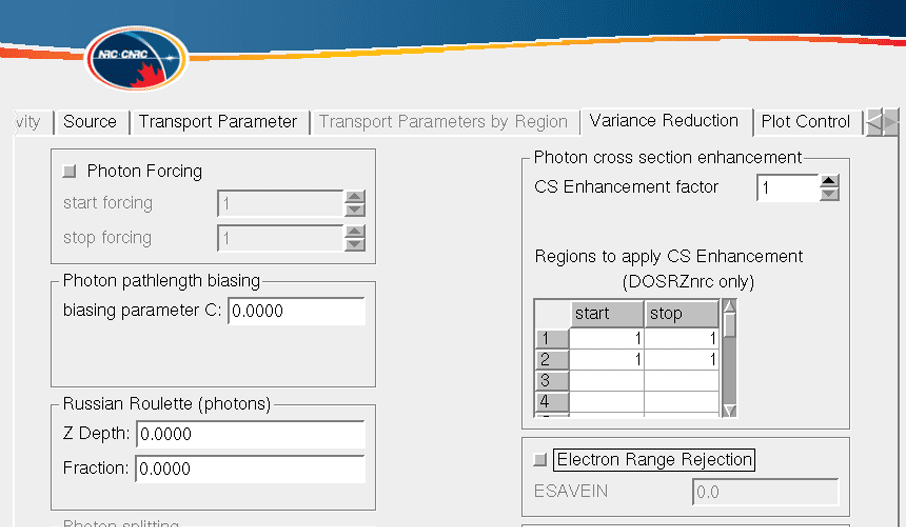

<!-- # 1. -->
<!-- # 2. -->
<!-- # 3. -->
<!-- # 4. -->

# 5. Explore calculation efficiency and variance reduction `beamdp` <!-- omit in toc -->

- [5.1. Simulation efficiency](#51-simulation-efficiency)
- [5.2. Depth dose calculation efficiency](#52-depth-dose-calculation-efficiency)



## 5.1. Simulation efficiency

In this laboratory students are asked to look at the efficiency of a depth dose
curve calculation in a water phantom. The EGSnrc application `DOSRZnrc` will be
used.

Variance reduction techniques (VRTs) can improve significantly the calculation
efficiency most of the time. The calculation efficiency $\large \varepsilon$ is
quantified using the expression

$$\large \varepsilon = \frac{1}{s^2\cdot T_\text{CPU}}\ ,$$

where $\large s$ is the statistical uncertainty in the quantity of interest and
$\large T_\text{CPU}$ the CPU time required by the calculation. The quantity
$\large \varepsilon$ is a measure of how fast a desired statistical uncertainty is
obtained or by how much the statistical uncertainty can be reduced using VRTs.
Note that the latter can be achieved at the expense of increased simulation time
while still increasing the efficiency since one would need less time to reach
the same uncertainty.

If you like to work from the command line, use an editor to view and modify the
input as requested. To run a `DOSRZnrc` simulation go to the application
directory and make the application with the commands

```bash
cd $EGS_HOME/dosrznrc
make
```

Then you can run the application with the following command, replacing
`input_file` with the name of an actual input file. Note that the option `[-p
pegs4_file]` is required if you are using a pegs4 file.

```bash
dosrznrc -i input_file [-p pegs4_file]
```

Alternatively, you can use the `egs_inprz` GUI with the name of the input file:

```bash
egs_inprz input_file
```

## 5.2. Depth dose calculation efficiency

Run with the [`10MV_pdd_basecase.egsinp`](./assets/10MV_pdd_basecase.egsinp)
input file, which calculates the percentage depth dose (PDD) for a 10 MV beam
incident on a water phantom. Use the PEGS4 data file `521icru.pegs4dat` with
material information for AE = 0.521 MeV. If time is available, increase the
number of histories by a factor of 10.

### Questions

1. Compare the uncertainty on the ratio of scored dose $\large D$ to scored
   kerma $\large K$ to the uncertainty on the scored ratio $\large D/K$. The
   required information is found inside the output file
   `10MV_pdd_basecase.egslst`.

   - Why is there a difference?

   - Which way is more efficient?

2. Modify the base case and use `ECUT = 0.700 MeV`.

   - Does this change the calculated dose anywhere?

     *Hint:* Look at the `*.plotdat` files using the plotting program  `xmrace`.
     For visibility, remove the $\large D/K$ datasets since $\large D$ and
     $\large D/K$ are many order of magnitudes smaller.

   - Quantify the change in efficiency!

     *Hint:* For instance compare the efficiency for $\large D_\textup{max}$ on
     the central axis.

3. Modify the above case and use the `AE = 700` dataset for water.

   - Does this change the calculated dose anywhere?

   - Quantify the efficiency change.

   - Why does the dose minus stoppers increase? *Hint:* This becomes evident as
     the statistical noise is reduced.

4. Starting from the base case, turn on range rejection with `ESAVEIN = 10 MeV`.

   - Does this change the calculated dose anywhere?

   - Why does the dose minus stoppers decrease?

   - Quantify the efficiency change!

5. As above but with `ESAVEIN = 2 MeV`. Why is there little change from the
   previous case?

6. Use the base case with an exponential transform value of −6. Quantify the
   change in efficiency for the dose from 0.5 cm to 1 cm depth and from 24 cm to
   26 cm depth.

7. Starting from the base case, turn on range rejection and set `ECUT = AE = 700
   keV`.

   - Do a run with these settings and compare the efficiency for calculating the
     dose on the central axis between 12 cm and 14 cm to the various runs above.

   - Do the same calculation again, but enhance the photon cross section by a
     factor of 3 in the regions between 10 cm and 16 cm. Compare the efficiency
     of the dose calculations at 12 cm to 14 cm, 6 cm to 8 cm and 24 cm to 26 cm
     between the two cases. Can you find an optimum enhancement?

---

### [Solutions laboratory 5](Lab-05-solutions.md)
