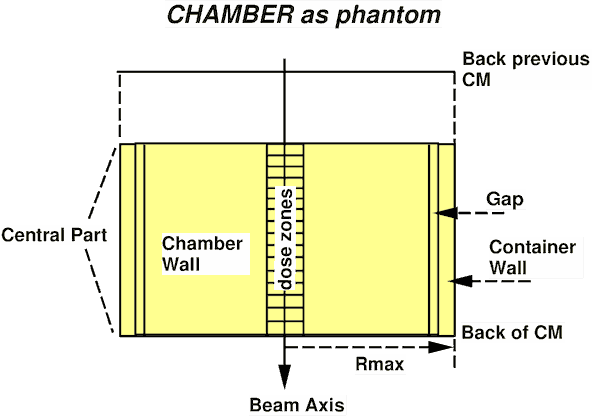

<!-- # 1. lab  -->
<!-- # 2. lab  -->
<!-- # 3. lab  -->
<!-- # 4. lab  -->
<!-- # 5. lab  -->

# 6. Run BEAMnrc examples <!-- omit in toc -->

- [6.1. EX10MeVe](#61-ex10meve)
- [6.2. EX16MVp](#62-ex16mvp)
- [6.3. EXphantom](#63-exphantom)


## 6.1. EX10MeVe

BEAMnrc accelerators each have their own folder in `$EGS_HOME`, and are compiled
in two steps. First, the order of components in the accelerator is specified in
a `.module` file, which resides in `$EGS_HOME/beamnrc/spec_modules`. This is
used as input to “build” the accelerator, using either the BEAMnrc GUI or the
`beam_build` command line tool. Then the accelerator is compiled with the `make`
command.

For this lab, the `.module` and `.egsinp` files will be provided.

1. Build the EX10MeVe accelerator on the command line. Notice that the module
   file already exists in `$EGS_HOME/beamnrc/spec_modules`. Type `beam_build.exe
   EX10MeVe` to build (from any directory).

2. Go into the `$EGS_HOME/BEAM_EX10MeVe` directory and compile this BEAMnrc
   application as usual, with the `make` command. Copy the sample input file
   `EX10MeVe.egsinp` to `$EGS_HOME/BEAM_EX10MeVe` using the following command:

   ```bash
   cp $OMEGA_HOME/beamnrc/BEAMnrc_examples/EX10MeVe/EX10MeVe.egsinp .
   ```

3. Launch the GUI with the command `beamnrc_gui` to edit the input file. From
   the `File` menu select the item **Load a previous accelerator** and choose
   `EX10MeVe.module`. The GUI will then ask you to select a PEGS4 data set.
   Click on the `Browse the HEN_HOUSE` button and select `521icru.pegs4dat` (in
   general, the PEGS4 data set you select depends on the materials that you will
   need in your model).

4. Select `Load a previous input file` from the `File` menu and choose the
   sample input file `EX10MeVe.egsinp`.

5. Within the GUI, you can preview the entire accelerator as specified by the
   input file as well as each of the component modules. Use
   `Preview->Preview Accelerator` to do this.

6. Click on the `Edit main input parameters` button in the `Selected components`
   window. In the main inputs dialogue, reduce the number of histories by a
   factor of 10.

7. Once you have made your changes, select `Save input parameters` from the
   `File` menu to save the modified input file (under the same name as the
   original input file).

8. Run the application from the command line:

   ```bash
   BEAM_EX10MeVe -i EX10MeVe -p 521icru
   ```

   Note that with BEAMnrc you may opt to work entirely from the GUI: there is an
   `Execute` menu from which you can `Compile` and `Run` your application.

Aside: You might notice that the initial energy of the beam is 12 MeV, but the
accelerator is named as 10 MeV. This is because the on-phantom spectrum is
peaked at 10.6 MeV.

### Questions

- Review and understand each part of the `EX10MeVe.egslst` output file.

- How many particles of each type are in the phase space per incident electron?

- How much CPU time on average does it take to run one history?

- In which accelerator component is most energy deposited? Why? *Hint:* Under
  `TOTAL DOSE PER INCIDENT PARTICLE`, determine the dose zone with the most
  energy deposited. Then look at the output for each component module, where the
  dose zone assigned to each region is listed.

- Which accelerator component receives the largest dose? Why?

## 6.2. EX16MVp

Build, compile and run the `EX16MVp` example using the BEAMnrc GUI in a manner
similar to what you did for the `EX10MeVe` example above. Note that this time,
you’ll have to select `700icru.pegs4dat` as the PEGS4 data set. Compare the
results to the previous example.

Copy the sample input file `EX16MVp.egsinp` to `$EGS_HOME/BEAM_EX16MVp` using
the following command:

```bash
cp $OMEGA_HOME/beamnrc/BEAMnrc_examples/EX16MVp/EX16MVp.egsinp .
```

### Questions

- Review and understand each part of the output file.

- How many particles of each type are in the phase space per incident electron?

- How much CPU time on average does it take to run one history?

- In which accelerator component is most energy deposited? Why?

- Which accelerator component apart from the target receives the largest dose?
  Why?

## 6.3. EXphantom

Build, compile and run the `EXphantom` example using the BEAMnrc GUI in a manner
similar to what you did for the `EX10MeVe` example above. Note that you will use
`700icru.pegs4dat` as the PEGS4 data set. In this example, you are using a
feature of the CHAMBER component module designed to facilitate simulation of a
cylindrical depth-dose phantom. See figure below

When `CHAMBER` is used in this way, then the `EXphantom.egsplot` output file
will contain dose as a function of depth in the phantom, for all dose
components. This can be read in directly using a plotting program, such as
`xmgrace`. You will need the results in `EXphantom.egsplot` to answer some of
the questions below.

Copy the sample input file `EXphantom.egsinp` to `$EGS_HOME/BEAM_EXphantom`
using the following command:

```bash
cp $OMEGA_HOME/beamnrc/BEAMnrc_examples/EXphantom/EXphantom.egsinp .
```

> 
>
> The CHAMBER component module used to model a cylindrical depth-dose phantom.
> The number of layers in the top and bottom parts of the chamber must be set to
> zero (`N_TOP` = `N_BOT` = 0). The user can then specify either: a) a single
> thickness for all layers in the central part; or b) groups of layers of
> identical thickness. A single input for medium, `ECUT`, `PCUT`, dose zone and
> bit region, is then applied to all layers in the central part. Provided that
> the dose zone in this input is greater than zero, then this dose zone number
> will be applied to the first layer and will automatically be incremented by
> one for each subsequent layer. Note that the radius of the central axis voxels
> is determined by the inner radius of the chamber wall.

### Questions

- Review and understand each part of the output file.

- How does the time per history compare to the previous examples, and why is
  there a difference, if there is?

- Explain the shapes of the different components of the dose on the central
  axis. Note that since this simulation uses the phase space file generated by
  `EX10MeVe` as a source, the `LATCH` bit filters reference the bit region
  settings in that accelerator.

- How many times is each particle from the phase space source used? What are the
  possible effects of recycling the phase space source so many times?

- Try running more histories in the `EX10MeVe` example to generate more
  particles in the phase space source and then re-run `EXphantom`. Does the
  shape of the depth dose curve change?

---

### [Solutions laboratory 6](Lab-06-solutions.md)
