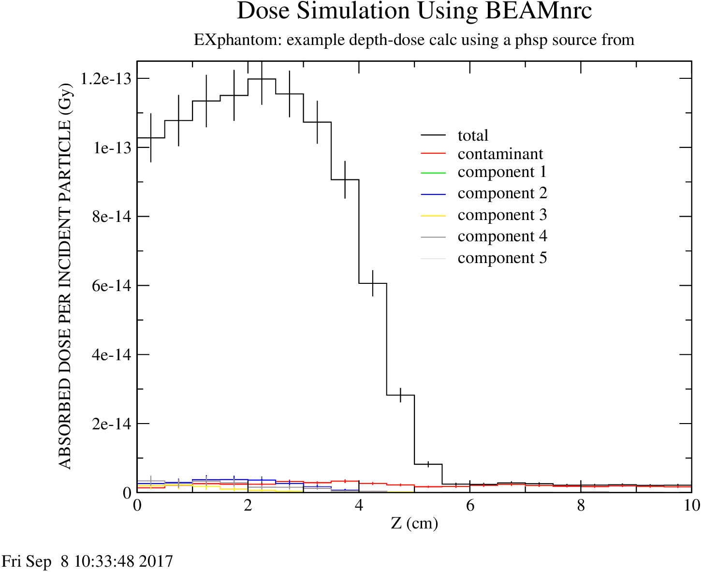

<!-- # 1. lab  -->
<!-- # 2. lab  -->
<!-- # 3. lab  -->
<!-- # 4. lab  -->
<!-- # 5. lab  -->

# 6. BEAMnrc examples: solutions <!-- omit in toc -->

- [6.1. EX10MeVe](#61-ex10meve)
- [6.2. EX16MVp](#62-ex16mvp)
- [6.3. EXphantom](#63-exphantom)

## 6.1. EX10MeVe

### How many particles of each type are in the phase space per incident electron?

> - photons: **0.118**
> - charged particles: **0.044**
> - all particles: **0.161**

### How much CPU time on average does it take to run one history?

> 0.16 millisecond (on 2.5 GHz Intel Core i5).

### In which accelerator component is most energy deposited? Why?

> The lead jaws, which corresponds to dose zones 14 and 15.

### Which accelerator component receives the largest dose? Why?

> The lead layers of the scattering foil, or dose zone 5.

## 6.2. EX16MVp

### How many particles of each type are in the phase space per incident electron?

> - photons: 0.174
> - charged particles: 0.093
> - all particles: 0.267

### How much CPU time on average does it take to run one history?

> 0.69 millisecond (on 2.5 GHz Intel Core i5)

### In which accelerator component is most energy deposited? Why?

> The Tungsten target. All primary electrons strike it, and they all undergo
> some ionization energy loss.

### Which accelerator component apart from the target receives the largest dose? Why?

> The primary collimator. It is blocking primary electrons and is the site of
> photon scattering interactions resulting in higher-order charged particles.

## 6.3. EXphantom

### How does the time per history compare to the previous examples, and why is there a difference, if there is?

> The time per history is roughly a factor of 100 less than for `EX16MVp` and
> `EX10MeVe`. The two main reasons for this are:
>
> 1. the accelerator consists of a fairly simple geometry with only one CM; and
>
> 2. range rejection in the large volume beyond the central axis of this
>    geometry significantly reduces CPU time.

### Explain the shapes of the different components of the dose on the central axis.

> Here is a plot of the results in `EXphantom.egsplot`:
>
> 
>
> Contaminant particles are identified as photons entering the phantom and, as
> expected, contaminant dose peaks at depth greater than total dose, and total
> dose is approximately equal to contaminant dose at depths greater than 6 cm.
>
> Dose components 1–5 are contributions from particles (and their descendants)
> that have passed through scrapers 1–5, respectively, of the square applicator
> in `EX10MeVe`. Contributions are greatest for components 2 and 4, which happen
> to correspond to the two thickest scrapers. In fact, dose contribution appears
> to scale approximately with scraper thickness.

### How many times is each particle used? What are the possible effects of recycling so many times?

> Each particle is used 87 times (original use plus $\large 86\times$
> recycling). Recycling particles introduces correlations into the dose results.
> While recycling particles many times may *smooth out* depth-dose results, it
> may also introduce systematic biases reflecting the statistical limitations of
> the phase space data. The uncertainty estimates on dose will reflect this,
> and, past a certain number of recycles, error bars will not decrease,
> regardless of how smooth the depth-dose curve is.

### Does the shape of the depth dose curve change?

> Yes, there are changes to the shapes of the depth-dose curves, but the curves
> should be consistent with one another, considering the statistical
> uncertainty.
