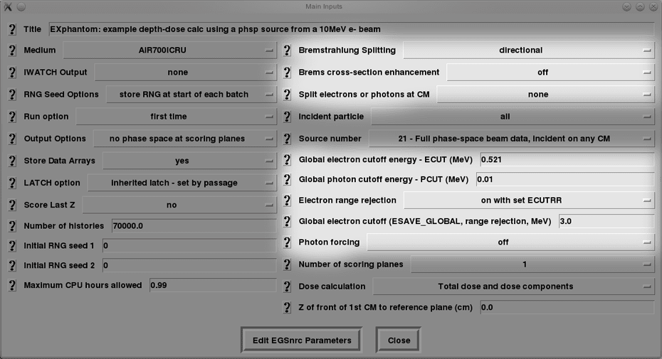

<!-- # 1. -->
<!-- # 2. -->
<!-- # 3. -->
<!-- # 4. -->
<!-- # 5. -->
<!-- # 6. -->

# 7. Investigate variance reduction in BEAMnrc <!-- omit in toc -->

- [7.1. Introduction](#71-introduction)
- [7.2. Optimization](#72-optimization)
- [7.3. Uniform bremsstrahlung splitting (UBS)](#73-uniform-bremsstrahlung-splitting-ubs)
- [7.4. Directional bremsstrahlung splitting (DBS)](#74-directional-bremsstrahlung-splitting-dbs)
- [7.5. Bremsstrahlung cross section enhancement](#75-bremsstrahlung-cross-section-enhancement)
- [7.6. Range rejection](#76-range-rejection)
- [7.7. Photon forcing](#77-photon-forcing)
- [7.8. ECUT](#78-ecut)
- [7.9. Russian roulette](#79-russian-roulette)



## 7.1. Introduction

The efficiency of a calculation, $\large \epsilon$ is defined as:

$$\large \epsilon = \frac{1}{T s^2}$$

where $\large T$ is the time taken to do the calculation and $\large s$ is an
estimate of the uncertainty $\large \sigma$, for some quantity of interest.
Obviously, a higher efficiency is better because it implies that it takes less
time to reach a given uncertainty. The efficiency for any given calculation will
depend on the quantity of interest.

When comparing calculations, remember that the estimate of the uncertainty is
*subject to large uncertainties itself,* and the time taken to do a given
calculation may depend strongly on what other tasks the computer is handling,
concurrently.

To investigate simulation efficiency and variance reduction techniques
*properly* would constitute a project of several weeks if not months. The
purpose here is to make you aware of the concepts and the possibilities
available.

## 7.2. Optimization

Compile one of the example accelerators or one that you developed with no
optimization. This can be done within the GUI, by turning optimization `off`.
Remember to “clean up” before recompiling the same run. Alternatively, you can
do this from the command-line by issuing the commands:

```bash
make clean        # removes all files generated by a previous compilation
make FOPT=-O0     # capital letter 'o', followed by a zero
```

which will replace the default optimization options set in the `$EGS_CONFIG`
file, which are:

`FOPT = -O2`

**Don’t forget to recompile with these default optimization options when you’re
done !**

### Questions

- Compare the CPU time required to execute the simulation with and without
optimization. Are the simulation results identical?

## 7.3. Uniform bremsstrahlung splitting (UBS)

Use the `EX16MVp` photon accelerator example, turn off photon forcing and
increase the number of histories to 50 000.

### Questions

- Calculate the efficiency of the simulation without bremsstrahlung splitting,
and for uniform bremsstrahlung splitting factors of 2, 20 and 40 with respect to
the total photon fluence in the centre-most zone (scoring zone 1) at the scoring
plane. What about electron fluence efficiency inside the same zone?

## 7.4. Directional bremsstrahlung splitting (DBS)

Use the `EX16MVp` photon accelerator example, and again turn off photon forcing
and increase the number of histories to 50 000.

### Questions

- Turn on directional bremsstrahlung splitting with a splitting radius of 10 cm
  at an SSD of 100 cm and a splitting number of 100. Calculate the photon
  fluence efficiency in the central scoring zone (zone 1 in the scoring plane).
  Also note the electron fluence efficiency inside this zone. Compare these to
  the results obtained with no splitting and with uniform bremsstrahlung
  splitting.

- Turn on electron splitting at the back of the flattening filter (CM number 3,
  plane number 5) and place the Russian roulette plane 2 mm upstream of that.
  You should also turn on radial redistribution of split $\large e^+$ and
  $\large e^-$ in the directional bremsstrahlung splitting options. Rerun the
  simulation and calculate the two fluence efficiencies again.

- **Bonus**: Vary the splitting radius to 5 cm, 7.5 cm and 30 cm and observe the
  changes in efficiency for the photon and electron fluences.

## 7.5. Bremsstrahlung cross section enhancement

### Task

Using EX16MVp with directional bremsstrahlung splitting (DBS) without electron
splitting, turn on bremsstrahlung cross section enhancement in the target with
an enhancement factor of 20. Note: to obtain a constant enhancement factor, set
the “enhancement constant” to 20 and the “enhancement power” to some number
$\large \leq$ 0.

### Questions

- Determine the efficiency of the photon fluence in the centre-most scoring zone
  for several different values of the bremsstrahlung splitting number over the
  range 100–4000. At what splitting number is the calculation most efficient ?
  What is the efficiency at this splitting number without cross section
  enhancement?

- **Bonus**: Try to determine the optimum splitting number using the method
  outlined in p 100–101 of the BEAMnrc manual. That is, fit

  $$\large \frac{N_\text{s}}{\epsilon_{N_\text{s}}}\quad\mathrm{vs}\quad\left(N_\text{s}-1\right)$$

  where $\large N_\text{s}$ is the bremsstrahlung splitting number and $\large
  \epsilon_{N_\text{s}}$ is the efficiency at that splitting number, using the
  quadratic equation:

  $$\large \frac{N_s}{\epsilon_{N_s}} = A_0 + A_1\left(N_\text{s}-1\right) + A_2\left(N_\text{s}-1\right)^2$$

  The optimum splitting number is then given by $\large \sqrt{A_0/A_2}$. What is
  the efficiency of your calculation at this optimum splitting number ? How does
  it compare to the maximum efficiency you found earlier?

## 7.6. Range rejection

### Questions

- Calculate the relative efficiency for the example electron and photon
  accelerators with the  `Electron range rejection`  option set to  `off`, or
   `on with set ECUTRR`  or finally to  `on with varying ECUTRR`.  Don't forget to choose a suitable value of `ESAVE_GLOBAL`.

## 7.7. Photon forcing

### Questions

- Quantify the effects of having  `Photon forcing`  set to `on` in the air past
  the accelerator head in the photon accelerator example (turn photon forcing
  back on if you have turned it off for previous questions). Specifically look
  at the differences in the following with the forcing `on` and `off`:

  1. the calculation time;

  2. the statistics on the photons and electrons in the field;

  3. the absolute number of particles in the phase space files;

  4. the range of particle statistical weights.

## 7.8. ECUT

### Questions

- For the three example cases (EX16MVp, EX10MeV, EXphantom), find the effect on
  the calculation speed of changing the global electron cutoff energy `ECUT` to
  0.8 MeV and 1.0 MeV. Can you detect changes in the output, other than
  simulation time ?

## 7.9. Russian roulette

### Questions

- Quantify the effects of setting the `Russian Roulette` option to `on` or `off`
  with uniform bremsstrahlung splitting.

- Do the same with augmented range rejection with directional bremsstrahlung
  splitting.  Hint: Range rejection only makes a difference if electrons are followed.

---

### [Solutions laboratory 7](Lab-07-solutions.md)
