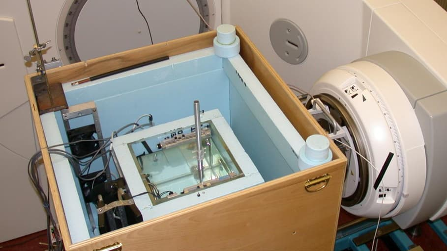
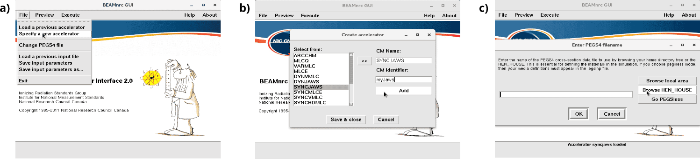
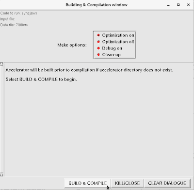
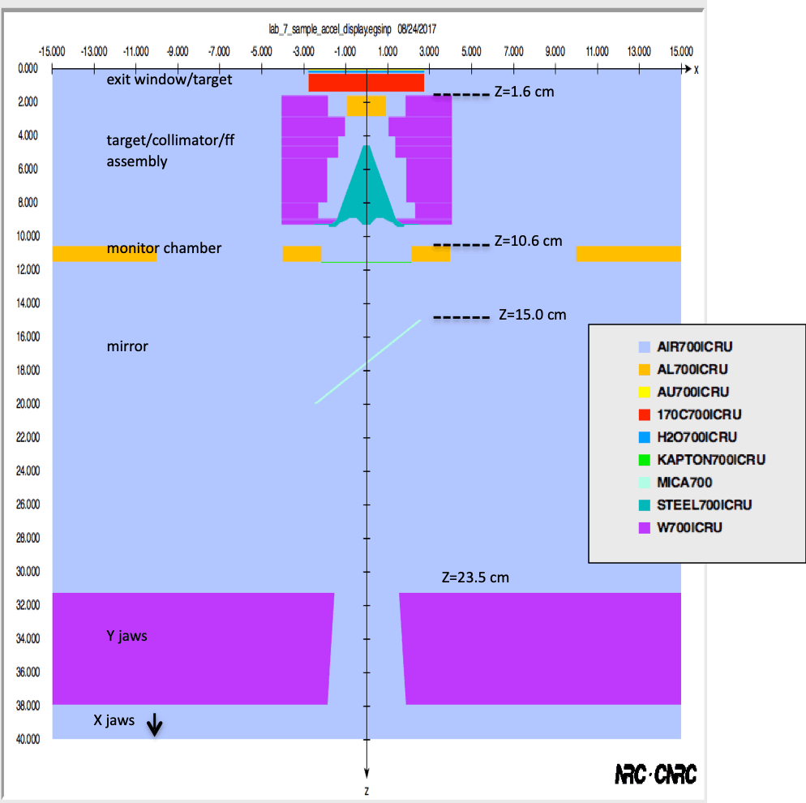
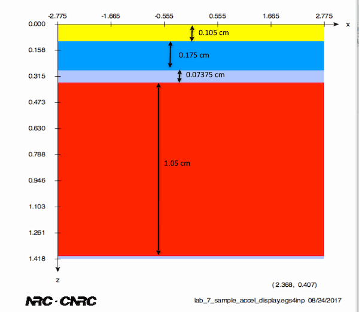
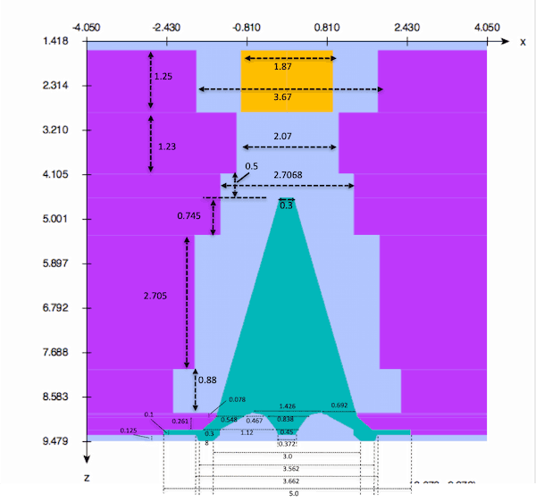
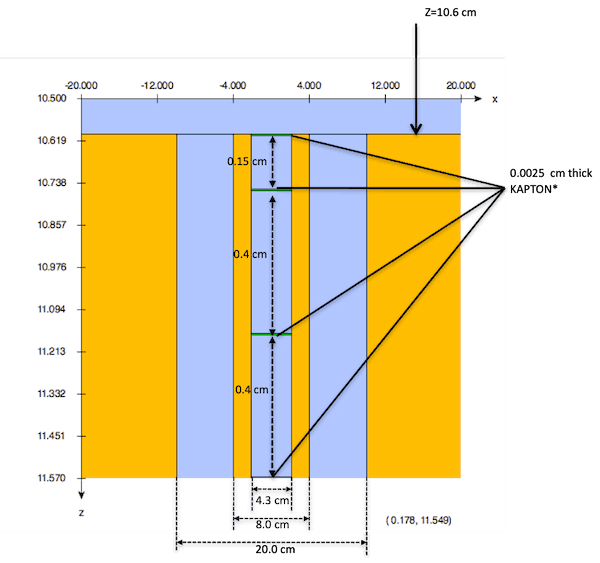
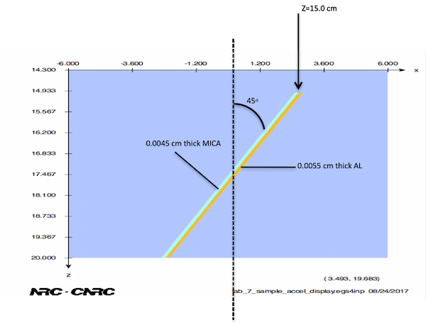
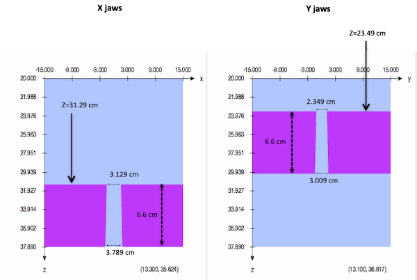

<!-- # 1. -->
<!-- # 2. -->
<!-- # 3. -->
<!-- # 4. -->
<!-- # 5. -->
<!-- # 6. -->
<!-- # 7. -->

# 8. Create your own BEAMnrc accelerator <!-- omit in toc -->

- [8.1. Build and run your accelerator model](#81-build-and-run-your-accelerator-model)
- [8.2. Adding component modules](#82-adding-component-modules)
- [8.3. Compiling the accelerator](#83-compiling-the-accelerator)
- [8.4. Sample accelerator, 18 MV photon beam: overview](#84-sample-accelerator-18-mv-photon-beam-overview)
- [8.8. Exit window and target](#88-exit-window-and-target)
- [8.6. Target, collimator and flattening filter assembly.](#86-target-collimator-and-flattening-filter-assembly)
- [8.7. Monitor chamber](#87-monitor-chamber)
- [8.8. Mirror](#88-mirror)
- [8.9. Jaws](#89-jaws)

## 8.1. Build and run your accelerator model

If you brought along the details of an accelerator you wish to model, build a
new BEAMnrc accelerator and create an input file **according to your
specifications,** following the steps described in Sections 8.2 and 8.3.
Otherwise, you can use the specifications of a sample accelerator, provided in
Sections 8.4 to 8.9.

### Questions

- How many CMs are needed?

- Where is most of the energy deposited in your accelerator?

- How many particles are in any given scoring plane per incident particle?

- How long does it take on average to run one history?

- For which CM do you find it most difficult to prepare the input?

## 8.2. Adding component modules

In the BEAMnrc GUI, click  `File -> Specify a new accelerator`, as shown in
Figure 8.1a In the dialogue window that pops up, shown in Figure 8.1b, select a
component module (e.g.  `SYNCJAWS` ) and click on the `>>` button. Type in any
name for the component module (CM) under  `CM Identifier`, and click  `Add`,
then repeat this process to add more CMs. When you are done, click  
`Save & close`. Recall that CMs in BEAMnrc are always *vertically stacked.*

Save the accelerator module file (e.g.  `syncjaws.module` ) — this will provide
the name of the accelerator. The next window, shown in Figure 8.1c, allows you
to select the material data to use. Click  `Browse HEN_HOUSE`  and select
`700icru.pegs4dat`.

> 
>
> **Figure 8.1** BEAMnrc dialogue windows: a) Creating a new accelerator; b)
> Selecting components; and c) Selecting pegs4 data file for material
> definitions.

## 8.3. Compiling the accelerator

In the main BEAMnrc GUI window, go to `Execute -> Compile` and click on `Build
& Compile`, as shown in Figure 8.2. Now you are ready to start editing a new
input file to define the parameters of each CM in your accelerator.

> 
>
> **Figure 8.2** BEAMnrc: Selecting pegs4 data file for material definitions.

## 8.4. Sample accelerator, 18 MV photon beam: overview

This is a global view of a sample linear accelerator (linac) producing a photon
beam. The primary beam of electrons hitting the target has a **nominal energy of
18 MeV,** with a spot-size of **0.2 cm, full-width half-maximum** (FWHM).
Details for each component of the accelerator are provided in the sections below. The drawing is
not to scale.

## 8.8. Exit window and target

Drawing is not to scale. Please refer to Section 8.4 for the media color legend.

## 8.6. Target, collimator and flattening filter assembly.

Drawing is not to scale. Please refer to Section 8.4 for the media color legend.
All distance measurements are given in centimetres.

## 8.7. Monitor chamber

Drawing is not to scale. Please refer to Section 8.4 for the media color legend.
Note that the number of kapton layers here is reduced by 50% to facilitate
input.

## 8.8. Mirror

Drawing is not to scale. Please refer to Section 8.4 for the media color legend.

## 8.9. Jaws

The collimating linac jaws form a 10 $\large\times$ 10 cm² field at SSD =
100 cm. Drawing is not to scale.

---

### [Solutions laboratory 8](Lab-08-solutions.md)
