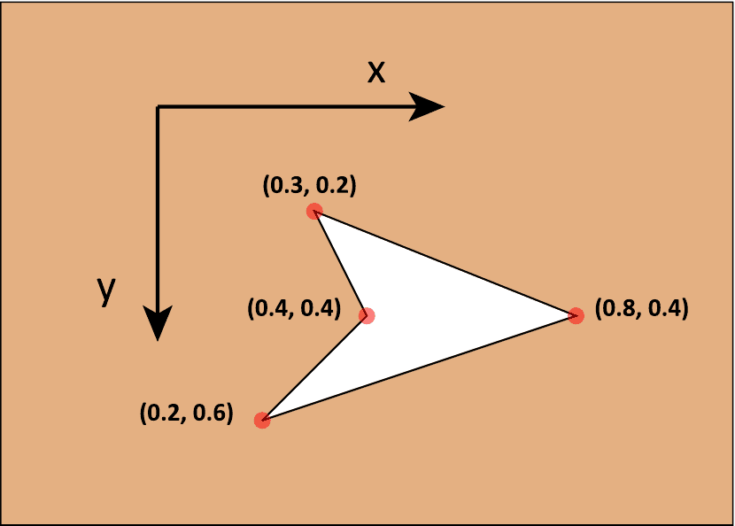

<!-- # 1. -->
<!-- # 2. -->
<!-- # 3. -->
<!-- # 4. -->
<!-- # 5. -->
<!-- # 6. -->
<!-- # 7. -->
<!-- # 8. -->

# 9. Calculate dose in a phantom with `DOSXYZnrc` <!-- omit in toc -->

- [9.1. Simulating a simple water phantom](#91-simulating-a-simple-water-phantom)
- [9.2. Coordinating BEAMnrc and DOSXYZnrc](#92-coordinating-beamnrc-and-dosxyznrc)
- [9.3. Coordinate transformation script](#93-coordinate-transformation-script)


## 9.1. Simulating a simple water phantom

Using the `dosxyznrc_gui` graphical user interface, simulate a 5 cm
$\large\times$ 5 cm $\large\times$ 5 cm water phantom consisting of 1 cm³ voxels
irradiated by a parallel beam of 10 MeV electrons. Use the 700icru material
data, and set `ECUT=0.7` and `PCUT=0.01`.

With source 0, set the beam to be incident along the $\large Z$ axis in the
DOSXYZnrc coordinate system with a 3 cm $\large\times$ 3 cm field. The angle of
the beam relative to the $\large x$, $\large y$ and $\large z$ axis should be
90, 90 and 0, respectively.

To speed up the simulation, turn on range rejection and set `ESAVE=2` MeV.

Run `dosxyznrc` with 10000 histories to start with. However, if the uncertainty
is not to your satisfaction, run more histories using the `restart` feature
under the `Run option` simulation parameter.

For analysis, we will be using the `statdose` application. This simple
application reads `*.3ddose` files and can be used to generate plots, perform
normalization, and other functions.

### Questions

- Plot a profile using `statdose` to confirm the beam direction and size.

- In [section 9.3](#93-coordinate-transformation-script) we provide a small
  python script to convert the DICOM gantry, couch, collimator angles into the
  DOSXYZnrc `theta`, `phi` and collimator (`phicol`) angles. Keep in mind that
  this code does not handle the singularity points of the transformation
  exactly. Save this python code in the file `coordinateTransform.py` in the
  dosxyznrc directory, and make it executable with the command `chmod +x
  coordinateTransform.py`. Run the coordinate transform code with gantry, couch
  and collimator all as 0.

  ```bash
  ./coordinateTransform.py 0 0 0
  ```

- Change to source 1, and use the `theta`, `phi` and `phicol` outputs from the
  transform to set the beam direction. Set the $\large x$, $\large y$, and
  $\large z$ isocentre coordinates to 0, 0, and 2.5, respectively. Plot a
  profile using `statdose` to determine the beam direction in DOSXYZnrc
  coordinates.

- Change the source to use the phase-space file from the 10 MeV example, i.e.,
  from `BEAM_EX10MeVe` runs. Bring the source down from the top of the phantom
  (i.e., in the $\large +z$ direction) by setting `theta = 180 degrees`, `phi =
  0 degrees`, `phicol = 0 degrees`.  Set
  `Distance from the source to isocentre` so that the source plane is coincident
  with the minimum $\large z$ boundary (upper surface) of the phantom.  Note that while it's
  possible to increase this distance, if the source is too far away most of
  particles may miss the phantom entirely! 
  Note that the phase-space may “restart” several times if it is
  not large enough — for the purposes of this lab this is OK, but keep in mind
  that this leads to an underestimation of uncertainty. Save the results from
  this run.
- Repeat the previous step, but change the phantom definition. Define the
  phantom as a single column of 5 voxels along $\large z$, 1 cm³ in size. Set
  the thickness of the region outside the phantom to **non-uniform** (this is
  the `dflag` variable), and set the $\large x$ and $\large y$ thicknesses to
  2 cm. The $\large z$ thicknesses can be 0. Set the medium of the region
  outside the phantom to `H2O700ICRU` — notice that we have created an identical
  phantom, but reduced the number of voxels. Compare the central axis depth-dose
  to the dose obtained in the previous exercise, and the calculation times for
  the two simulations.

   **Bonus Question:** If the phase space source was restarted, in which
   simulation did it restart more times?  Why? (*Hint:* Consider `dsurround` in
   both cases.)

- Our DOSXYZnrc simulations used `700icru` PEGS data, whereas the
  `BEAM_EX10MeVe` simulations used `521icru`. The important difference between
  these datasets is that the value of AE is different, leading to inconsistent
  interaction cross-sections. Does this mean our DOSXYZnrc results are
  incorrect?

## 9.2. Coordinating BEAMnrc and DOSXYZnrc

### Using the BLOCK component module to collimate a beam

Using `beamnrc_gui`, create an accelerator with a single component module of
type BLOCK. Set the material data to `700icru`. Use this BLOCK to model a lead
(`PB700ICRU`) beam block of thickness 1 cm that has an opening with the shape
and coordinates shown in the figure below. *Hint:* you will need 2 sub-regions
to create this shape.

> 
>
> Looking down at the opening in a lead block simulated using the BLOCK CM. The
> opening in this example should have straight sides (i.e., parallel to the
> $\large z$ axis). The block is 1 cm thick.

Now model a 10 MeV electron beam impinging on this beam block. Use a 2 cm
$\large\times$ 2 cm rectangular beam (`ISOURC=6`) centered at the origin and run
10000 histories. Set `ECUTIN` to 10 MeV so that only those electrons going
through the block opening reach the scoring plane below the block.

Use `beamdp_gui` to look at the electron phase space data below the block (the
“list parameters” option). **Pay attention to the $\large (x,y)$ coordinates**
of the electrons that make it through the collimators.

### Adjusting the collimator angle

Copy the sample input file `dosxyznrc_block_example.egsinp` from
`$EGS_HOME/dosxyznrc/examples` to your `$EGS HOME/dosxyznrc` directory, and
change the name of the phase space source file to that of the file you just
generated with your block accelerator model. Run a simulation with this source
bearing down on a 10 cm $\large\times$ 10 cm $\large\times$ 10 cm phantom.

The `IWATCH` flag in this input file is set to 1 to allow you to see the $\large
(x,y)$ coordinates of the incident electrons. By looking at the particle
energies (the second number) in the `Initial shower values`, you should be able
to find the same particles listed by `beamdp` (`IWATCH` is listing total energy,
whereas `beamdp` is listing kinetic energy). The charge is the 3rd value, and
the $\large x$ and $\large y$ coordinates are the 5th and 6th values. Scroll up
to the top of the listing to be able to compare with the first particles listed
from the phase-space.

### Questions

- What do you notice about these $\large (x,y)$ coordinates when compared to the
  $\large (x,y)$ coordinates output by `beamdp` for the phase space file?

- Change the `phicol` parameter to rotate the phase space source in its plane
  until the $\large (x,y)$ coordinates in DOSXYZnrc match those output by
  `beamdp`. What is the value of `phicol` that provides this mapping?

- Vary the source input angle `theta` so that the phase space source is incident
  on one side of the phantom. Note that you will want to set the $\large z$
  isocentre to 5 cm and the distance from source to isocentre to 5 cm. Use the
  value of `phicol` determined in the last question. Take a look at the $\large
  (x,y,z)$ coordinates of the incident electrons.

## 9.3. Coordinate transformation script

```python
#!/usr/bin/env python3

# Coordinate transformation from DICOM to DOSXYZnrc
#    Input:  gantry angle, couch angle and collimator angle from DICOM
#    Output: theta, phi, phicol for DOSXYZnrc (using BEAMnrc phsp)
#
# This code is based on the example provided in the article:
#
# Beam coordinate transformations from DICOM to DOSXYZnrc
# Lixin Zhan, Runqing Jiang and Ernest K Osei
# Physics in Medicine & Biology, Volume 57, Number 24 (2012)

import sys
import math

def dcm2dosxyz(AngleGantry, AngleCouch, AngleCollimator):

    gamma = AngleGantry*math.pi/180.0
    col   = AngleCollimator*math.pi/180.0
    rho   = AngleCouch*math.pi/180

    # Distort couch and gantry angles slightly to avoid special cases
    if AngleCouch in (90.0,270.0) and AngleGantry in (90.0,270.0):
        rho   = rho   * 0.999999
        gamma = gamma * 0.999999

    # Do calculations
    sgsr = math.sin(gamma)*math.sin(rho)
    sgcr = math.sin(gamma)*math.cos(rho)
    theta = math.acos(-sgsr)
    phi = math.atan2(-math.cos(gamma),sgcr)
    CouchAngle2CollPlane = math.atan2(-math.sin(rho)*math.cos(gamma), math.cos(rho))
    phicol = (col-math.pi/2) + CouchAngle2CollPlane

    # Coord transformation for BEAMnrc generated phsp to DOSXYZnrc
    phicol = math.pi - phicol

    return (theta*180/math.pi, phi*180/math.pi % 360, phicol*180/math.pi % 360)

def main(argv):
    if len(argv) != 3:
        print ("Usage: coordinateTransform.py gantryAngle couchAngle collimatorAngle")
        return

    print("Gantry, couch, collimator:",float(sys.argv[1]), float(sys.argv[2]), float(sys.argv[3]))
    [theta, phi, phicol] = dcm2dosxyz(float(sys.argv[1]), float(sys.argv[2]), float(sys.argv[3]))
    print("Theta, phi, phicol:", theta, phi, phicol)

if __name__ == "__main__":
   main(sys.argv[1:])
```

---

### [Solutions laboratory 9](Lab-09-solutions.md)
