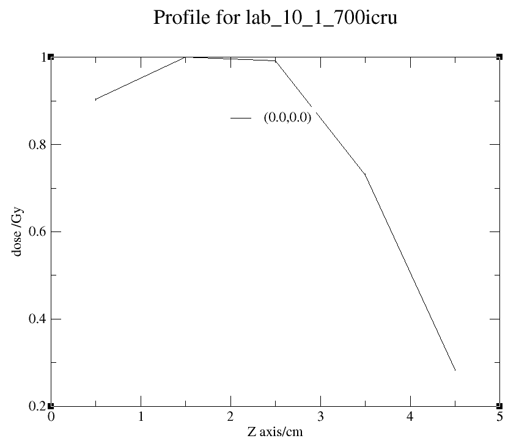
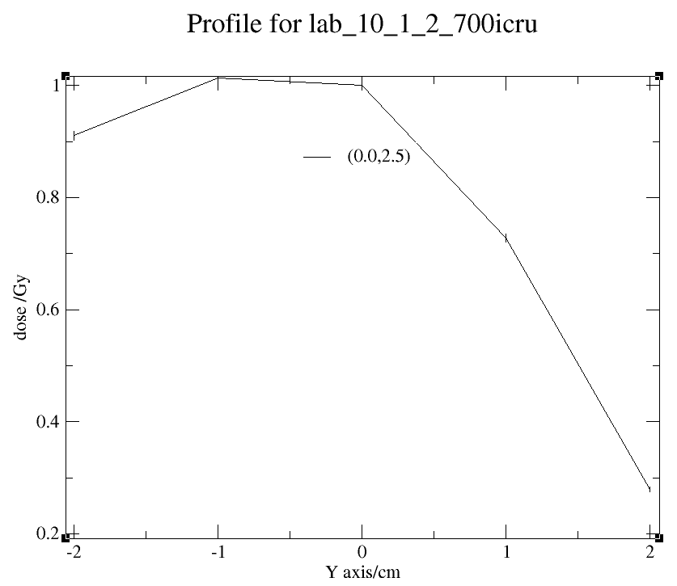

<!-- # 1. -->
<!-- # 2. -->
<!-- # 3. -->
<!-- # 4. -->
<!-- # 5. -->
<!-- # 6. -->
<!-- # 7. -->
<!-- # 8. -->

# 9. Calculate dose in a phantom: laboratory solutions <!-- omit in toc -->

- [9.1. Simulating a simple water phantom](#91-simulating-a-simple-water-phantom)
- [9.2. Coordinating BEAMnrc and DOSXYZnrc](#92-coordinating-beamnrc-and-dosxyznrc)

## 9.1. Simulating a simple water phantom

### Plot a profile using `statdose` to confirm the beam direction and size.

> 

### In the dosxyznrc directory, run this coordinate transform code

```bash
./coordinateTransform.py 0 0 0
```

### Set the x, y, and z isocentre coordinates to 0, 0, and 2.5, respectively. Plot a profile.

> 

### Compare the central axis depth-dose, and the calculation times for the two simulations.

> The depth dose curves agree within uncertainty, and the simulation is about
> 2.5 times faster:
>
> ```text
> normal phantom: Total CPU time for run =    35.7 s
> non-uniform:    Total CPU time for run =    14.5 s
> ```

### Does this mean our DOSXYZnrc results are incorrect?

> Two different values of `AE` should not be used in the same simulation, due to
> the resulting > inconsistent cross-sections. However, in this case the low
> energy particles that may exist in the > BEAMnrc phase space will simply be
> discarded during the DOSXYZnrc simulation. This leads to an > inefficiency,
> but not necessarily incorrect results. However, be aware that certain
> experiments > could be sensitive to the inconsistency and lead to confusion or
> misinterpretation.

## 9.2. Coordinating BEAMnrc and DOSXYZnrc

### What do you notice about these $\large (X,Y)$ coordinates?

> $\large X\rightarrow -X$ \
> $\large Y\rightarrow -Y$

### What is the value of `phicol` that provides this mapping?

> `phicol` must be set to 180 degrees to map $\large X\rightarrow X$ and $\large Y\rightarrow Y$.

### Take a look at the $\large (X,Y,Z)$ coordinates of the incident electrons.

> `theta`: 90 degrees \
> `ziso`: = 5 cm \
> `dsource`: = 5 cm \
> `phicol`: 180 degrees.
>
> We then obtain the following mapping:
>
> $\large X\rightarrow 5$ cm \
> $\large Y\rightarrow Y$ \
> $\large Z = 5 + X$ cm.
>
> For the source incident on the bottom, we use:
>
> `theta` = 0 \
> `ziso` = 5 cm \
> `dsource` = 5 cm \
> `phicol` = 0.
>
> We then obtain the mapping:
>
> $\large X\rightarrow X$ \
> $\large Y\rightarrow -Y$ \
> $\large Z=10$ cm,
>
> which makes sense when considering that the $\large Z$ axis in the DOSXYZnrc
> coordinate system is the $\large -Z$ axis in > the BEAMnrc coordinate system and that
> both systems are right-handed.
