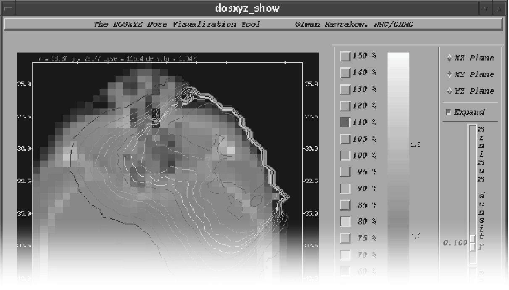
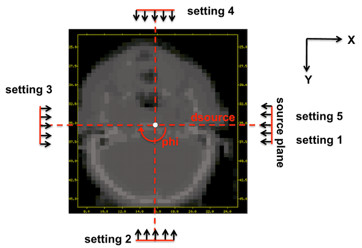

<!-- # 1. -->
<!-- # 2. -->
<!-- # 3. -->
<!-- # 4. -->
<!-- # 5. -->
<!-- # 6. -->
<!-- # 7. -->
<!-- # 8. -->
<!-- # 9. -->

# 10. Run advanced DOSXYZnrc simulations <!-- omit in toc -->

- [10.1. Modelling a CT phantom](#101-modelling-a-ct-phantom)
- [10.2. Synchronized BEAM simulation sources](#102-synchronized-beam-simulation-sources)



## 10.1. Modelling a CT phantom

### Preparation

Copy the following files from the [assets/](./assets/) directory into your
`$EGS_HOME/dosxyznrc/` directory:

```text
CT_create.inp                   # ctcreate input file
CT_example_electron.egsinp      # DOSXYZnrc input file
image_001.header                # Pinnacle CT header file
image_001.img.zip               # Pinnacle CT phantom (binary data, zipped)
```

In your `$EGS_HOME/dosxyznrc/` directory, unzip the `.img` file with the command

```bash
unzip image_001.img.zip
```

#### Important

Edit the `CT_create.inp` file to *change the string
`$EGS_HOME` to the actual absolute path of your `$EGS_HOME`
directory* (use the terminal command `echo $EGS_HOME` to get the actual path).

### Create a CT phantom

Create a sample phantom from a Pinnacle CT image of a patient’s head and chest
using the following command. Note that you must first navigate to the directory
containing the `.inp` file.

```bash
ctcreate CT_create.inp
```

This generates a phantom in the text file `image_001.egsphant`. The actual CT
data is stored in the files `image_001.header` and `image_001.img`.

For your interest, check whether or not the binary CT data bytes are swapped by
consulting the `ctcreate` log in `CT_create.inp.ctlst`.
Review the phantom file `image_001.egsphant` with a text editor. The arrays of
media numbers should give you a very rough slice-by-slice idea of what the CT
phantom looks like.

### Run an 18 MeV parallel beam simulation

Load `CT_example_electron.egsinp` as a "previous input file" in `dosxyznrc_gui`
and select `700icru.pegs4dat` from the `$HEN_HOUSE` as the PEGS4 data file. Then
run `dosxyznrc` with this input file from the GUI, in interactive mode.

This will run a simulation of a parallel beam of 18 MeV electrons, 10 cm
$\large\times$ 10 cm field, incident at 45° on the neck of the phantom (gantry:
45°,  couch: 0°,  collimator: 0°). You may want to increase the number of
histories to get better statistics. Use the following command to view the
isodose contours superimposed on the CT phantom:

```bash
dosxyz_show image_001 CT_example_electron
```

### Questions

- Using the `coordinateTransform.py` script you saved in the `dosxyznrc`
directory (Laboratory 7), experiment with gantry and couch rotations to confirm
that the dose distribution moves as expected.

  ```bash
  ./coordinateTransform.py 90 90 0
  ```

- Rename your original `image_001.egsphant` file to `image_001_orig.egsphant`.
  You’re going to be using that phantom in the section below. Now edit the
  `CT_create.inp` input and re-generate the phantom, **decreasing** the $\large
  x$ and $\large y$ dimensions of the voxels of the phantom to 0.25 cm. Run the
  `dosxyznrc` simulation again and note the increase in computation time and in
  dose uncertainty.  Look at the dose distribution again using `dosxyz_show`.  Do you like the look of this
  distribution more than with the coarser $\large x$-$\large y$ voxel resolution?

- The four parameters `xctsubmin`, `xctsubmax`, `zctsubmin` and `zctsubmax` in
  the file `CT_create.inp` are set to select the patient’s head and neck and
  very little surrounding air. **Increase the size of this sub-volume,
  especially in the** $\large z$ **direction, to include the patient’s chest** (making
  sure to reset the $\large x$ and $\large y$ dimensions of the phantom voxels
  to 0.5 cm, or else you could run into memory problems).  Use the output from the previous `ctcreate` run
  in `CT_create.inp.lst`, which shows the $\large x$, $\large y$ and $\large z$ limits of the original
  CT data, as a guide when setting new sub-volume limits.

- Look at the rough slice-by-slice data in the `image_001.egsphant` file to
  ensure that you are including the chest (you can run `dosxyz_show` without a
  `.3ddose` file). ***What happens to the minimum possible dimensions of the
  DOSXYZnrc voxels as the sub-volume is increased?***

## 10.2. Synchronized BEAM simulation sources

### Creating the simplified accelerator with SYNCJAWS

Using `beamnrc_gui`, create, build and compile an accelerator with only 1
component module of type `SYNCJAWS`. Use the `700icru` pegs data from
`$HEN_HOUSE`.

As a source, use a 10 cm $\large\times$ 10 cm beam (source no. 6) of 6 MeV
photons. Select one scoring plane below CM 1.

In the `SYNCJAWS` CM inputs, define two 2 paired lead (`PB700ICRU`) jaws, one
opening in the $\large x$ direction and one opening in the $\large y$ direction.
Do not worry about setting the jaw thickness or opening dimensions. These will
be specified in the jaw opening sequence file described below. Set `ECUT` and
`PCUT` in the jaw material to 10 MeV. This will immediately eliminate any
particle hitting the jaws and, although not realistic, the CPU time saved will
allows these calculations to be carried out in the time allotted for this lab.

For the file containing jaw opening data, copy the sample sequence file provided
in

```bash
$OMEGA_HOME/beamnrc/CMs/sample_sequences/sample_syncjaws.sequence
```

into your accelerator directory and open this file in a text editor. Referring
to Section 15.3.8 (p. 166) in the BEAMnrc Manual, which describes the format of
the file defining jaw opening data for both `DYNJAWS` and `SYNCJAWS`, modify
this file to define 5 fields using the 2 sets of jaws *Hint:* You won’t need
to change the $\large z$ dimensions in the example sequence file, but you will
need to add the first position for `INDEX = 0.0`:

1. For `INDEX=0.00`:   a 1 cm $\large\times$ 1 cm field
2. For `INDEX=0.25`:  a 3 cm $\large\times$ 3 cm field
3. For `INDEX=0.50`:   a 1 cm $\large\times$ 1 cm field
4. For `INDEX=0.75`:  a 3 cm $\large\times$ 3 cm field
5. For `INDEX=1.00`:   a 1 cm $\large\times$ 1 cm field

Now, return to the GUI and specify this modified file as the `File containing
jaw opening data`. A preview of this CM will show the opening data for the first
of the fields defined above. Choose the `Dynamic` field type. Save your input
file and then try running it to make sure that it works with your accelerator.

Finally, compile your accelerator as a shared library by issuing the following
command in the accelerator directory.

```bash
make library
```

### Defining a synchronized source in DOSXYZnrc

Use `dosxyz_gui` to define a synchronized source incident on the CT phantom
created in the first part of this lab.

Read in the original CT phantom file, `image_001_orig.egsphant`, in the
`Phantom definition` pane. Select the options to zero the dose in air
and suppress dose output.

Use source 21 (Dynamic BEAM simulation source). Using the `define settings`
button, define 5 settings that will create a source rotating in the transverse
$\large xy$ plane of the CT phantom through 0–360° about the isocentre, see
figure below. Note that the isocentre of the phantom is equal to that of the
sub-volume of CT data used to create the phantom: (16, 37.45, −2). Make sure
that the `MU Indices` of each setting point match the `INDEX` values of the jaw
fields defined earlier. Finally, set `dsource` to 20 cm, `theta` to 90° and vary
`phi`.

> 
>
> Illustration of the rotation of the beam through 0–360° in the
transverse plane of the CT phantom about the isocentre.

Select the simplified accelerator created in earlier as your BEAM simulation
source. Note that only accelerators compiled as shared libraries show up in the
browser. For the input file, select the BEAM input file defined in earlier and
use the `700icru` pegs data.

Back in the main DOSXYZnrc GUI input window, specify a large, uniform volume of
air surrounding the phantom. Turn range rejection on with `ESAVE` set to 2 MeV.
Run 10⁶ histories. Don’t forget to save this input file before you run it.

### Questions

- Using [VICTORIA](http://web.uvic.ca/~bazalova/dose_viewer/) (an online dose
  visualization tool) or `dosxyz_show`, look at the isodose contours in the
  $\large xy$ plane of the phantom near the isocentre. ***Does the pattern make
  sense to you given the synchronized input?***

- Edit the file defining the jaw fields so that the pattern you see in the
  question above is rotated by 90°. ***Is there another way to achieve this without
  altering the file defining the jaw fields?***

- In the input file for the BEAM simulation, change the field type from
  `Dynamic` to `Step-and-shoot`. ***How does this change the isodose contours? Can
  you explain the change in contour shape?***

---

### [Solutions laboratory 10](Lab-10-solutions.md)
