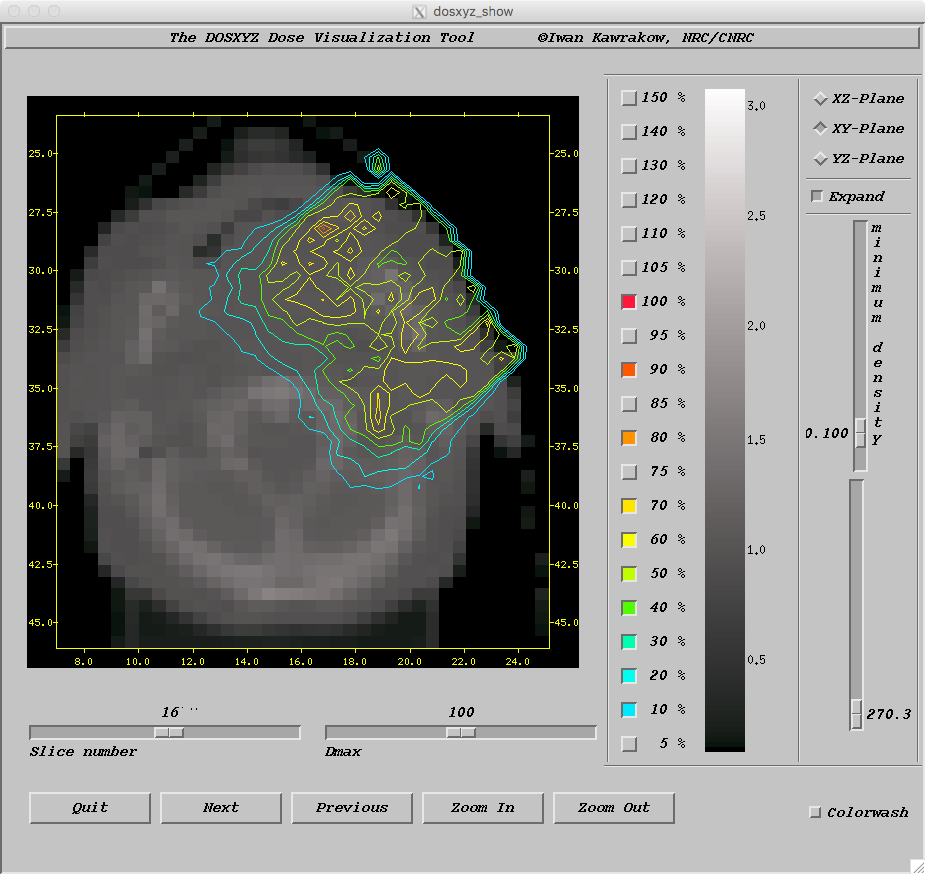
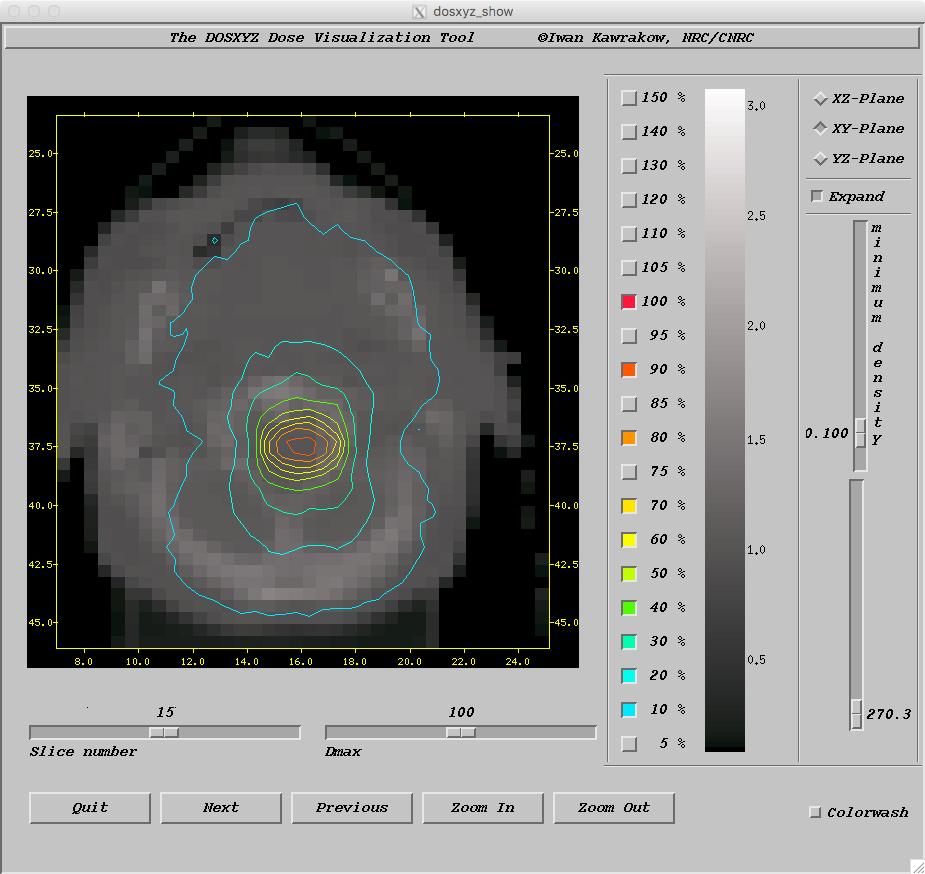
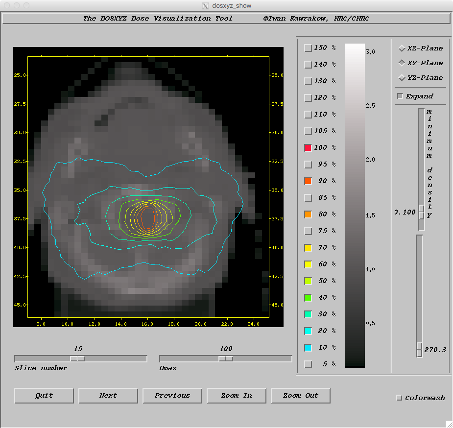

<!-- # 1. -->
<!-- # 2. -->
<!-- # 3. -->
<!-- # 4. -->
<!-- # 5. -->
<!-- # 6. -->
<!-- # 7. -->
<!-- # 8. -->
<!-- # 9. -->

# 10. Advanced DOSXYZnrc: solutions <!-- omit in toc -->

- [10.1. Modelling a CT phantom](#101-modelling-a-ct-phantom)
- [10.2. Synchronized BEAM simulation sources](#102-synchronized-beam-simulation-sources)

## 10.1. Modelling a CT phantom

### Using the `coordinateTransform.py` script in the `dosxyznrc` 1, (...)

> The output of the simulation using an unmodified `CT_example_electron.egsinp`
> looks like the figure below. It shows a view through slice 16 in the
> transverse $\large xy$ plane (approximately the mid-point of the phantom along
> $\large z$​​). Also visible are isodose contours resulting from a simulation
> using `CT_example_electron.egsinp` without modifications.
>
> 

### What happens to the minimum possible dimensions of the DOSXYZnrc voxels?

> Voxel sizes need to be readjusted so that an integer number of CT voxels fit
> in them:
>
> ```text
> Final x,y,z dimensions of dosxyznrc voxels in cm (adjusted so that an
> integer number fit exactly on the CT data): 0.50361 0.50361 0.50000
> ```

## 10.2. Synchronized BEAM simulation sources

### Does the pattern make sense to you given the synchronized input?

> The isodose contours at a slice in the transverse $\large xy$ plane
> approximately mid-way through the $\large z$ thickness of the phantom look
> like the figure below. It shows isodose contours through slice 15 in the
> transverse $\large xy$ plane resulting from the synchronized source set up.
>
> 
>
> The pattern makes sense if one considers that the jaws are contracted to give
> the smallest 1 cm $\large\times$ 1 cm field at `phi` = 0° (360°), 180°, which
> direct the source at either side of the patient’s head and neck, while the
> jaws are expanded to the largest 3 cm $\large\times$ 3 cm field at `phi` =
> 90°, 270°, at which points the source is directed at the back and front of the
> patient’s head and neck, respectively.

### Is there another way to achieve this without altering the file defining the jaw fields?

> The modified file defining the jaw fields should now contain:
>
> ```text
> Ex: 5 fields, 2 jaws
> 5
> 0.0
> 0.001, 0.2, 1.5, 1.5, -1.5, -1.5
> 0.201, 0.3, 1.5, 1.5, -1.5, -1.5
> 0.25
> 0.001, 0.2, 0.5, 0.5, -0.5, -0.5
> 0.201, 0.3, 0.5, 0.5, -0.5, -0.5
> 0.5
> 0.001, 0.2, 1.5, 1.5, -1.5, -1.5
> 0.201, 0.3, 1.5, 1.5, -1.5, -1.5
> 0.75
> 0.001, 0.2, 0.5, 0.5, -0.5, -0.5
> 0.201, 0.3, 0.5, 0.5, -0.5, -0.5
> 1.0
> 0.001, 0.2, 1.5, 1.5, -1.5, -1.5
> 0.001, 0.2, 1.5, 1.5, -1.5, -1.5
> ```
>
> The resultant isodose contours should look like the figure below, which shows
> isodose contours through slice 15 in the transverse $\large xy$ plane
> resulting from changing the “phase” of the jaw opening coordinates by 90°. The
> same rotation could be accomplished by using the original jaw field definition
> file but redefining the settings of DOSXYZnrc source 21 so that `phi` rotates
> between −90° and 270°.
>
> 

### How does this change the isodose contours? Can you explain the change in contour shape?

> Using “step-and-shoot” with the sequence file from the question above, the
> >isodose contours should look like the figure below, which shows isodose
> >contours through slice 15 in the transverse $\large xy$ plane resulting from
> >the same jaw opening sequence, but using “step-and-shoot” mode. This shape
> >makes sense given that, in step-and-shoot mode, the field opening dimensions
> >are constant and are synchronized with the `MU Indices` (and `phi` values)
> in >source 21, as follows:
>
> | `MU Index` range | `phi` range |    opening size    |
> | :--------------: | :---------: | :----------------: |
> |        —         | degree (°)  |        cm²         |
> |   0.00 – 0.25    |   0 – 90    | 1 $\large\times$ 1 |
> |   0.25 – 0.50    |  90 – 180   | 3 $\large\times$ 3 |
> |   0.50 – 0.75    |  180 – 270  | 1 $\large\times$ 1 |
> |   0.75 – 1.00    |  270 – 360  | 3 $\large\times$ 3 |
>
> 
