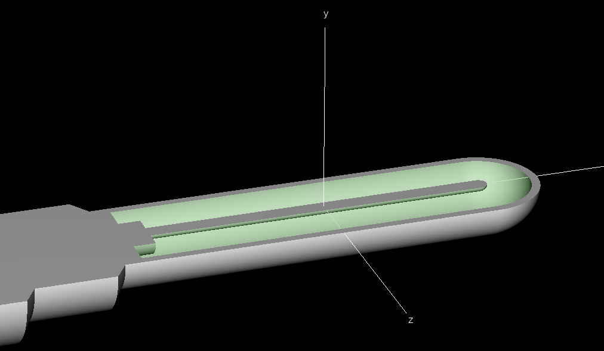
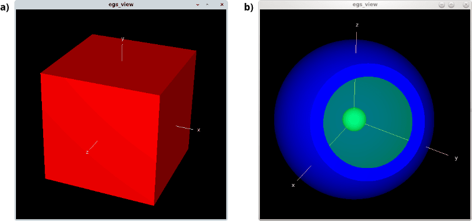
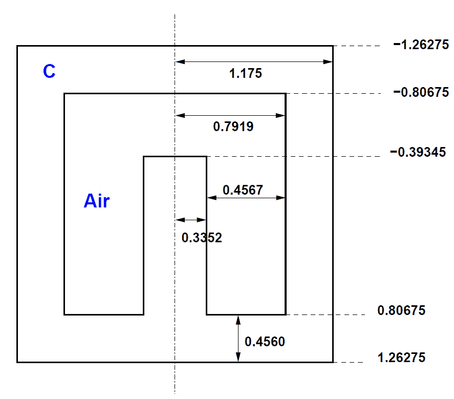
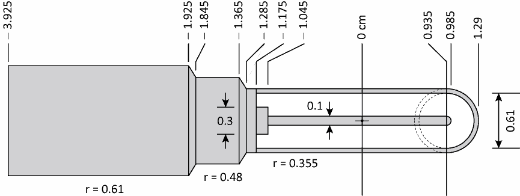

<!-- # 1. -->
<!-- # 2. -->
<!-- # 3. -->
<!-- # 4. -->
<!-- # 5. -->
<!-- # 6. -->
<!-- # 7. -->
<!-- # 8. -->
<!-- # 9. -->
<!-- # 10. -->

# 11. Build an ionization chamber model in egs++ <!-- omit in toc -->

- [11.1. Create a simple input file](#111-create-a-simple-input-file)
- [11.2. Visualize your geometry with `egs_view`](#112-visualize-your-geometry-with-egs_view)
- [11.3. Dig in with clipping planes](#113-dig-in-with-clipping-planes)
- [11.4. Build an egs++ model of the 3C chamber](#114-build-an-egs-model-of-the-3c-chamber)
- [11.5. Build an egs++ model of an Exradin A12 chamber](#115-build-an-egs-model-of-an-exradin-a12-chamber)
- [11.6. Compare with a chamber modelled with a mesh](#116-compare-with-a-chamber-modelled-with-a-mesh)



## 11.1. Create a simple input file

A significant part of the work involved in setting up a simulation is writing
the geometry input to represent the physical model. To get acquainted with
building geometries and viewing them in `egs_view`, let’s start with a very
simple example. In a text editor, create a new document with the following
geometry input, describing a cubic box:

```ruby
:start geometry definition:

    ### a simple box definition
    :start geometry:
        name     = my_box       # this name is up to you
        library  = egs_box
        box size = 10           # length units are cm
        :start media input:
            media = my_medium
        :stop media input:
    :stop geometry:

    ### name of the geometry to load in the viewer
    simulation geometry = my_box

:stop geometry definition:
```

Note that white space is irrelevant — except for line returns because egs++
reads one input per line. Comment your code as you go, and remember the
`simulation geometry` input to tell the viewer which geometry to load (by name).

Media names are up to you: the viewer merely assigns different colors to
different media. These names will ultimately have to be defined in the `media
definition` input block to run a simulation. However the viewer displays media
even if they are not yet defined.

For a description of the input syntax for each geometry, and for input examples, refer to the
[egs++ manual](https://nrc-cnrc.github.io/EGSnrc/doc/pirs898/), in the
[Geometries](https://nrc-cnrc.github.io/EGSnrc/doc/pirs898/group__Geometry.html) section, e.g., for the [box geometry](https://nrc-cnrc.github.io/EGSnrc/doc/pirs898/classEGS__Box.html).

## 11.2. Visualize your geometry with `egs_view`

Save your box geometry input in a file named `simple.egsinp`. From the
directory where you saved the file, launch the geometry viewer from the
command-line:

```bash
egs_view simple.egsinp &
```

You should see a red square in the geometry window (the box you designed), along
with a `View Controls` window. The viewer starts with the camera on the positive
$\large z$ axis, but you can rotate the geometry in 3D by dragging with the
mouse, as shown in Figure 11.1a.

You can pan the view by dragging while pressing the `Ctrl` key, and zoom in and
out with the middle mouse button or the mouse wheel. Note that these
manipulations do *not* affect your input: `egs_view` **never writes to the input
file.**

Spend a few minutes exploring the view control tabs `Display`, `Colors`,
 `Regions` and `Camera`. At any time you can export the current view as an image
with `File->Save image`, but even more useful is an option to save your current
view settings, using `File->Save settings`. This will create a `.egsview` file,
and if you load these settings again it will restore all your choices of
material colours, transparencies, clipping planes, etc. This is very handy!

The `File->Reload` button (or `Ctrl+R`) reads the input file again, which is
useful to update the view upon modifying the input file, without having to
launch the viewer again. *Be warned however that reloading is not yet robust:
some changes in the input file may cause the viewer to crash!*

> 
>
> **Figure 11.1**  a) snapshot of the cube defined in the `simple.egsinp` input
file. b) snapshot of the point of view you are asked to reproduce using viewer
clipping planes in [Section 11.3](#11-dig-in-with-clipping-planes)

### Question

- What are the region numbers inside and outside the cube? *Hint:* hover your
 mouse over the geometry view.

## 11.3. Dig in with clipping planes

Edit your input file to add a second geometry (inside the `geometry definition`
input block) defining a set of concentric spheres:

```ruby
:start geometry:
    name     = my_spheres               # this name is up to you
    library  = egs_spheres
    radii    = 0.3 1.8 2                # three concentric spheres
    :start media input:
        media = default shell center    # names of media 0 1 2 ...
        set medium = 2 1                # set region 2 to medium 1 (shell)
        set medium = 0 2                # set region 0 to medium 2 (center)
    :stop media input:
:stop geometry:
```

Keep in mind that there can be only one `:start geometry definition:` and it
must contain all of your geometries.

By default the whole geometry is filled with medium 0 (`default`, the first one
in the  `media`  list), so it is redundant to specify `set medium`  for regions
 containing medium 0.

Change the  `simulation geometry`  to  `my_spheres` (or the name you chose) and
reload the input in the viewer. You can play with transparency to reveal the
internal structure of the geometry, but clipping planes provide a more direct
route. In the `Display` tab of `egs_view`, apply a clipping plane with normal
 vector aimed along the positive $\large z$ axis and passing through the origin.
Make the `default` medium partially transparent and rotate the geometry around.
Then, apply a clipping plane to get a view similar to the one shown in
Figure 11.1b.

### Question

- From the clipped point of view, what is the list of regions when you hover
  your mouse over the small central sphere?

- What is the region number *outside* the defined geometry?

## 11.4. Build an egs++ model of the 3C chamber

Use your newly acquired expertise in egs++ syntax to model the geometry of the
NRC reference ionization chamber "3C", the schematic of which is reproduced in
Figure 11.2. This is a cylindrically symmetric geometry with 4 distinct layers
along its axis, so the natural option is a "conestack" geometry. Align the
conestack along the $\large z$ axis, and position it according to the numbers
given in the diagram. Below is an input template *to get you started.* Note that
the `# ...` in the code examples are blanks meant to be replaced with the
appropriate content.

> 
>
> **Figure 11.2** Simplified schematic of NRC’s 3C ionization chamber which is
Canada’s primary standard for air kerma in a ⁶⁰Co beam. Dimensions are in
centimetres. Drawing is not to scale.

```ruby
:start geometry:
    name    = 3C
    library = egs_cones
    type    = EGS_ConeStack
    axis    = # ... figure out the input for 'axis'

    ### top layer
    :start layer:
        thickness    = # ...
        top radii    = # ...
        bottom radii = # ...
        media        = graphite
    :stop layer:
:stop geometry:
```

Inspect the geometry with `egs_view`.

### Questions

- What are the region numbers which correspond to the air cavity?

- Where are regions 1 and 2?

- Can you figure out the conestack region numbering scheme?

## 11.5. Build an egs++ model of an Exradin A12 chamber

The Exradin A12 is a thimble ionization chamber, shown schematically in
Figure 11.3. The basic strategy to model such an instrument is to use a
conestack for most of the chamber, which is cylindrically symmetric, except for
the spherical tip. Build the chamber tip with spheres (as shown by dashed lines
in the diagram) and combine it it with the chamber body, modelled as a
conestack.

> 
>
> **Figure 11.3** Simplified schematic of an Exradin A12 thimble chamber, based
on information from the manufacturer’s product brochure. All units are in
centimetres. Radial dimensions are given, as well as the position of the various
points along the chamber’s axis (with the centroid of the collecting volume
positioned at 0 cm). The central electrode, the thimble shell and the chamber
body are made of C552 plastic. The thimble shell is 0.5 mm thick.

### Model the spherical chamber tip

Start a new input file for this chamber geometry. Define a geometry for the
chamber tip using concentric spheres. *Hint:* The smallest sphere will become
the spherical tip of the central electrode! Inspect the geometry in `egs_view`.

**Tip:** If the viewer complains it cannot find the geometry, you can specify a
viewing box, by adding the following input block in your input file (*outside*
the geometry definition block):

```ruby
:start view control:
    xmin = -4
    xmax =  4
    ymin = -4
    ymax =  4
    zmin = -4
    zmax =  4
:stop view control:
```

### Model the chamber body

Use a conestack to define the cylindrically symmetric chamber body according to
the dimensions provided in the schematic. In the next step you will join this
conestack to the spheres using a cd geometry. Remember that you ought to avoid
overlapping planes in egs++, so think about extending the conestack beyond the
position where it will be joined with the spherical tip.

### Join the chamber body to the chamber tip

Create a set of three planes that are normal to the chamber axis, so as to
define two regions, numbered 0 and 1. The middle plane should be located where
the chamber body and chamber tip are to be joined.

```ruby
:start geometry:
    name      = cd_planes
    library   = egs_planes
    type      = EGS_Xplanes
    positions = # ...
:stop geometry:
```

Finally, use a cd geometry to combine the chamber body and the chamber tip,
using the planes you defined as the base geometry. Verify your geometry in the
viewer.

```ruby
:start geometry:
    name    = chamber
    library = egs_cdgeometry
    base geometry = cd_planes
    set geometry  = # ...
    set geometry  = # ...
:stop geometry:
```

### Questions

- What are the region numbers that correspond to the air cavity?

- Why is the region for the spherical tip of the air cavity so large?

- How many regions are there in total in this model ? How many *real*
regions?

- What is the largest region number in this geometry?

## 11.7. Compare with a chamber modelled with a mesh

Download the [a12-mesh.egsinp](./assets/a12-mesh.egsinp) input file to your
`$EGS_HOME/egs_app/` directory. Also download the
[`a12-1.5M.msh-01.zip`](https://github.com/user-attachments/files/17469105/a12-1.5M.msh-01.zip)
and
[a12-1.5M.msh-02.zip](https://github.com/user-attachments/files/17469106/a12-1.5M.msh-02.zip)
compressed mesh geometry file segments to `$EGS_HOME/egs_app/`. Go in your
`egs_app` directory and recover the `a12-1.5M.msh` file with the commands:

```bash
cat a12-1.5M.msh-01.zip a12-1.5M.msh-02.zip > a12-1.5M.msh.zip
unzip a12-1.5M.msh.zip
```

Launch and `egs_app` simulation using the `a12-mesh.egsinp` input file (it may
take a little while, the mesh geometry file is 70 MB!):

```bash
egs_app -i a12-mesh.egsinp
```

Copy the all the non-geometry input blocks from  `a12-mesh.egsinp` file to the
end of your your A12 chamber model your built in the first part of this lab, and
save this new model under a new name in the `egs_app` directory. Run the
simulation with this input, and compare the results with those obtained with
`a12-mesh.egsinp`.

### Questions

- For the same number of histories, which model takes longer to simulate, and
  why?

- Does the energy deposited to air agree? Does the dose agree? Why or why not?

---

## 11.8 Use labels to reference regions

Place the original chamber model (not the mesh) in a 20x20x20cm$^3$ box of water using `egs_genvelope` and `egs_box`. Make sure to update the `simulation geometry` input line, and don't duplicate it.

```ruby
    :start geometry:
        name        = water_box
        library     = egs_box
        box size    = 20 20 20
        :start media input:
            media = water
        :stop media input:
    :stop geometry:

    :start geometry:
        name = chamber_in_water
        library = egs_genvelope
        base geometry = water_box
        inscribed geometries = chamber
    :stop geometry:

    simulation geometry = chamber_in_water
```

Open this in egs_view and check the region numbers for the air cavity. Notice that they have changed! Any time we modify the geometry, it is likely to result in most of the region numbers changing. This can be a big pain! To avoid this, use region labels.

In the CD geometry where we join the body and tip, we will determine the local region numbers (the global region numbers are what the final simulation geometry would report). In `egs_view`, find the `Simulation geometry` drop box on the `Display` tab. Select your CD geometry by name (we named it `chamber` above). Determine the new region numbers for the air.

In your input file, add a new line in the `chamber` CD geometry.

```ruby
    :start geometry:
        name    = chamber
        library = egs_cdgeometry
        base geometry = cd_planes
        set geometry  = 0 chamber_body
        set geometry  = 1 chamber_tip

        set label = my_air_regions X X X

    :stop geometry:
```

The text `my_air_regions` can now be used anywhere in the input file that asks for regions. This can be in an ausgab dose scoring object, particle source (e.g. the isotropic source can depend on regions), or in `egs_chamber` where it asks for `cavity regions`. We won't go into more detail now, but keep this in mind for future labs!

### [Solutions laboratory 11](Lab-11-solutions.md)
