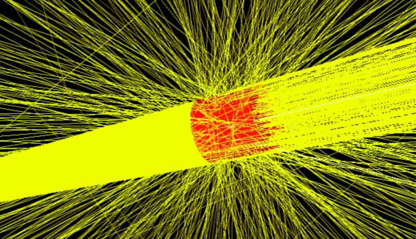

<!-- # 1. -->
<!-- # 2. -->
<!-- # 3. -->
<!-- # 4. -->
<!-- # 5. -->
<!-- # 6. -->
<!-- # 7. -->
<!-- # 8. -->
<!-- # 9. -->
<!-- # 10. -->
<!-- # 11. -->

# 12. Investigate egs++ sources and ausgab scoring objects <!-- omit in toc -->

- [12.1. Introduction](#121-introduction)
- [12.2. Running a simulation using an isotropic point source](#122-running-a-simulation-using-an-isotropic-point-source)
- [12.3. Running the simulation using a collimated source](#123-running-the-simulation-using-a-collimated-source)
- [12.4. Notes on collimated point source normalization](#124-notes-on-collimated-point-source-normalization)



## 12.1. Introduction

A simple geometry (water cylinder) is used to showcase the ability to score dose
with the `egs_dose_scoring` object. Particle tracks can be generated with the
`egs_track_scoring` object. Differences between isotropic and collimated point
sources are discussed.

This lab uses `tutor7pp` as the application, so go in the directory
`$EGS_HOME/tutor7pp` and build the application using `make`:

```bash
cd $EGS_HOME/tutor7pp
make
```

### Preparing the input file

Start by editing a new file to add all the input blocks necessary to run the
simulation. Note that we will be using the bare minimum, but there are many more
options that can be added. In what follows, step-by-step instructions are given
along with different tasks and questions.

### Defining a cylindrical water phantom

The first step is to define the geometry, which must be placed between the
`:start geometry definition:` and `:stop geometry definition:` delimiters in the
input file. First define a cylinder with axis parallel to the $\large z$ axis and 5 cm
radius:

```ruby
:start geometry definition:

  :start geometry:
    library  = egs_cylinders
    type     = EGS_ZCylinders
    name     = the_cylinder
    midpoint = 0 0 0
    radii    = 5
  :stop geometry:

:stop geometry definition:
```

This block defines an *infinitely long* cylinder of 5 cm radius. To produce a
finite cylinder of 10 cm height with its front face at $\large z=0$, first define
bounding planes and then put everything together using an ND geometry. Add these
geometries to the geometry definition block above.

```ruby
:start geometry:
    library    = egs_planes
    type       = EGS_Zplanes
    name       = the_planes
    positions  = 0 10
:stop geometry:

:start geometry:
    library    = egs_ndgeometry
    name       = phantom
    dimensions = the_planes the_cylinder
    :start media input:
        media = H2O521ICRU
    :stop media input:
:stop geometry:
```

Don't forget to tell the `EGS_Application` which geometry is the simulation
geometry:

```ruby
simulation geometry = phantom
```

After placing all these blocks into the geometry definition block, visualize the
geometry with `egs_view` and enjoy the fruit of your hard work:

```bash
egs_view input_file_name
```

## 12.2. Running a simulation using an isotropic point source

The next step is defining the source. Similar to the geometry definition block,
you can define as many sources as desired and then choose the one to use for
your simulation.

Define an isotropic point source of 100 keV photons. This source emits particles
uniformly in all directions. Position the source at −100 cm from the origin on
the negative $\large z$ axis:

```ruby
:start source definition:

   :start source:
      library  = egs_point_source
      name     = the_point_source
      position = 0, 0, -100
      :start spectrum:
          type   = monoenergetic
          energy = 0.1
      :stop spectrum:
      charge = 0
   :stop source:

   simulation source = the_point_source

:stop source definition:
```

### Dose scoring object definition

Score dose using the ausgab object `egs_dose_scoring` which must be defined
between the `:start ausgab object definitions:` delimiter and corresponding
`stop` delimiter:

```ruby
:start ausgab object definition:

    :start ausgab object:
        library     = egs_dose_scoring
        volume      = 785.398163397       # in cm^3
        region dose = yes
        name        = lab7_dose_scoring
    :stop ausgab object:

:stop ausgab object definition:
```

where the volume is provided for the cylindrical phantom to be able to compute
the dose. By default volumes are set to 1 cm$^3$.

### Defining number of histories to run

The last piece of input required for the simulation to run, albeit with
many defaults, is the number of histories to run, `ncase`. This value is
defined in the `run control` block

```ruby
:start run control:
    ncase = 100000
:stop run control:
```

### Running the simulation

To run the simulation type in the following command:

```bash
tutor7pp -i input_file_name -p 521icru
```

Since the output goes to the screen by default, you can *pipe* the output to the
`tee` command to *simultaneously* save the terminal output to a file, for later
analysis of the results:

```bash
tutor7pp -i ... -p ... | tee output_file
```

### Questions

- Compare the energy deposited reported by the `egs_dose_scoring` object and the
  one corresponding to the fraction of energy deposited reported by `tutor7pp`.
  Are they the same ? *Hint:* `egs_dose_scoring` uses the source's
  normalization and $\large E_{\rm tot}$ is the total energy entering the
  phantom, in MeV.

- What is the solid angle $\large \Omega$ subtended by the isotropic source and
  the front face of the geometry ?

- Compute the efficiency $\large \varepsilon$ based on the uncertainty in the
  energy deposited calculated with the `egs_dose_scoring` object and take note
  of it for a later comparison with the collimated source.

## 12.3. Running the simulation using a collimated source

Run the same calculation using a collimated source. Add the following source
definition input to the source definition block

```ruby
:start source:

    library  = egs_collimated_source
    name     = my_collimated_source
    distance = 100

    :start source shape:
         type     = point
         position = 0 0 -100
    :stop source shape:

    :start target shape:
         library = egs_circle
         radius  = 5
    :stop target shape:

    :start spectrum:
          type   = monoenergetic
          energy = 0.1
    :stop spectrum:
    charge = 0

:stop source:
```

Set the simulation source to be `my_collimated_source`. You may want to make a
copy of your input file.

Run the simulation again by issuing the following command (with your choice of
names for the input and output files):

```bash
tutor7pp -i myinput -p 521icru | tee myoutput
```

### Questions

- Compare the *fraction* of energy deposited with the result obtained for the
  isotropic point source. Are they the same ? Explain !

- Compare the energy deposited reported by the `egs_dose_scoring` object with
  the same result obtained earlier for the isotropic point source. Are they the
  same ? Explain ! *Hint:* See
  [Section 12.4](#124-notes-on-collimated-point-source-normalization) below for a
  description on how normalization is done in `EGS_CollimatedSource`.

- Compute the efficiency based on the uncertainty in the energy deposited
  calculated with the `egs_dose_scoring` object and compare it with the
  efficiency of the isotropic source. Do you see any difference ?

### Particles tracks

And now comes the fun part: *particle tracks !*

You will be generating particle tracks with the collimated source. To this end,
you must define an `egs_track_scoring` object between the `ausgab object
definition` delimiters in our input file. Here is an example:

```ruby
:start ausgab object:
    library         = egs_track_scoring
    name            = tracker
    score electrons = no
    score positrons = no
    score photons   = yes
    # start scoring = 0      # default is 0
    # stop  scoring = 1024   # default is 1024
    # buffer size   = 1024   # default is 1024
:stop ausgab object:
```

Tracks are only *scored* inside the geometry, hence particle tracks are only
generated inside the water cylinder. To see the particle track from the source
all the way to the phantom, you need to embed the cylinder and the source inside
another geometrical object.

Use a large box of air as an envelope geometry. Add the following two geometries
in your geometry definition block:

```ruby
:start geometry:
    library  = egs_box
    box size = 500 500 500
    name     = air_box
    :start media input:
        media = AIR521ICRU
    :stop media input:
:stop geometry:

:start geometry:
   library = egs_genvelope
   name    = phantom_in_air
   base geometry = air_box
   inscribed geometries = phantom
:stop geometry:
```

Switch the simulation geometry to be `phantom_in_air`. Run the simulation once
more with 10 times fewer particles. This simulation should take a fraction of a
second and produce the particle track file `myinput.ptracks`. To visualize it
launch `egs_view` with the name of the tracks file:

```bash
egs_view myinput.egsinp myinput.ptracks
```

In the GUI check the box  `Show tracks`  in the Particle Tracks section to
display the tracks. You can also load the track files afterwards as well with
the **Load tracks** button. To see tracks, make the air box transparent or
define a clipping plane. The effect of the collimated source becomes more
apparent as one zooms into the picture. The picture on the cover page of this
Laboratory was produced in exactly this way !

## 12.4. Notes on collimated point source normalization

`EGS_CollimatedSource` uses a variance reduction technique that eliminates the
inefficiency of setting particles into motion that may miss the target. For
details see the appendix in Bielajew, Rogers and Nahum, [*Physics in Medicine and
Biology* **30**, 419–427, 1985.](https://doi.org/10.1088/0031-9155/30/5/005)

Using this approach, one can score a quantity $\large E$ by adding up individual
contributions $\large e_i$, and compute the ratio

$$\large \frac{E}{F} = \frac{\sum\limits_{i=1}^{N_{\Omega}}{w_i' e_i}}{(N_{\Omega}/d^2)}$$

to obtain the quantity $\large E$ per unit fluence $\large F$, with fluence
$\large F$ defined as $\large N_{\Omega}/\Omega/d^2$. $\large N_{\Omega}$ is
the number of particles uniformly emitted into the solid angle $\large \Omega$
and $\large w_i'$ accounts for isotropic emission into the target area A.

The ratio per incident history $\large E/N_{\Omega}$ can be recovered using

$$\large \frac{E}{N_{\Omega}} = \frac{E}{F} \cdot \frac{1}{(\Omega \cdot d^2)} ,$$

from where the normalization to number of uniformly emitted particles in $\large 4\pi$
follows trivially.

---

### [Solutions laboratory 12](Lab-12-solutions.md)
