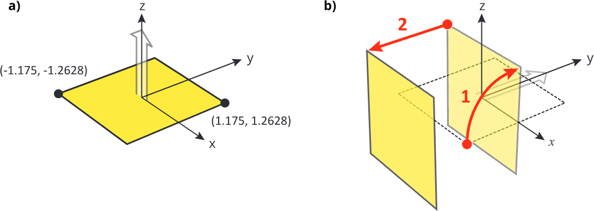

<!-- # 1. -->
<!-- # 2. -->
<!-- # 3. -->
<!-- # 4. -->
<!-- # 5. -->
<!-- # 6. -->
<!-- # 7. -->
<!-- # 8. -->
<!-- # 9. -->
<!-- # 10. -->
<!-- # 11. -->
<!-- # 12. -->

# 13. Calculate chamber correction factors with `egs_chamber` <!-- omit in toc -->

- [13.1. Introduction](#131-introduction)
- [13.2. Define the geometry of the 3C ion chamber](#132-define-the-geometry-of-the-3c-ion-chamber)
- [13.3. Define the source of incident particles](#133-define-the-source-of-incident-particles)
- [13.4. Define the scoring options](#134-define-the-scoring-options)
- [13.5. Define the Monte Carlo transport parameters](#135-define-the-monte-carlo-transport-parameters)
- [13.6. Turn on the production of particle tracks](#136-turn-on-the-production-of-particle-tracks)
- [13.7. Define the run control parameters](#137-define-the-run-control-parameters)
- [13.8. Run the simulation](#138-run-the-simulation)
- [13.9. Run EGSnrc in parallel](#139-run-egsnrc-in-parallel)
- [13.10. Calculate a chamber correction factor](#1310-calculate-a-chamber-correction-factor)


## 13.1. Introduction

In this laboratory you will use the 3C ion chamber egs++ geometry model you
created in a previous session. You are going to run the `egs_chamber`
application to calculate the dose deposited in this chamber.

Go to the `$EGS_HOME/egs_chamber` application directory and, if necessary,
build the application with the `make` command:

```bash
cd $EGS_HOME/egs_chamber
make
```

## 13.2. Define the geometry of the 3C ion chamber

You already built an egs++ geometry input to represent the 3C ion chamber. The
schematic of the chamber is reproduced in the figure below for reference. Adjust
the input file according to the following instructions to get it ready for an
 `egs_chamber` simulation:

1. **Copy or move your 3C input file** to the `egs_chamber` application
   directory.

2. **Center the conestack geometry** on the origin. The axis input should be:\
   `axis = 0 0 -1.26275  0 0 1`.

3. **Define media** in the 3C input file to model air and graphite:

   ```ruby
   :start media definition:

   ae  = 0.521
   ap  = 0.010
   ue  = 2.511
   up  = 2

   :start air:
       density correction file = air_dry_nearsealevel
   :stop air:

   :start graphite:
       density correction file = carbon_graphite_icru90_1.7g_cm3
   :stop graphite:

   :stop media definition:
   ```

4. **Add an extra radius** of 4 cm in every layer, filled with the media
   `vacuum` . This is just to help visualize particle tracks. The `vacuum`
   medium is always defined in egs++. Note that you cannot change the colour of
   `vacuum` : it is transparent. But notice how the new vacuum regions are
   numbered and show up in the region list in the viewer.

5. **Determine the region numbers** of the geometry with `egs_view`, especially
   the regions that correspond to the air cavity (where dose is going to be
   scored).

Your geometry input for the 3C chamber should now look similar to:

```ruby
 :start geometry definition:

     :start geometry:
         name    = 3C
         library = egs_cones
         type    = EGS_ConeStack
         axis    = 0 0 -1.26275 0 0 1

         :start layer:
             thickness    = 0.456
             top radii    = 1.175 4
             bottom radii = 1.175 4
             media = graphite vacuum
         :stop layer:

         :start layer:
             thickness    = 0.4133
             top radii    = 0.7919 1.175 4
             bottom radii = 0.7919 1.175 4
             media = air graphite vacuum
         :stop layer:

         :start layer:
             thickness    = 1.2002
             top radii    = 0.3352 0.7919 1.175 4
             bottom radii = 0.3352 0.7919 1.175 4
             media = graphite air graphite vacuum
         :stop layer:

         :start layer:
             thickness    = 0.456
             top radii    = 1.175 4
             bottom radii = 1.175 4
             media = graphite vacuum
         :stop layer:

     :stop geometry:

     simulation geometry = 3C

 :stop geometry definition:
```

> 
>
> Simplified schematic of NRC's 3C ionization chamber which is Canada's primary
> standard for air kerma in a $\large ^{60}\text{Co}$ beam. Dimensions are in
> centimetres. Drawing is not to scale.

## 13.3. Define the source of incident particles

The input syntax for egs++ sources, along with working examples, are provided in
the [egs++manual](http://nrc-cnrc.github.io/EGSnrc/doc/pirs898/index.html), in the
`Particle sources` section.

Let's consider a rectangular parallel $\large ^{60}\text{Co}$ beam incident on the 3C
chamber from the side. The size of the incident beam is $\large
2\times1.2628$ cm along the $\large z$ direction, and $\large 2\times1.175$ cm
along the transverse direction (covering the whole chamber).

In egs++, you model such an incident beam with an `egs_parallel_beam` source.
For a parallel beam you must define the *shape* of the beam (here a rectangle
shape), which by default lies flat in the *xy*-plane, at $\large z=0$. The input
syntax for the rectangle shape is given in the [egs++manual](http://nrc-cnrc.github.io/EGSnrc/doc/pirs898/index.html).

Define a rectangular field emitting photons along the $\large +z$ direction with
the required dimensions. The rectangle shape is defined by four coordinates,
corresponding to the points $\large (x_ \text{min},y_ \text{min})$ and $(x_
\text{max},y_ \text{max})$ of the rectangle. The source input block is given
below, and the corresponding rectangular field is illustrated in the figure
below (a).

Use the spectrum defined in the `co60.spectrum` file. You must provide the
*full path* of the file, but you can used `$HEN_HOUSE` in your input file.

```ruby
:start source definition:

    :start source:
        name      = my_z_beam           # a name
        library   = egs_parallel_beam   # source library
        direction = 0 0 1               # +z direction
        charge    = 0                   # use photons
        :start shape:                   # shape of beam
            library   = egs_rectangle   # shape library
            rectangle = -1.175 -1.2628 1.175 1.2628
        :stop shape:
        :start spectrum:
            type = tabulated spectrum   # spectrum type
            spectrum file = $HEN_HOUSE/spectra/egsnrc
        :stop spectrum:
    :stop source:

:stop source definition:
```

What you have defined is a source which emits photons from a rectangular field
in the $\large z=0$ plane, in the $\large +z$ direction, as shown in the figure
below (a). This implies that particles would be *born* right in the middle of
the 3C chamber and travel along the central axis of the chamber! But you want
particles to be incident on the chamber from the outside, and hit the chamber on
the side wall, along the $\large +y$ direction.

> 
>
> **a)** The shape of the parallel beam, in the *xy* -plane by default, and with
> particles emitted along $\large +z$. **b)** The rotation of the source to emit
> particles along the $\large +y$ axis, and the translation to move the source
> shape away from the origin.](figures/source)

Hence you first need to *rotate* your source 1.5708 radian (90 degrees)
around the *x*-axis so that photons are emitted along the $\large +y$
direction. You then also have to *translate* the source along $\large -y$ so
that incident particles are *born* outside the 3C chamber. These
transformations are illustrated in the figure (b).

Keep in mind that in an egs++ transformation, **rotation occurs *before*
translation,** regardless of the order of the input.

Create the following `egs_transformed_source` , accordingly, as a second source
object, *inside* the top-level `source definition` input block you defined
above:

```ruby
:start source:
    name        = my_y_beam              # give a name
    library     = egs_transformed_source # load library
    source name = my_z_beam              # source to transform
    :start transformation:
        rotation    = 1.5708 0 0         # 90 degrees around x
        translation = 0 -2 0             # move outside chamber
    :stop transformation:
:stop source:
```

Finally, don't forget to specify the `simulation source` to tell EGSnrc which
source to use in the simulation, in the top-level `source definition` input
 block! You cannot view the source yet in the viewer because particle tracks
are only generated when a simulation runs.

## 13.4. Define the scoring options

The scoring options specify what quantity to calculate, , dose to the air cavity
in this particular case. In `egs_chamber`, the geometry specified in the
scoring section **overrides** the simulation geometry specified in the geometry
section. (This allows `egs_chamber` to transport particles through multiple
geometries in a single simulation, , you can define multiple calculation
geometries.) Enter the following `scoring options` input block:

```ruby
:start scoring options:
    :start calculation geometry:
        geometry name   = 3C      # name of geometry to run
        cavity regions  = 4 9     # all regions for air cavity
        cavity mass     = # write cavity mass in g here...
    :stop calculation geometry:
:stop scoring options:
```

**Remember:** the geometry specified in the `calculation geometry` input block
 ***overrides*** the `simulation geometry` specified in the geometry input block.
 However, the latter is still the one that is loaded in the viewer.

## 13.5. Define the Monte Carlo transport parameters

In this simulation you are using default EGSnrc transport parameters, so you
don't need to enter them explicitly. Nevertheless, it is good practice to
specify at least `ECUT` and `PCUT` to remember later on what was used, and
because they are usually critical parameters in optimizing the simulation. Enter
the following `Monte transport parameter` input block:

```ruby
:start MC transport parameter:
    Global Ecut = 0.521        # cutoff energy for electrons
    Global Pcut = 0.01         # cutoff energy for photons
:stop MC transport parameter:
```

## 13.6. Turn on the production of particle tracks

In production runs you normally don't want to generate particle tracks because
it slows down the simulation, and it might generate huge files! But it is a
good idea to generate tracks at first to ensure that your particle source
behaves as expected. Add the following `ausgab object definition` input block
 to get particle tracks:

```ruby
:start ausgab object definition:
    :start ausgab object:
        name    = my_tracks          # give it a name
        library = egs_track_scoring  # load the proper library
    :stop ausgab object:
:stop ausgab object definition:
```

## 13.7. Define the run control parameters

All that is left to specify is `ncase` , the number of incident particle
histories you want to run. Start with a small number of histories to check that
the simulation runs well. Random number generator seeds are set in the `rng
definition` input block (otherwise default values are used). Enter the
following `run control` qand `rng definition` input blocks:

```ruby
:start run control:
    ncase = 10000
:stop run control:

:start rng definition:
    initial seeds = 193 45   # any two numbers less than 32768
:stop rng definition:
```

## 13.8. Run the simulation

As with any other EGSnrc application, run the simulation by typing the name of
the application, followed by the `-i` flag and the input file name, for example:

```bash
egs_chamber -i 3c.egsinp
```

Open the geometry in `egs_view` and **load the particle tracks** to verify that
particles travel through the geometry as expected; it should look like the image
on the lab cover page.

**Disable** the generation of particle tracks by commenting out the ausgab
definition input block, and **increase** `ncase` to run 10$^7$ histories in
order to reach an uncertainty below 1% on the value of dose to the air cavity.

```ruby
#:start ausgab object definition:   # disable this input block
    :start ausgab object:
        # object definition lines...
    :stop ausgab object:
:stop ausgab object definition:

:start run control:
    ncase = 1e7
:stop run control:
```

### Questions

- What is the dose to the air cavity of the 3C chamber, and its uncertainty?

- How much CPU time would be required to reduce the uncertainty by a factor 10?

- What is the efficiency of this simulation?

- Compare the dose to the one obtained with CAVRZnrc previously. Is it the same?

## 13.9. Run EGSnrc in parallel

If you computer has multiple cores, then you can run EGSnrc *in parallel*,
meaning that your simulation will be split among multiple cores and therefore
run much faster.

First, figure out how many *threads* your computer can run in parallel: issue
the `lscpu` command and look for the `CPU(s)` entry. If the `lscpu` command is
not available, try `less /proc/cpuinfo` and look for the `siblings` entry.

You can spread EGSnrc simulations on multiple threads with the `egs-parallel`
command. Issue that command to see usage and available options. For example, to spread your `egs_chamber`
simulation over $\large n=12$ threads running concurrently, issue the following
command—*note the `'` single quotes enclosing the original simulation command*:

```bash
egs-parallel -n 12 -c 'egs_chamber -i 3c.egsinp'
```

You can use the `--verbose` option to get more information about the parallel
jobs.
Give it a try! Note that for parallel simulations, the output is ***not echoed
to the terminal.*** It is written in a file with the `.egslog` extension (so
`3c.egslog` in this example).

Monte Carlo is typically *pleasingly parallel* algorithm, meaning that all
histories can be simulated independently from each other; threads don't have to
communicate during the simulation. This is ideal for parallelization, and the
simulation speed up is very nearly $\large n$. A simulation which takes 1 hour
on a single thread will run in 5 minutes on 12 cores!

### Questions

- How does the efficiency change when running your simulation on a single thread
  versus 10 threads?

- Is the calculated dose numerically the same when running on a single thread or
  multiple threads (using the same number of histories and the same random
  seeds)?

- Find the optimal number of threads. Try to run with more threads than are
  available on your machine. What happens? *Hint:* use the `--verbose` option to
  investigate.

## 13.10. Calculate a chamber correction factor

**Consider this scenario:** another metrology institute has replicated your 3C
ion chamber, but decided to manufacture it out of another material, say
aluminum, instead of graphite.

You want to compare measurements with this other lab, but you have to account
for the chamber wall material difference between the ion chambers: you have to
calculate a *correction factor* that allows you to take into account the the
wall material difference comparing dose measurements.

The idea is to run two simulations, one with the original graphite wall chamber,
and another where you change the wall material everywhere to aluminum.

Adjust the input file to change the 3C chamber wall material to aliminum (which
has to be defined as a new medium), or better yet: define a second geometry in
the same file with aluminum walls.

Run the simulation again. Note the new value of dose to the air cavity in this
case.

### Questions

- What is the dose to the air cavity in the aluminum chamber, and its
  uncertainty?

- Is it different from the dose in a graphite chamber (considering the
  uncertainty)?

- What is the calculated correction factor for dose between a graphite 3C
  chamber and an aluminum 3C chamber?

- Repeat the simulation for a PMMA chamber, and answer the same questions.

---

### [Solutions laboratory 13](Lab-13-solutions.md)
