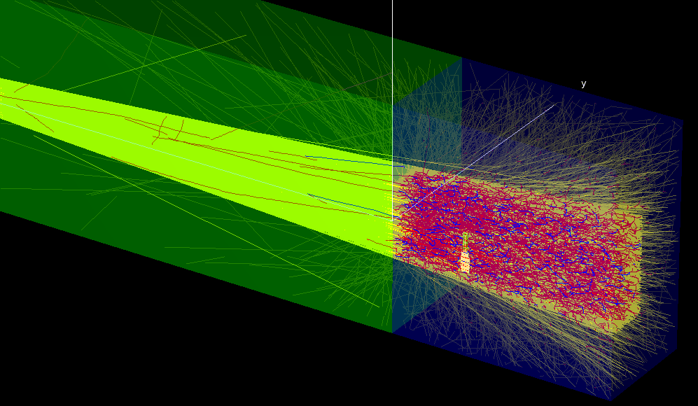
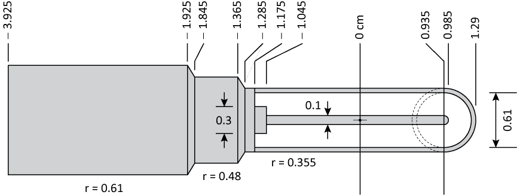
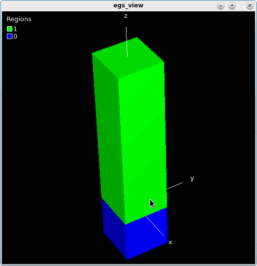
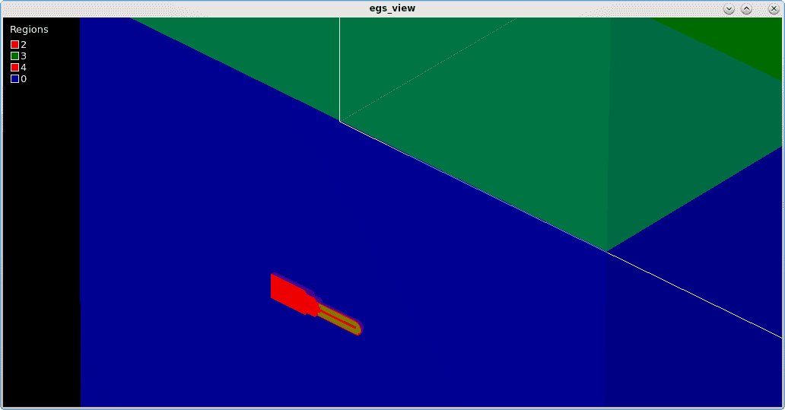
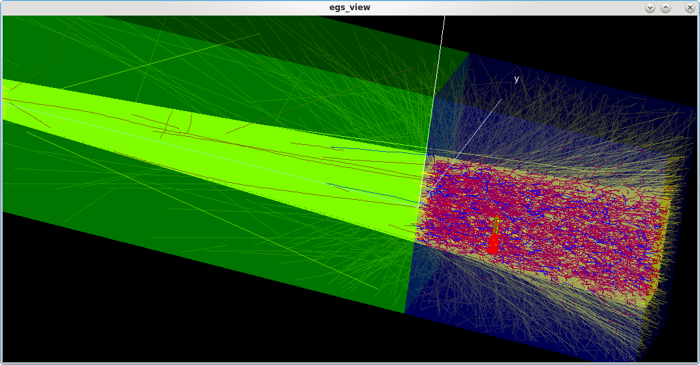
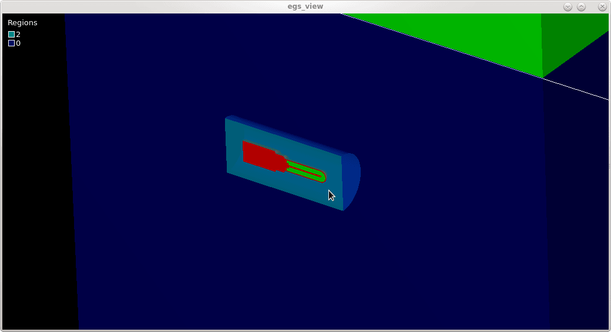

<!-- # 1. -->
<!-- # 2. -->
<!-- # 3. -->
<!-- # 4. -->
<!-- # 5. -->
<!-- # 6. -->
<!-- # 7. -->
<!-- # 8. -->
<!-- # 9. -->
<!-- # 10. -->
<!-- # 11. -->
<!-- # 12. -->
<!-- # 13. -->

# 14. Variance reduction techniques with egs_chamber <!-- omit in toc -->

- [14.1. Introduction](#141-introduction)
- [14.2. Define the geometry for the Exradin A12 chamber](#142-define-the-geometry-for-the-exradin-a12-chamber)
- [14.3. Define the geometry for the water phantom](#143-define-the-geometry-for-the-water-phantom)
- [14.4. Inscribe the chamber inside the water phantom](#144-inscribe-the-chamber-inside-the-water-phantom)
- [14.5. Define the particle source](#145-define-the-particle-source)
- [14.6. Define the scoring options](#146-define-the-scoring-options)
- [14.7. Define transport parameters, media, and tracks](#147-define-transport-parameters-media-and-tracks)
- [14.8. Run the simulation](#148-run-the-simulation)
- [14.9. Implement range-based Russian roulette](#149-implement-range-based-russian-roulette)
- [14.10. Implement photon cross-section enhancement](#1410-implement-photon-cross-section-enhancement)



## 14.1. Introduction

In this laboratory we explore variance reduction techniques available in
`egs_chamber` for speeding up calculations of ionization chambers. To
this end, you will use a model of an Exradin A12 detector in a water
phantom, irradiated by a 6 MeV photon point source located 100 cm above
from the water surface.

## 14.2. Define the geometry for the Exradin A12 chamber

Start from the A12 chamber model you built in a previous session. The chamber
specifications are reproduced in Figure 10.1 for reference. Recall that the
chamber is modelled with a conestack (for the chamber body) and a set of spheres
(for the chamber tip), joined together in a cd geometry.

Load the chamber geometry in  `egs_view`  and ensure that the chamber is
aligned along the $\large x$ axis and centred at the origin.

> 
>
> **Figure 10.1** Simplified schematic of an Exradin A12 thimble chamber, based
on information from the manufacturer’s product brochure. All units are in
centimetres. Radial dimensions are given, as well as the position of the various
points along the chamber’s axis (with the centroid of the collecting volume at
0 cm). The central electrode, the thimble shell and the chamber body are made of
C552 plastic. The thimble shell is 0.5 mm thick.

## 14.3. Define the geometry for the water phantom

Define a 30 cm $\large\times$ 30 cm $\large\times$ 30 cm water phantom
with a long column of air above it to model a typical chamber
calibration setup. To this end, create very long columns of water and
air with  `egs_box`  geometries along the $\large z$ axis and then "chop" them
with a cd geometry based on three $\large z$ planes located at −30, 0,
and 110 cm, as listed below. The `# ...` in the code examples are are placeholders
meant to be replaced by the appropriate content.

```ruby
### long column of water
:start geometry:
    name     = water_column
    library  = egs_box
    box size = 30 30 1000
    :start media input:
        media = water
    :stop media input:
:stop geometry:

### long column of air
:start geometry:
    name     = air_column
    library  = egs_box
    box size = 30 30 1000
    :start media input:
        media = air
    :stop media input:
:stop geometry:

### define base planes for phantom cd geometry
:start geometry:
    name    = cd_planes
    library = egs_planes
    type    = EGS_Zplanes
    positions = # ...
:stop geometry:

### put everything together using a cd geometry
:start geometry:
    name    = phantom
    library = egs_cdgeometry
    base geometry = cd_planes
    set geometry  = # ...
    set geometry  = # ...
:stop geometry:
```

Load the  `phantom`  geometry in the viewer; it should look similar to
Figure 10.2.

> 
>
> **Figure 10.2** The water phantom and the air above, built from
long columns of air and water, joined into a cd geometry.

## 14.4. Inscribe the chamber inside the water phantom

Place the chamber inside the phantom: use the phantom geometry as an envelope
and *inscribe* the chamber in the envelope. The chamber should be located 10 cm
below the surface, so you’ll need to adjust the chamber position accordingly:
a) change the position of the midpoint of the sphere that defines the chamber tip;
and b) change the position of the chamber body conestack.

Put the chamber inside the phantom geometry with an envelope:

```ruby
:start geometry:
    name    = chamber@10cm
    library = egs_genvelope
    base geometry = # ...
    inscribed geometries = # ...
:stop geometry:
```

Change the  `simulation geometry`  input to load the  `chamber@10cm`
geometry in the viewer. It should now look similar to
Figure 10.3 (using a clipping plane).

> 
>
> **Figure 10.3** A cutaway view of the A12 ionization chamber inscribed insidze
the water phantom used as an envelope geometry.

## 14.5. Define the particle source

Consider a typical calibration setup involving a 6 MeV photon point source
located 100 cm above the water surface, collimated to a 10 cm $\large\times$ 10cm
field at the origin:

```ruby
:start source definition:

    :start source:
        name      = my_source                  # give it a name
        library   = egs_collimated_source      # source library
        charge    = 0

        ### point source 100 cm away on the +z axis
        :start source shape:
            type     = point
            position = # ...
        :stop source shape:

        ### collimation to 10x10 field on phantom surface (z = 0)
        :start target shape:
            library   = egs_rectangle
            rectangle = # ...
        :stop target shape:

        ### monoenergetic 6 MeV spectrum
        :start spectrum:
            type   = monoenergetic
            energy = # ...
        :stop spectrum:

    :stop source:

    ### use this source in the simulation
    simulation source = my_source

:stop source definition:
```

## 14.6. Define the scoring options

The scoring options define the actual calculation geometry (which completely
*overrides* the simulation geometry, the latter only specifying the viewer
geometry). Use the `chamber@10cm` geometry, which is the complete
chamber-in-phantom model at this point.

Specify the regions where you want to score the dose. Look at the
geometry in the viewer to determine the region numbers which correspond
to the air cavity, and enter them as a list of numbers in the
`cavity regions` input.

You must also compute the volume of the entire air cavity and multiply
that by the air density (0.0012048 g/cm³) to determine the cavity
mass, in grams. Enter this value in the  `cavity mass`  input.

```ruby
:start scoring options:

    :start calculation geometry:
        geometry name   = chamber@10cm
        cavity regions  = # ... list of cavity regions
        cavity mass     = # ... mass of the cavity, in grams
        cavity geometry = chamber@10cm
    :stop calculation geometry:

:stop scoring options:
```

### Questions

- What region numbers correspond to the A12 air cavity?

- What is the overall mass of the air cavity, in grams?

## 14.7. Define transport parameters, media, and tracks

Use default Monte Carlo transport parameters, request 10⁶ histories,
and pick random number seeds. Ensure all media names are defined in the
`media definition` input block. Add an `ausgab object` input block to
score up to 10000 tracks.

```ruby
### run control
:start run control:
    ncase = 1e6
:stop run control:

### random number generator
:start rng definition:
    initial seeds = 29 3871
:stop rng definition
```

```ruby
### MC transport parameters
:start MC transport parameter:
    Global Ecut = 0.521
    Global Pcut = 0.010
:stop MC transport parameter:

### media
:start media definition:

    ### cutoff energies
    ae  = 0.521
    ap  = 0.010
    ue  = 50.511
    up  = 50

    ### water
    :start water:
        density correction file = water_liquid
    :stop water:

    # ... define media for air and c552 as well

:stop media definition:
```

```ruby
### particle tracks
:start ausgab object definition:

    :start ausgab object:
        name         = my_tracks
        library      = egs_track_scoring
        stop scoring = 10000
    :stop ausgab object:

:stop ausgab object definition:
```

## 14.8. Run the simulation

If you haven't done so previously, you will need to compile `egs_chamber`.
Once an application has been compiled, it doesn't need to be compiled again
(unless the source code is changed). On linux, to compile `egs_chamber` use:

```bash
cd $EGS_HOME/egs_chamber
make
```

You are finally ready to run the simulation:

```bash
egs_chamber -i a12.egsinp
```

Open the geometry in the viewer, and load the particle tracks. After
applying a clipping plane you should be able to recover a
view similar to the one shown in Figure 10.4.

> 
>
> **Figure 10.4** The result of the A12 chamber simulation with tracks loaded
(using clipping plane). Photons are shown in yellow, electrons in red and
positrons in blue. Note how many electrons are being transported far away from
the scoring regions!

### Questions

- What is the dose in the chamber cavity, and its uncertainty?

- What is the efficiency of the calculation?

- How much time would it take to compute the dose to 1% accuracy?

## 14.9. Implement range-based Russian roulette

You are now going to improve the efficiency of the simulation with
variance reduction techniques. First define a new cylindrical geometry
(using a conestack for example) to act as the *cavity* geometry. This is
**not** going to be included in the simulation *world*; rather, it will
be used by the Russian roulette algorithm to determine if an electron is
within range of the scoring regions. The cavity geometry should be
simple, but enclose all scoring regions. Add it somewhere in your
`geometry definition` input block:

```ruby
:start geometry:
    ### cylinder which enclose the entire chamber cavity
    name    = rr_cavity@10cm
    library = egs_cones
    type    = EGS_ConeStack
    axis    = 1.3 0 -10 -1 0 0
    :start layer:
        thickness    = 2.5
        top radii    = 0.32
        bottom radii = 0.32
        media        = air
    :stop layer:
:stop geometry:
```

Check the dimensions of this simple conestack cylinder: it is just large enough
to contain *at least* all the air cavity of the chamber. Next, add the following
variance reduction input block to subject electrons to Russian roulette if their
CSDA range is not sufficient to reach the cavity geometry you just defined.

```ruby
:start variance reduction:

    :start range rejection:
        rejection       = 2               # 1 / (survival probability)
        Esave           = 0.521           # ECUT implies true VRT
        cavity geometry = rr_cavity@10cm  # geometry for range
        rejection range medium = water    # medium for range
    :stop range rejection:

:stop variance reduction:
```

The input `rejection = 2` means that electrons that are far away from
the cavity should *survive* with a probability of 0.5 (and the survivors
have their statistical weight increased by a factor 2 to leave the
physics unaffected overall). The `rejection range medium` is the medium with the longest electron
mean free path outside the cavity geometry, here water. If this input is
missing, then range is calculated on a region-by-region basis, which is
less efficient.

Finally, specify the cavity geometry in the calculation geometry
*again*, as it overrides the one from the variance rejection input block
(just like the calculation geometry overrides the viewer geometry).
Also, comment out the particle tracks ausgab object (particle tracks
don’t work well with variance reduction).

```ruby
:start calculation geometry:
    geometry name   = chamber@10cm
    cavity regions  = 3 6 24
    cavity mass     = 0.0007844
    cavity geometry = rr_cavity@10cm   # for range calculation
:stop calculation geometry:
```

### Questions

- Run the simulation for `rejection = 2`, and compare the dose, uncertainty and
efficiency to previous results. Is the simulation more *efficient* overall ?

- Explore different values of the rejection parameter: 2, 4, 8, 16, etc. What is
the optimal rejection value for this simulation ?

## 14.10. Implement photon cross-section enhancement

Range-based Russian roulette reduces the number of electrons far away
from the scoring region, i.e., those unlikely to contribute to the cavity
dose. Photon cross-section enhancement (XCSE), conversely, *increases*
the number of electrons most likely to contribute to dose, near the
cavity.

First, add a layer of water all around your chamber geometry, so that
you can specify where to enhance the photon cross section. You can
achieve this by inscribing the A12 chamber inside a simple water
cylinder, before inscribing this cylinder in the phantom:

```ruby
### define an xcse water shell
:start geometry:
    name    = xcse
    library = egs_cones
    type    = EGS_ConeStack
    axis    = 2.3 0 -10 -1 0 0
    :start layer:
        thickness    = 7.3
        top radii    = 1.6
        bottom radii = 1.6
        media        = water_xcse
    :stop layer:
:stop geometry:

### inscribe chamber inside the xcse shell
:start geometry:
    name    = chamber_in_xcse
    library = egs_genvelope
    base geometry = xcse
    inscribed geometries = chamber
:stop geometry:

### inscribe chamber_in_xcse inside the phantom
:start geometry:
    name    = chamber@10cm
    library = egs_genvelope
    base geometry = phantom
    inscribed geometries = chamber_in_xcse
:stop geometry:
```

**Tip:** To inspect the XCSE region visually in the viewer, use a different
medium name `water_xcse`  for water in the  `xcse` geometry, to render it in a
different color in the viewer. Of course, this medium must also be defined as
water in the `media definition` section: it's water under a different name!
Hence it show up as a different color in the viewer.

Use the viewer to inspect the geometry; it should look similar to
Figure 10.5.

> 
>
> **Figure 10.5** A view of the xcse shell in which the chamber is now
inscribed, using a clipping plane and a medium named differently for the XCSE
water shell.

### Questions

- What are the regions numbers for the water, the XCSE shell, and the air
cavity?

- Have the cavity regions changed when you added the XCSE shell?

Now, turn on  `cs enhancement = 1`  in the variance reduction block:

```ruby
cs enhancement = 1    # 0 means off, 1 means on
```

Finally, specify in the calculation geometry the regions in which the
cross section should be enhanced, and for each region specify the
enhancement factor. Here we are enhancing electron generation in **all**
regions, *except* in the water (region 0) and in the air above it
(region 1). Set `rejection = 1024`, and keep in mind that the
enhancement factor must be a divisor of, and smaller than, the rejection
number.

```ruby
start calculation geometry:

    geometry name   = chamber@10cm
    cavity regions  = # ... cavity regions
    cavity mass     = # ... cavity mass
    cavity geometry = rr_cavity@10cm

    ### photon cross section enhancement
    enhance regions =  2  3  4  5  6  7  8  9 10 11 12 13 14 15 16 17 18 19 20 21 22 23 24 25 26
    enhancement     =  8  8  8  8  8  8  8  8  8  8  8 8  8  8  8  8  8  8  8  8  8  8   8  8  8

:stop calculation geometry:
```

### Questions

- Run the simulation with an enhancement factor of 8. Compare the dose,
uncertainty and efficiency to previous results. Is the simulation more
*efficient*?

- Explore different values of the enhancement factor: 2, 4, 8, 16, ..., 256.
What is the optimal enhancement factor for this simulation?

- Run the simulation with cross section enhancement, but without
range-based Russian roulette. Which variance reduction technique is more
efficient, in its own right, for this simulation?

- Run the simulation again *without* cross section enhancement, but with
range-based Russian roulette. Do you notice anything strange when you
compare the efficiency with your previous Russian roulette results?
How can that be?

---

### [Solutions laboratory 14](Lab-14-solutions.md)
