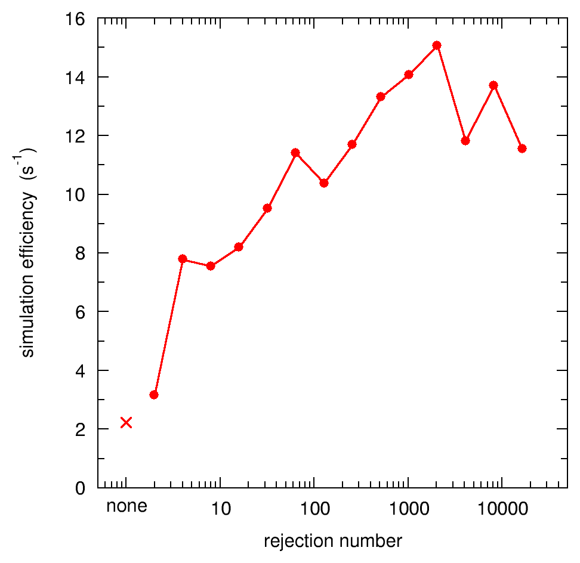
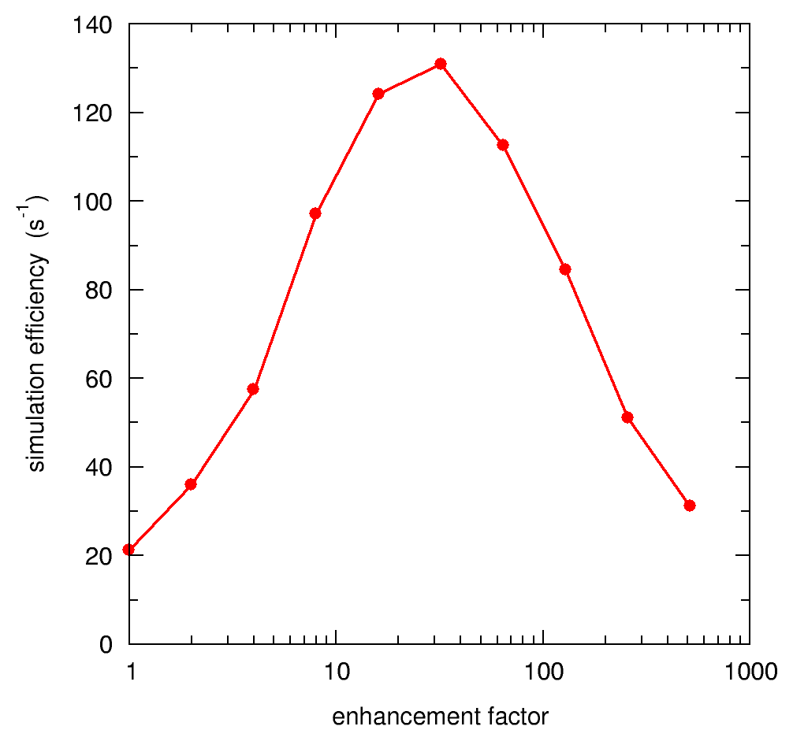

<!-- # 1. -->
<!-- # 2. -->
<!-- # 3. -->
<!-- # 4. -->
<!-- # 5. -->
<!-- # 6. -->
<!-- # 7. -->
<!-- # 8. -->
<!-- # 9. -->
<!-- # 10. -->
<!-- # 11. -->
<!-- # 12. -->
<!-- # 13. -->

# 14. Variance reduction in `egs_chamber`: solutions <!-- omit in toc -->

- [14.6. Define the scoring options](#146-define-the-scoring-options)
- [14.8. Run the simulation](#148-run-the-simulation)
- [14.9. Implement range-based Russian roulette](#149-implement-range-based-russian-roulette)
- [14.10. Implement photon cross-section enhancement](#1410-implement-photon-cross-section-enhancement)

<!-- ## 14.1. -->
<!-- ## 14.2. -->
<!-- ## 14.3. -->
<!-- ## 14.4. -->
<!-- ## 14.5. -->
## 14.6. Define the scoring options

### What region numbers correspond to the A12 air cavity?

> The A12 ionization chamber air cavity is composed of **regions 3, 6 and 24.**

### What is the overall mass of the air cavity, in grams?

> The volume of the entire A12 air cavity (regions 3, 6 and 24) is 0.6511 cm³, and the density of air is 0.0012048 g/cm³, hence the mass of air in the cavity is **0.0007844 grams.** The scoring options input block should therefore look like this:
>
> ```ruby
> :start scoring options:
>
>     :start calculation geometry:
>         geometry name   = chamber@10cm
>         cavity regions  = 3 6 24
>         cavity mass     = 0.0007844
>     :stop calculation geometry:
>
> :stop scoring options:
> ```

<!-- ## 14.7. -->
## 14.8. Run the simulation

### What is the dose in the chamber cavity, and its uncertainty?

> Here is a sample output for the A12 chamber simulation, showing the dose per incident photon and the associated uncertainty:
>
> ```text
> Total cpu time for this run:            62.13 (sec.) 0.0173(hours)
> Histories per hour:                     5.7943e+07
> Number of random numbers used:          1639787994
> Number of electron CH steps:            8.67789e+07
> Number of all electron steps:           9.5435e+07
>
>
>  last case = 1000000 fluence = 1e+06
>
> Geometry                        Cavity dose
> -----------------------------------------------
> chamber@10cm              1.0719e-15 +/- 8.511  %
> ```

### What is the efficiency of the calculation?

> The efficiency of this simulation is $\large \epsilon = \frac{1}{(0.08511)^2(62.13\text{ s})} \approx 2.22\text{ s}^{-1}$.

### How much time would it take to compute the dose to 1% accuracy?

> According to this efficiency, the amount of time that would be required to reach 1% accuracy is $\large t = (\epsilon \sigma^2)^{-1} \approx 4500 \text{ s}$, or about 75 minutes.

## 14.9. Implement range-based Russian roulette

### Is the simulation more *efficient* overall?

> ```text
> Total cpu time for this run:            41.35 (sec.) 0.0115(hours)
> Histories per hour:                     8.70617e+07
> Number of random numbers used:          1004533110
> Number of electron CH steps:            5.06369e+07
> Number of all electron steps:           5.73789e+07
>
>
>  last case = 1000000 fluence = 1e+06
>
> Geometry                        Cavity dose
> -----------------------------------------------
> chamber@10cm              1.1172e-15 +/- 8.739  %
> ```
>
> The dose is consistent with the result without rejection, considering the statistical uncertainty. The uncertainty is about the same as before, however the simulation time has decreased by about 35 %, so overall the simulation efficiency improved: $\large \epsilon \approx 3.17\text{ s}^{-1}$.

### What is the optimal rejection value for this simulation?

> The figure below shows the imulation efficiency as a function of the rejection number, on a semi-log scale. The cross on the left indicates the efficiency when rejection is not used at all. As the rejection number increases, so does the efficiency, up to the optimal rejection number around 2000. At that point the efficiency is almost 7 times higher than without rejection, meaning that simulation time is reduced by a factor 7 to reach the same relative uncertainty.
>
> 
>
> The graph is not smooth because the number of histories is relatively small and the uncertainty high (and so is the uncertainty *on the uncertainty*). Running a large number of histories would reveal a smoother curve, with a more accurate maximum.
>
> Keep in mind that efficiency is *problem-specific:* it depends on the geometry, the energy, the media, etc. Therefore it is good practice to determine the optimal variance reduction parameters for each kind of problem, before launching long sets of simulations. In the current example, that could mean the difference between a 7-day simulation and a 1-day simulation!

## 14.10. Implement photon cross-section enhancement

### What are the regions numbers for the water, the XCSE shell, and the air cavity?

> The water phantom is region number 0, the XCSE shell is region 2, and the air cavity is composed of regions 4, 7 and 25.

### Have the cavity regions changed when you added the XCSE shell?

> Yes, the cavity region numbers have changed because the XCSE shell envelope base geometry gets a region number before the inscribed chamber. Hence, the cavity region numbers have all increased by one.

### Is the simulation more *efficient*?

> Here is a sample output for the A12 chamber simulation, with XCSE turned
on, with an enhancement factor of 8:
>
> ```text
> Total cpu time for this run:            10.87 (sec.) 0.0030(hours)
> Histories per hour:                     3.31187e+08
> Number of random numbers used:          228653214
> Number of electron CH steps:            7.66077e+06
> Number of all electron steps:           1.00394e+07
>
>
>  last case = 1000000 fluence = 1e+06
>
> Geometry                        Cavity dose
> -----------------------------------------------
> chamber@10cm              1.1527e-15 +/- 3.035  %
> ```
>
> The dose value remains statistically consistent with previous results. Both the simulation time and the uncertainty have been reduced: the efficiency has increased dramatically to $\large \epsilon \approx 100\text{ s}^{-1}$, about 50 times the initial efficiency!

### What is the optimal enhancement factor for this simulation?

> The figure below shows the simulation efficiency as a function of the enhancement factor, on a semi-log scale. As the enhancement factor increases, the simulation efficiency goes through a well-defined optimum around 32. Beyond that, the benefit of generating more electrons near the scoring regions is offset by the cost of transporting extra electrons that don’t end up contributing to the dose.
>
> 
>
> The maximum efficiency is almost 60 times higher than the original efficiency. So variance reduction has turned a 2-month simulation into a 1-day simulation!

### Which variance reduction technique is more efficient, in its own right, for this simulation ?

> We already know from above that the efficiency of range-based Russian roulette without XCSE peaks around $\large \epsilon = 15\text{ s}^{-1}$, for a rejection number near 2000.
>
> When running XCSE without rejection, the efficiency is again maximized for an enhancement factor around 32, and the maximum efficiency is about $\large \epsilon = 15\text{ s}^{-1}$.
>
> Hence in this particular case, both methods on their own yield similar efficiency improvements. Both techniques work well together because XCSE generates a lot of extra electrons near the chamber, which are costly to transport, and many of which end up traveling away from the scoring regions. Russian roulette mitigates this cost by *rouletting away* the stray electrons.

### Do you notice anything strange when you compare with previous Russian roulette results?

> When running the simulation again without XCSE (but with Russian roulette), the efficiency is about 50 % higher than with Russian roulette alone. You can see this in the previous figure, where efficiency starts at $\large \epsilon \approx 22\text{ s}^{-1}$ for an enhancement factor of 1, compared to $\large \epsilon \approx 14\text{ s}^{-1}$ in the Russian roulette results graph, for a rejection number of 1. This is strange since the only difference between these simulations is the inclusion of the chamber inside the XCSE water shell.
>
> It turns out that the conestack is slightly inefficient in that particles stop at every conestack layer plane, *even outside the conestack!* Inscribing the conestack inside the water shell limits the extent of these virtual stopping planes outside the chamber, and transport is therefore more efficient.
>
> This goes to show that geometry itself is a considerations when improving simulation efficiency: some geometry constructs are more efficient than others, and picking the optimal one can save additional time.
