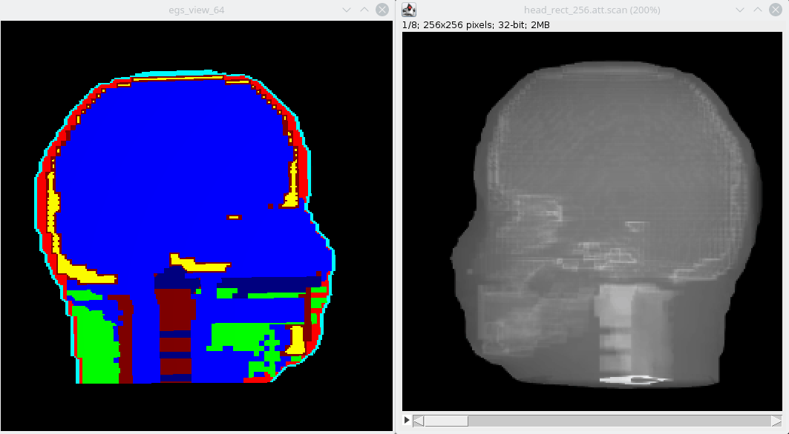

<!-- # 1. -->
<!-- # 2. -->
<!-- # 3. -->
<!-- # 4. -->
<!-- # 5. -->
<!-- # 6. -->
<!-- # 7. -->
<!-- # 8. -->
<!-- # 9. -->
<!-- # 10. -->
<!-- # 11. -->
<!-- # 12. -->
<!-- # 13. -->
<!-- # 14. -->

# 15. Model CBCT scans of a human head using `egs_cbct` <!-- omit in toc -->

- [15.1. Setting the stage](#151-setting-the-stage)
- [15.2. CBCT scan using a monoenergetic photon beam](#152-cbct-scan-using-a-monoenergetic-photon-beam)
- [15.3. CBCT scan using a 120 kVp photon beam](#153-cbct-scan-using-a-120-kvp-photon-beam)



## 15.1. Setting the stage

In this laboratory you will generate Cone Beam CT (CBCT) scan projections of a head
phantom using the Female Adult voXel phantom `FAX06` developed by
Richard Kramer for Monte Carlo calculations in radiation protection
dosimetry[^1]. To use this phantom download the [`Lab-15-supplement.zip`](./assets/Lab-15-supplement.zip). Extract the archive and copy the files therein to your `$EGS_HOME/egs_cbct/` directory. The following files should be in the `egs_cbct` application folder:

```text
fax06_med1.bin       => binary 3D voxel matrix
head.data            => medium name mapping
fax06.pegs4dat       => PEGS4 material data
120kVp_cbct.ensrc    => 120 kV x-ray spectrum
lab-15.1-head.egsinp => example input file
```

[^1]: Kramer, R., et al. *All about FAX: a Female Adult voXel phantom for Monte Carlo calculation in radiation protection dosimetry.* [Physics in Medicine & Biology 49.23, 5203–5216](doi.org/10.1088/0031-9155/49/23/001) (2004)

Go to the `egs_cbct` folder and move the PEGS4 data file `fax06.pegs4dat` to `$EGS_HOME/pegs4/data`
using the commands:

```bash
cd $EGS_HOME/egs_cbct
mv fax06.pegs4dat $EGS_HOME/pegs4/data/
```

Build the application with the `make` command:

```bash
make
```

Use the `envsubst` command to **replace** any occurrence of `${EGS_HOME}` inside
the input file `lab-15.1-head.egsinp` with **your own path** to `$EGS_HOME`:

```bash
envsubst < Lab-15.1-head.egsinp > Lab-15.2-head.egsinp
```
This should produce the file `Lab-15.2-head.egsinp` containing the absolute path
to the files. This file name is simply a suggestion.

**_Feel free to use your own file naming convention!_**

## 15.2. CBCT scan using a monoenergetic photon beam

Usually a CBCT scanner uses a 120 kVp x-ray beam. The average energy of
such beams is around 60 keV. In this part of the Laboratory we ask you
to generate a scatter-free (ideal) head scan using the average energy of
the NRC 120 kVp beam. You can find this value on top of the
`source definition` input block of the input file `Lab-15.2-head.egsinp`.

Read the header of the input file `Lab-15.2-head.egsinp` and the comments next to
the different inputs to understand their meaning and how a CBCT scan can be
generated. You can use the scan names suggested in the input file, but perhaps it
is a good idea to differentiate between the monoenergetic and the
polyenergetic scans.

**Note:** To produce a CBCT scan one needs to obtain what is called a
blank scan, which is a scan in the absence of the phantom. It is a good idea
to make a copy of the initial input file with a different name.
indicating it is a blank scan calculation. For instance you could name it
`blank_256_mono.egsinp` .

To run a simulation issue the following command

```bash
egs_cbct -i input_file_name -p fax06
```

Where `input_file_name` can be substituted with the actual name of your input files.

### Steps

1. Generate a blank scan by following the instructions provided in the
input file for this purpose.

2. Generate a 0° projection scatter-free (ideal) scan making use of the
blank scan obtained in the previous step with the two different sources.
Which source is more efficient?

### Questions

- Visualize the scan using `imageJ` by importing it as a (`little-endian`)
`32-bit real` raw image. How do you reproduce the image on the cover of
this lab?

- Change the `calculation type` in the `scoring options` input block
from `ray-tracing` to `planar`. Repeat the calculation and extract the
calculation efficiency for the ideal scan from the screen output.
How much more inefficient is the `planar` calculation of the ideal scan?
Why?

- In the above calculation how much more inefficient is the scatter calculation?

- Reset the calculation type to `ray-tracing` and figure out
how to produce additional projections and visualize the full
scan using `imageJ` as a rotating 3D phantom!

## 15.3. CBCT scan using a 120 kVp photon beam

Generate a 0° scatter-free projection of the head phantom using an NRC 120 kVp
spectrum and compare it with the same projection for the monoenergetic case. The
`ImageJ` software can be quite handy for such comparisons!

You will need to edit your input file and find the input block defining
the source particle energy and switch from a monoenergetic beam to using
the EGSnrc spectrum file `120kVp_cbct.ensrc`. This file can be found in
the `egs_cbct` folder. Don’t forget to update the `spectrum file` input
key with the full path to the location of this file.

**Attention:** You should recalculate the blank scan as they are not the
same!

### Questions

- Is there a difference in calculation time between the monoenergetic and
the polyenergetic beams? How about efficiency?

- Do you see a qualitative or quantitative difference in the scans ? Use
`imageJ` to select a very narrow rectangular region on the projection
and use the option to plot a live profile from the `Analyze` menu item.

- Change the `calculation type` in the `scoring options` input block
from `ray-tracing` to `planar`. Repeat the calculation and extract the
calculation efficiency for the ideal and the scatter scan from the
screen output. How much more inefficient is the scatter calculation?

---

### [Solutions laboratory 15](Lab-15-solutions.md)
