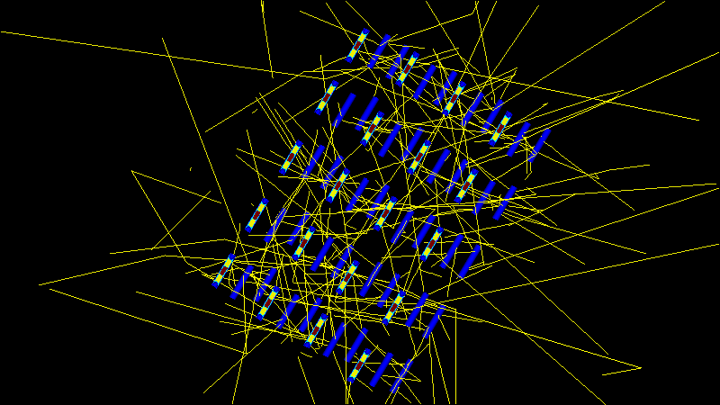

# 16. Model an LDR brachytherapy treatment with `egs_brachy`

- [16.1. Installation](#161-Installation)
- [16.2. LDR prostate brachytherapy with the TG-43 approach](#162-ldr-prostate-brachytherapy-with-the-tg-43-approach)
- [16.3. LDR prostate brachytherapy in an idealized phantom](#163-ldr-prostate-brachytherapy-in-an-idealized-phantom)
- [16.4. Switch back to the develop branch](#164-switch-back-to-the-develop-branch)




## 16.1. Installation

In this Laboratory, you will use the `egs_brachy`, application to simulate low dose-rate (LDR) prostate brachytherapy treatment. You will compare full Monte Carlo simulations to simplified TG-43-like simulations.

To install `egs_brachy` when you already have EGSnrc installed, execute the following commands:
```ruby
cd $HEN_HOUSE
git remote add clrp https://github.com/clrp-code/EGSnrc_CLRP.git
git fetch clrp
git checkout egs_brachy
git submodule update --init --recursive
```

Next, the following environment variables must be set as empty. If using the bash shell:
```ruby
unset HEN_HOUSE EGS_HOME EGS_CONFIG
```

or if using the tcsh shell:
```ruby
unsetenv HEN_HOUSE EGS_HOME EGS_CONFIG
```

From the EGSnrc directory, issue the following command:
```ruby
HEN_HOUSE/scripts/configure.expect egs-brachy 3
```
The script will output the three environment variables that need to be set (`$EGS_HOME` etc.). These statements need to be set in your ~/.bashrc (or .zshrc, .cshrc, .profile) file.

After making changes in `~/.bashrc`, either start a new terminal, or use `source ~/.bashrc` to get the changes.

Recompile egs_view, using:
```ruby
cd $HEN_HOUSE/egs++/view
make clean; make -j
```

Next, if not already done, copy the `egs_brachy` files from the `$HEN_HOUSE` to your `$EGS_HOME` area and compile everything:
```ruby
  cd $EGS_HOME
  mkdir -p egs_brachy
  cd egs_brachy
  cp -pr $HEN_HOUSE/user_codes/egs_brachy/egs_brachy/* .
  make
```

A more detailed description of `egs_brachy` installation is provided in section 3.2 of the manual, found at https://clrp-code.github.io/egs_brachy/pdf/egs_brachy_user_manual.pdf


## 16.2 LDR prostate brachytherapy with the TG-43 approach
In this section we will simulate 100 $^{103}\text{Pd}$ seeds in a large water phantom. We will score dose in a small target volume made of 2 $\text{mm}^3$ water voxels.

**Define the geometry**
- Look in the `lib/geometry/phantoms`, folder inside the main `egs_brachy`, directory and find a $30\times30\times30 \text{cm}^3$ box of water that will hold the scoring phantom and the seeds.
-  Use the `egs_glib`, geometry library to include this water box in your input file geometry definition block.

```ruby
:start geometry:
    name = box
    library = egs_glib
    include file = lib/geometry/phantoms/30cmx30cmx30cm_box_xyz_water.geom
:stop geometry:
```

-  Do the same for the phantom called `ptv_3.4cmx2.8cmx3.8cm_2mm_xyz_water`. This phantom will be used as your scoring phantom.
-  Add the $^{103}\text{Pd}$ TheraSeed 200 source geometry definition to your input file. Look under `lib/geometry/sources`.
-  You currently have a single copy of the seed in your simulation. Use the library  `egs_autoenvelope` to inscribe multiple copies of the seed in the scoring phantom. Since we want to run a TG-43-like simulation, we need to specify the type of the envelope as `EGS_ASwitchedEnvelope`, which will remove interseed effects. Use the file `100seeds_grid_5x7mmx4x7mmx5x8mm_0.5mm_perturb_in_z` to specify the location of the seeds. You can find this file under `lib/geometry/transformations`. This special type of envelope geometry also requires a three-dimensional shape within which it will use a Monte Carlo method to discover which regions of the base geometry contains inscribed geometries. A `boundary.shape` is available for this purpose along with the seed geometry definition in `lib/geometry/sources`.

The following files are found in `lib/geometry/sources/Pd103_LDR/TheraSeed_200/`:
- `TheraSeed_200.geom`: geometry definition of the seed
- `TheraSeed_200_wrapped.geom`: includes a cylinder slightly larger than the seed to prevent geometry errors that may occur due to seed and voxel boundaries that overlap.
- `TheraSeed_200.shape`: defines where the particles should be emitted from for the source definition.
- `boundary.shape`: defines a volume slightly larger than seed (a simple cylinder) used for region discovery and volume correction.

```ruby
:start geometry:
    name = phantom_and_seeds
    library = egs_autoenvelope
    type = EGS_ASwitchedEnvelope 
    base geometry = phantom

    :start inscribed geometry:
        inscribed geometry name = seed

        :start transformations:
            include file = lib/geometry/transformations/100seeds_grid_5x7mmx4x7mmx5x8mm_0.5mm_perturb_in_z
        :stop transformations:

        :start region discovery:
            action = discover
            density of random points (cm^-3) = 1E8
            include file = lib/geometry/sources/Pd103_LDR/TheraSeed_200/boundary.shape
        :stop region discovery:
    :stop inscribed geometry:
:stop geometry:
```

-  Inscribe the autoenvelope geometry into the large water box. This composite geometry will be your final simulation geometry.
-  Finally, `egs_brachy` needs to know which geometries are phantoms, sources, envelopes (only if `EGS_ASwitchedEnvelope` is used), and simulation geometries.

```ruby
source geometries = seed
phantom geometries = phantom
source envelope geometry = phantom_and_seeds
simulation geometry = final
```

Your geometry definition input block should look as follows:

```ruby
:start geometry definition:
    :start geometry:
        name = box
        library = egs_glib
        include file = lib/geometry/phantoms/30cmx30cmx30cm_box_xyz_water.geom
    :stop geometry:

    :start geometry:
        name = phantom
        library = egs_glib
        include file = lib/geometry/phantoms/ptv_3.4cmx2.8cmx3.8cm_2mm_xyz_water.geom
    :stop geometry:

    :start geometry:
        name = seed
        library = egs_glib
        include file = lib/geometry/sources/Pd103_LDR/TheraSeed_200/TheraSeed_200.geom
    :stop geometry:

    :start geometry:
        name = phantom_and_seeds
        library = egs_autoenvelope
        type = EGS_ASwitchedEnvelope
        base geometry = phantom

        :start inscribed geometry:
            inscribed geometry name = seed

            :start transformations:
                include file = lib/geometry/transformations/100seeds_grid_5x7mmx4x7mmx5x8mm_0.5mm_perturb_in_z
            :stop transformations:

            :start region discovery:
                action = discover
                density of random points (cm^-3) = 1E8
                include file = lib/geometry/sources/Pd103_LDR/TheraSeed_200/boundary.shape
            :stop region discovery:

        :stop inscribed geometry:
    :stop geometry:

    :start geometry:
        name = final
        library = egs_genvelope
        base geometry = box
        inscribed geometries = phantom_and_seeds
    :stop geometry:

    source geometries = seed
    phantom geometries = phantom
    source envelope geometry = phantom_and_seeds
    simulation geometry = final
:stop geometry definition:
```


**Define the media**
Add a media definition input block and set AE, UE, AP, and UP to 0.512, 2.512, 0.001, and 1.500 MeV respectively. Use an `include file` statement to point to the `material.dat` file in the `lib/media` directory.


**Define the volume correction routines**
The 100 seeds occupy space within our scoring phantom. To get an accurate dose in voxels that have overlapping seed geometries, we need to correct the volume of those voxels. The following input block will correct the volume of all voxels within the boundaries of the pre-defined shape. Each source geometry model distributed with `egs_brachy` comes with its pre-defined boundary shape for volume correction purposes.

```ruby
:start volume correction:
    :start source volume correction:
        correction type = correct
        density of random points (cm^-3) = 1E8
        include file = lib/geometry/sources/Pd103_LDR/TheraSeed_200/boundary.shape
    :stop source volume correction:
:stop volume correction:
```

**Define the source**
Define an `egs_isotropic_source` which emits photons only. Include the following file to define the shape of the active element of the seeds: `TheraSeed_200.shape` (again, found with the source geometry definition). 

Define a tabulated spectrum and use the $^{103}\text{Pd}$ NNDC line spectrum included with `egs_brachy` under `lib/spectra`. Finally, define the location of the 100 seeds using the same transformations file used in the geometry input block. Don't forget to specify the `simulation source` input.

```ruby
:start source definition:
    :start source:
        name = TheraSeed
        library = egs_isotropic_source
        charge = 0
        include file = lib/geometry/sources/Pd103_LDR/TheraSeed_200/TheraSeed_200.shape

        :start spectrum:
            type = tabulated spectrum
            spectrum file = lib/spectra/Pd103_NNDC_2.6_line.spectrum
        :stop spectrum:
    :stop source:

    :start transformations:
        include file = lib/geometry/transformations/100seeds_grid_5x7mmx4x7mmx5x8mm_0.5mm_perturb_in_z
    :stop transformations:

    simulation source = TheraSeed
:stop source definition:
```

**Define the scoring options**
By default, `egs_brachy` scores collision kerma using a tracklength estimator which requires mass energy absorption coefficients data. Point `egs_brachy` to the muen data under `lib/muen` and specify that dose should be scored for water. Activate energy deposition (also known as interaction) scoring.

```ruby
:start scoring options:
    muen file = lib/muen/brachy_xcom_1.5MeV.muendat
    muen for media = WATER_0.998
    score energy deposition = yes
:stop scoring options:
```

**Define the Monte Carlo transport parameters**
`egs_brachy` is distributed with various combinations of suggested transport parameters. Use the low energy default by inserting an `include file` statement and pointing to the appropriate file under `lib/transport`.

```ruby
include file = lib/transport/low_energy_default
```

**Define the run control parameters and run modes**
Specify two million (2e6) initial particles in the `run control` input block. In addition, specify `superposition` as the  `run mode` in the `run mode` input block. In superposition mode, only one source geometry will be active at any time, eliminating interseed effects and simulating TG-43 conditions.

```ruby
:start run control:
    ncase = 2e6
:stop run control:

:start run mode:
    run mode = superposition
:stop run mode:
```

**Run the simulation**
Run the simulation in `pegsless` mode by typing the name of the application and specifying the input file with the `-i` option: `egs_brachy -i myinput`.


### Questions
16.2.1  What is the average tracklength dose to the scoring region? What is its uncertainty?

16.2.2  Compare the tracklength dose and its uncertainty to the average energy deposition dose and its uncertainty. What is the relative efficiency of the tracklength dose compared to the energy deposition dose? 

16.2.3  How many particle steps were taken in the source geometry? How many were taken in the phantom?


## 16.3 LDR prostate brachytherapy in an idealized phantom
You will now repeat the previous simulation with a more realistic approach.

-  Replace occurrences of water in your geometry definition by prostate tissue (look in the `lib/geometry/phantoms` folder).
-  Change the scoring medium from water to prostate in the `scoring options` input block.
-  Change the `run mode` to `normal`.
-  Remove the line `type = EGS_ASwitchedEnvelope`, which will change the envelope to a regular 
`egs_autoenvelope`. Also remove the following line, in order to model all 100 seeds concurrently: `source envelope geometry = phantom_and_seeds`.

You will use particle recycling to achieve a similar statistical uncertainty than the previous simulation, but using with much fewer initial histories.

-  Change the number of histories to twenty thousand (2e4).
-  Add a `particle recycling` input block within a `variance reduction` input block. Turn particle recycling on: recycle each particle once and rotate recycled particles:

```ruby
:start variance reduction:
    :start particle recycling:
        times to reuse recycled particles = 1
        rotate recycled particles = yes
    :stop particle recycling:
:stop variance reduction:
```
-  Run the simulation.


### Questions
16.3.1  Compare the average dose and its uncertainty to the previous results. Which dose is smaller?

16.3.2  How many particle steps were taken in the source geometry? How many were taken in the phantom? Compare to the previous simulation.

16.3.3  What is the relative efficiency of this simulation compared to the previous one?

## 17.6. Switch back to the develop branch

The egs_brachy installation also uses a different version of EGSnrc than the rest of this course! While this largely doesn't matter, some of the labs make use of newer features that are not yet included in the egs-brachy branch. For the rest of the labs, make sure to switch back to the `develop` branch, run the configuration script (setting the configuration name as `course` instead of `egs-brachy`), and update the environment variables accordingly (see Lab-01). Then, recompile `egs_view`.

```ruby
HEN_HOUSE/scripts/configure.expect course 3
```

Add the lines at the end of installation to `~/.bashrc`, replacing the old environment variables for `egs-brachy`. For example:

```bash
export EGS_HOME=$HOME/EGSnrc/egs_home/
export EGS_CONFIG=$HOME/EGSnrc/HEN_HOUSE/specs/course.conf
source $HOME/EGSnrc/HEN_HOUSE/scripts/egsnrc_bashrc_additions
```

Recompile `egs_view`:

```ruby
cd $HEN_HOUSE/egs++/view
make clean; make -j
```


