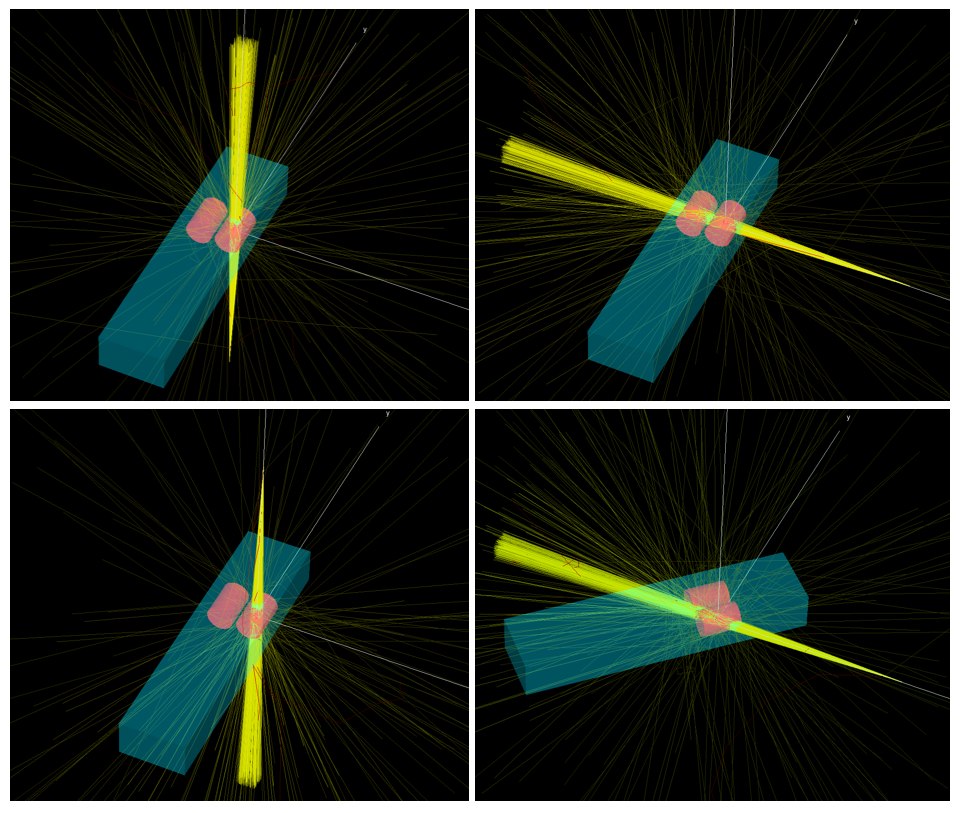

<!-- # 1. -->
<!-- # 2. -->
<!-- # 3. -->
<!-- # 4. -->
<!-- # 5. -->
<!-- # 6. -->
<!-- # 7. -->
<!-- # 8. -->
<!-- # 9. -->
<!-- # 10. -->
<!-- # 11. -->
<!-- # 12. -->
<!-- # 13. -->
<!-- # 14. -->
<!-- # 15. -->
<!-- # 16. -->

# 17. Model dynamic geometries and sources in egs++: solutions <!-- omit in toc -->

- [17.2. Rotate the geometry](#172-rotate-the-geometry)
- [17.3. Rotate the source](#173-rotate-the-source)
- [17.5. Run the simulation](#175-run-the-simulation)

<!-- ## 17.1. -->

## 17.2. Rotate the geometry

### What is the region number of the lung tumour?

> The lung tumour is region 4.

## 17.3. Rotate the source

### What would you change if you wanted to simulate gantry rotation while the beam is on?

> In this lab, we simulate beam delivery with static gantry by specifying no
> change in time index between control points where the gantry angle changes. To
> simulate gantry rotation while the beam is on, both the time index and the
> gantry angle must differ between consecutive control points.

<!-- ## 17.4. -->

## 17.5. Run the simulation

### What is the dose to the lung tumour?

> The dose to the lung tumour is $\large 2.0309 \times 10^{-14} \pm 0.409\%$
> (for $\large 10^7$ histories).

### What is the dose to the lung tumour when the lungs are water?

> The dose to the lung tumour is $\large 1.8130 \times 10^{-14} \pm 0.451\%$
> when the lung tissue is set to water.

### How will lung tumour dose change as a result of this?

> In the water lung case, the tumour dose is $\large \sim10\%$ lower (per history) due
> to the additional attenuation in the relatively high density water. In the
> past, treatment planning systems did not model tissue heterogeneities. So for
> a given prescription, dose to tumour was higher than planned (e.g., prescribe
> 60 Gy but actually get 66 Gy). With modern treatment planning systems,
> heterogeneities are modelled such that the tumour dose reported by the TPS is
> closer to what was prescribed (closer to reality). So, to maintain consistency
> with past outcomes, the prescription dose would need to increase by 10%.

### Which simulation is more efficient?

> For the lung tissue case, the efficiency is 1368 s$^{-1}$. For the water lung
> case, the efficiency is 872 s$^{-1}$. So, the lung tissue case is $\large \sim
> 1.6 \times$ more efficient than in the water lung case. The lung tissue case
> is more efficient due to fewer interactions occurring in the lower density
> lung tissue, and more interactions occurring in the tumour itself (where we
> are scoring dose).

### How would you simulate gantry rotation while the beam is on if the gantry rotates through 0/360 degrees?**

> The `egs_dynamic_source` will sample angles between control points (in cases
> where the time index changes between consecutive control points). Therefore,
> if you have control points <360 and >0 degrees, then you will end up with some
> $\large \sim 180$ degree angles, which you don't want. To fix this, you need
> to add an extra control point at 360 degrees, followed by another control
> point at 0 degrees with no time index change between them.
