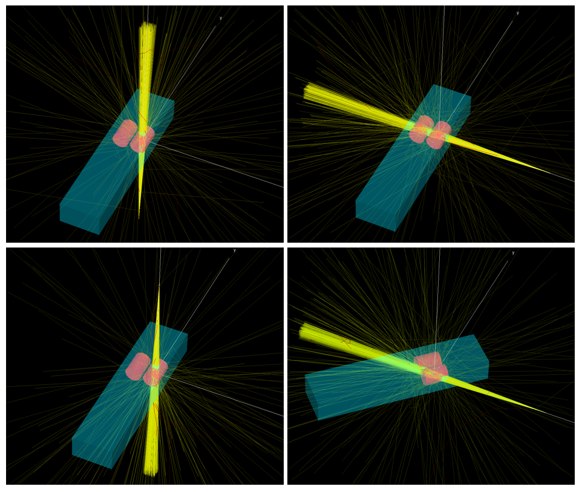

# 17. Dynamic geometries and sources in egs++

- [17.1. Create a simple geometry](#171-create-a-simple-geometry)
- [17.2. Rotate the geometry](#172-rotate-the-geometry)
- [17.3. Rotate the source](#173-rotate-the-source)
- [17.4. Complete the input file](#174-complete-the-input-file)
- [17.5. Run the simulation](#175-run-the-simulation)




## 17.1. Create a simple geometry

We will build a very simple patient model in `egs_chamber`. The body will consist of a large rectangle of water, the lungs will be modelled as two cylinders. One of the lungs will have a small, spherical tumour. We will score dose in the tumour. The x-direction corresponds to right/left, y is superior/inferior, and z is anterior/posterior.

Create a new input file, starting with the body (rectangular box of water):

```ruby
:start geometry definition:
    :start geometry:
        library  = egs_box
        name     = empty_body
        box size = 35 150 20
        :start media input:
            media = water
        :stop media input:
    :stop geometry:
:stop geometry definition:
```

Next, use cone stack geometries to model the lungs as cylinders (20 cm height, 7 cm radius). Choose the axis input parameters so that the centre of the lung is at (8, 30, 0) cm:
```ruby
    :start geometry:
        name    = lung_R
        library = egs_cones
        type    = EGS_ConeStack
        axis    = 8 20 0 0 1 0    # starts at (8, 20, 0) and builds up in +y direction
        :start layer:
            thickness    = 20
            top radii    = 7
            bottom radii = 7
            media        = lung
        :stop layer:
    :stop geometry:
```

Add another similar geometry to define the other lung (`axis` will need to be updated appropriately). Next, define a 2 cm sphere of water centred at (5, 30, 0) cm:
```ruby
    :start geometry:
        name     = tumour
        library  = egs_spheres
        midpoint = 8 30 0
        radii = 2
        :start media input:
            media = water
        :stop media input:
    :stop geometry:
```

Once you have added the sphere, you should have four geometries defined (body, two lungs, one tumour). Use an envelope to inscribe both lungs inside the body:
```ruby
    :start geometry:
        library = egs_genvelope
	name    = body_lungs
	base geometry = empty_body
	inscribed geometries = lung_L lung_R
    :stop geometry:
```

Both lungs can be inscribed at the same time because the inscribed geometries do not overlap with each other. However, the tumour must be inscribed in a separate step because it does overlap one of the lungs. Therefore, use another envelope geometry to inscribe the tumour into the above composite geometry. Once both envelope geometries are done, use a transformation to shift the body so that the lung tumour is at (0,0,0). The origin location corresponds to isocentre in our simulation.
```ruby
    :start geometry:
        name        = body_noRot
        library     = egs_gtransformed
        my geometry = body_noRot_noShift
        :start transformation:
            translation = -8 -30 0   # negative of the lung tumour position!
        :stop transformation:
    :stop geometry:
```

The body is now complete. Use `egs_view` to verify your simulation geometry. You can adjust transparency or use clipping planes to view the different regions. Ensure that the lung tumour is at (0,0,0).

Add a `media definition` input block to define the three media that will be used in this simulation (water, lung, air). We will be simulating a 6 MV photon beam, so the upper energies must be at least that high:
```ruby
:start media definition:

    ae = 0.521
    ap = 0.010
    ue = 6.511
    up = 6

    ### water
    :start water:
        # these files are found in: HEN_HOUSE/pegs4/density_corrections/
        density correction file = water_liquid
    :stop water:

    ### lung
    :start lung:
        density correction file = lung_inflated_icru_1986
    :stop lung:

    ### air
    :start air:
        density correction file = air_dry_nearsealevel
    :stop air:

:stop media definition:
```


## 17.2. Rotate the geometry

In this lab, we want to simulate a four-field lung treatment consisting of three fields delivered with the couch at 0 degrees (gantry angles = 0, 90, 180 degrees), and one field delivered with a 45 degree couch rotation (gantry angle = 90 degrees). Gantry rotation will be modelled using `egs_dynamic_source`, whereas couch (i.e., patient) rotation will be modelled using `egs_dynamic_geometry`. We will work on the `egs_dynamic_geometry` first:
```ruby
    :start geometry:
        name        = body
        library     = egs_dynamic_geometry
        my geometry = body_noRot      # name of existing geometry defined above
        synchronize motion = yes         # so that we can sync with the source!
        :start motion:
            # control point = time(1) xtrans(1) ytrans(1) ztrans(1) xrot(1) yrot(1) zrot(1)
            # units of cm and degrees
            control point 1 = 0.00 0 0 0 0 0 0
            control point 2 = 0.25 0 0 0 0 0 0
            control point 3 = 0.25 0 0 0 0 0 0
            control point 4 = 0.50 0 0 0 0 0 0
            control point 5 = 0.50 0 0 0 0 0 0
            control point 6 = 0.75 0 0 0 0 0 0
            control point 7 = 0.75 0 0 0 0 0 45      # rotation about the z-axis = couch kick!
            control point 8 = 1.00 0 0 0 0 0 45
        :stop motion:
    :stop geometry:
```

We want to synchronize patient motion with source motion, so we specify `synchronize motion = yes`. For the synchronization to work properly, the number of control points and their associated time index will need to match the source definition. We supply a list of eight control points (two per field). Equal beam weighting is achieved by specifying equally-spaced time points. For the first six control points, none of the `egs_dynamic_geometry` translation or rotation parameters are changing. These correspond to control points where only the gantry angle is changing, and gantry rotation will be handled later on using `egs_dynamic_source`. The control point numbers are not required and can be omitted.

Synchronized motion can also be used with `egs_beam_source` where the motion of the geometry in an `egs++` simulation can be synchronized with jaws and/or MLCs components in a BEAMnrc simulation.

Because we are simulating static fields (i.e., no couch or gantry motion while the beam is on), we change control point parameters without incrementing the time index. For example, between control points 6 and 7, the rotation of the patient about the z-axis changes from 0 to 45 degrees while the time index remains at 0.75. Between control points 7 and 8, the time index increases by 0.25 while the z-axis rotation remains at 45 degrees, thus simulating beam delivery with a 45 degree couch rotation. 

It is important to note that egs++ always applies rotations first. Therefore, it would be incorrect to incorporate the (-8, -30, 0) translation into the control point definitions above. 

To help visualize particle tracks, and to provide realistic surroundings for your patient, define a box of air (side length = 250 cm). Use another envelope geometry to place the patient inside the air box. This is the final geometry that we will use to calculate dose.

### Question
17.2.1 What is the region number of the lung tumour? Use `egs_view` to verify your answer.


## 17.3. Rotate the source

In the source definition block, define a collimated source originating from 100 cm away from isocentre = (0,0,0) along the z-axis. The target shape should be defined such that we get a $6\times6$ cm$^2$ square at isocentre. We will use a 6 MV linac photon spectrum that comes with the EGSnrc distribution:
```ruby
    :start source:
        name      = my_source_static
        library   = egs_collimated_source 
        charge    = 0   # photons
        
        ### point source 100 cm away on +z axis, directed in +z direction
        :start source shape: 
            type     = point
            position = 0 0 -100 
        :stop source shape:

        ### collimation to 5x5 cm^2 square field at isocentre
        :start target shape:             
            library   = egs_rectangle
            rectangle = -2.5 -2.5 2.5 2.5
        :stop target shape:
        
        ### 6 MV spectrum
        :start spectrum:
            type = tabulated spectrum
            spectrum file = /Users/patriciaoliver/EGSnrc/HEN_HOUSE/spectra/egsnrc/mohan6.spectrum
        :stop spectrum:
    :stop source:
```

The source that we have defined above is static. We will use `egs_dynamic_source` to make it rotate, to simulation gantry rotation. Add another source within your source definition block:
```ruby
    :start source:
        library = egs_dynamic_source
        name = my_source
        source name = my_source_static     # name of a previously defined source
        synchronize motion = yes           # sync with geometry!
        :start motion:
            # beam centred on tumour, which is at isocentre:
            control point 1 = 0 0 0 0 0 0 0 0.0
            control point 2 = 0 0 0 0 0 0 0 0.25
			etc...
            # Note: same number of CPs as egs_dynamic_geometry, also same time points 
                    # --> necessary for synchronization
        :stop motion:
    :stop source:
```

The format for the ith control point is: `control point i = xiso[i] yiso[i] ziso[i] dsource[i] theta[i] phi[i] phicol[i] time[i]`.  `dsource` is the distance from isocentre to source origin. With no rotations, +ve dsource is along the negative z-axis.`theta` is the angle of rotation of `dsource` about the y-axis (positive values define clockwise rotations relative to the negative z-axis). `Phi` is the angle of rotation of `dsource` about the z-axis (positive values define clockwise rotations relative to the x-axis. `Phicol` is the angle of rotation of the source about negative `dsource` (positive values define clockwise rotations). All values are in cm and degrees.

We define `dsource` = 0 because we already set the source-to-axis distance to 100 cm when we defined the static version of the collimated source. For `egs_dynamic_source`, the transformations are applied in the following order: (1) `dsource` translation, (2) all rotations, (3) isocentre translation.

Complete the definition of all eight control points. Remember that the number of control points and their associated time index will need to match those of the `egs_dynamic_geometry` that we defined earlier. Based on the coordinate system that we have defined for our patient, `theta` corresponds to gantry angle. `Phicol` and `Phi` can remain at zero throughout.

As a final step, define `simulation source = my_source` so that the correct source (the dynamic one) is used in the simulation.

### Question
17.3.1 What would you change if you wanted to simulate gantry rotation while the beam is on?


## 17.4 Complete the input file
Add the other necessary components of the input file: run control, rng definition, scoring options, variance reduction, and MC transport parameters:

```ruby
## Run control
:start run control:
    ncase = 1E7    # use fewer e.g., 1E5 for track generation
:stop run control:
            
## Random numbers
:start rng definition:
	initial seeds = 34 171
:stop rng definition:

## Scoring
:start scoring options:
    :start calculation geometry:
	geometry name = final
	cavity regions = 4
	cavity mass = 1            # not true but we're doing relative comparisons anyway
	cavity geometry = tumour   # for range-based Russian Roulette
    :stop calculation geometry:
:stop scoring options:

## Variance reduction
:start variance reduction:
    cs enhancement = 0       # no XCSE here
    :start range rejection:
        rejection = 32       # survival probability is one over this
        Esave     = 0.521    # no range rej but Russian Roulette for E > Esave
        cavity geometry = tumour             # dummy (see scoring options block above)
        rejection range medium = lung        # should be least dense medium in geom
    :stop range rejection:
:stop variance reduction:
                 
## Transport parameters
:start MC transport parameter:
    Global Ecut = 0.521        # cutoff energy for electrons, incl. rest mass, in MeV
    Global Pcut = 0.01         # cutoff energy for photons, in MeV
:stop MC transport parameter:
                     
## Ausgab objects
## comment this out once you are done with particle tracks
:start ausgab object definition:
   :start ausgab object:
       library = egs_track_scoring
       include time index = yes          ### default
       stop scoring = 20000
   :stop ausgab object:
:stop ausgab object definition:
```

For variance reduction techniques, we will use range-based Russian Roulette with a survival probability of 1/32 (feel free to experiment with other values). Photon cross-section enhancement is not used, although defining a XCSE region surrounding the lung tumour could be useful for improving efficiency.

For particle tracks with dynamic geometries and sources, `include time index = yes` is the default. This allows us to see particle tracks and geometry motion as a function of time in `egs_view`.


## 17.5. Run the simulation

First, run the simulation for a small number of histories (e.g., 1E5) to make sure it is working. View the particle tracks in `egs_view` to confirm that the beam directions and positioning are correct. The beams should all be aimed toward the lung tumour. You can adjust the time index (slider bar or numerical entry) to view certain points in time. The time window input controls the size of the time bin that you are viewing (e.g., set to 1.0 to see all particle tracks at once). The number of time steps can also be adjusted.

Next, run the simulation for a longer number of histories (1E7).

### Question
17.5.1 What is the dose to the lung tumour?

Repeat the simulation with the lungs set to water. Do not change anything else in the input file. 

### Questions
17.5.2 What is the dose to the lung tumour when the lungs are water? You should also change the `rejection range medium` from lung to water.

17.5.3 Imagine that your clinic has switched from using a treatment planning system (TPS) that does not account for tissue heterogeneities to one that does. How will lung tumour dose change as a result of this? Assume that the prescription dose specified in the TPS has not changed.

17.5.4 Which simulation is more efficient?

17.5.5 How would you simulate gantry rotation while the beam is on if the gantry rotates through 0/360 degrees?


