<!-- # 1. -->
<!-- # 2. -->
<!-- # 3. -->
<!-- # 4. -->
<!-- # 5. -->
<!-- # 6. -->
<!-- # 7. -->
<!-- # 8. -->
<!-- # 9. -->
<!-- # 10. -->
<!-- # 11. -->
<!-- # 12. -->
<!-- # 13. -->
<!-- # 14. -->
<!-- # 15. -->
<!-- # 16. -->
<!-- # 17. -->

# 18. Study ionization chamber dose response: solutions <!-- omit in toc -->

- [18.1. Look at the tracks created by a pencil beam](#181-look-at-the-tracks-created-by-a-pencil-beam)
- [18.2. Look at the tracks created by a 10 MeV pencil beam](#182-look-at-the-tracks-created-by-a-10-mev-pencil-beam)
- [18.3. Calculate the dose response functions (DRFs) for the 1  MeV beam](#183-calculate-the-dose-response-functions-drfs-for-the-1--mev-beam)
- [18.4. Calculate the dose response functions (DRFs) for the 10  MeV beam](#184-calculate-the-dose-response-functions-drfs-for-the-10--mev-beam)

## 18.1. Look at the tracks created by a pencil beam

### Answers

1. The amount of scatter is surprising, as it spreads over the whole 100 x 100 x
30 cm³ phantom.

2. The lateral electron range is the maximum distance electrons travel laterally
from the pencil beam, which can be observed on the tracks.

    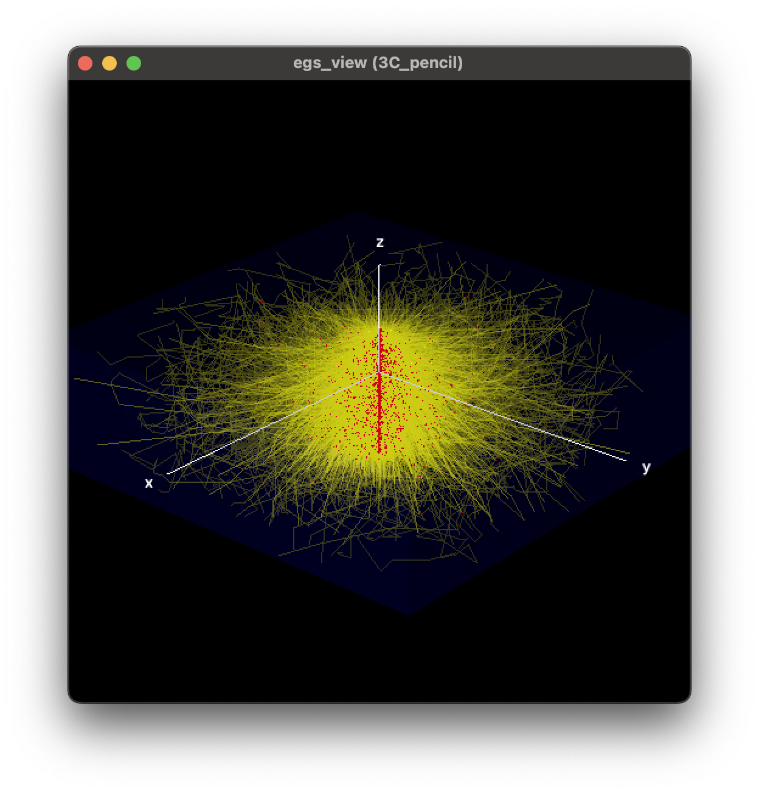
    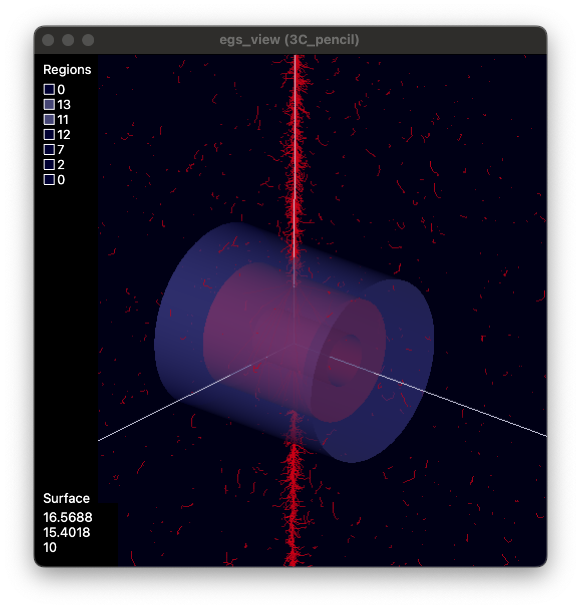

## 18.2. Look at the tracks created by a 10 MeV pencil beam

### Answers

1. The scatter is more forward-peaked, as seen with colors being brighter for
lower angles.

2. The lateral range is larger since the electrons have a higher energy with 10
MeV photons than 1 MeV photons, resulting in a greater range.

3. Positrons are created by pair production where the photon’s energy splits
between the electron and positron. Thus, positrons will have a smaller average
kinetic energy than electrons, which can be set in motion by Compton scattering
with a higher mean energy transfer.

    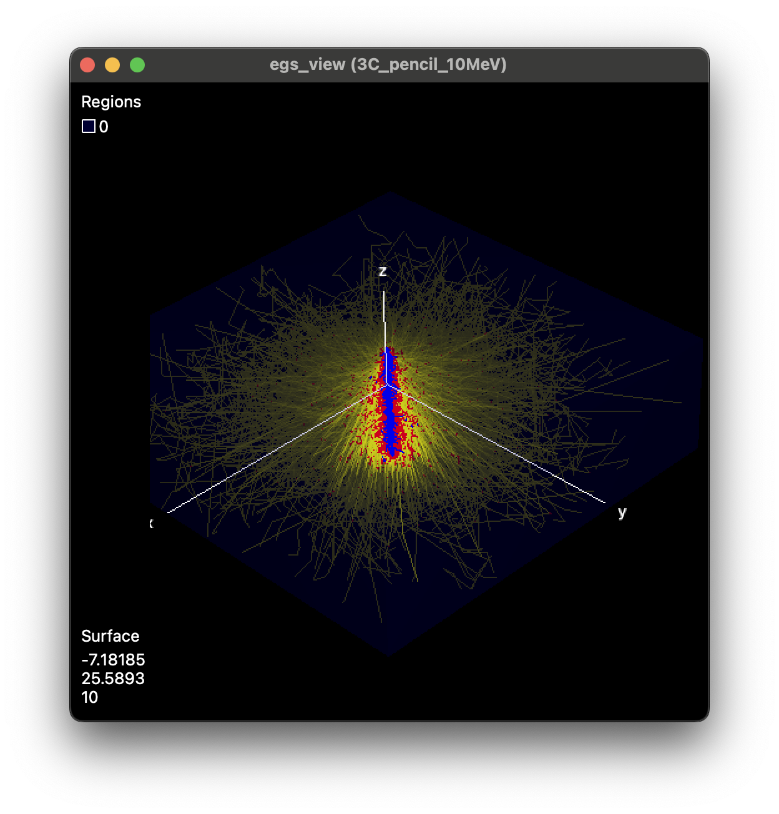
    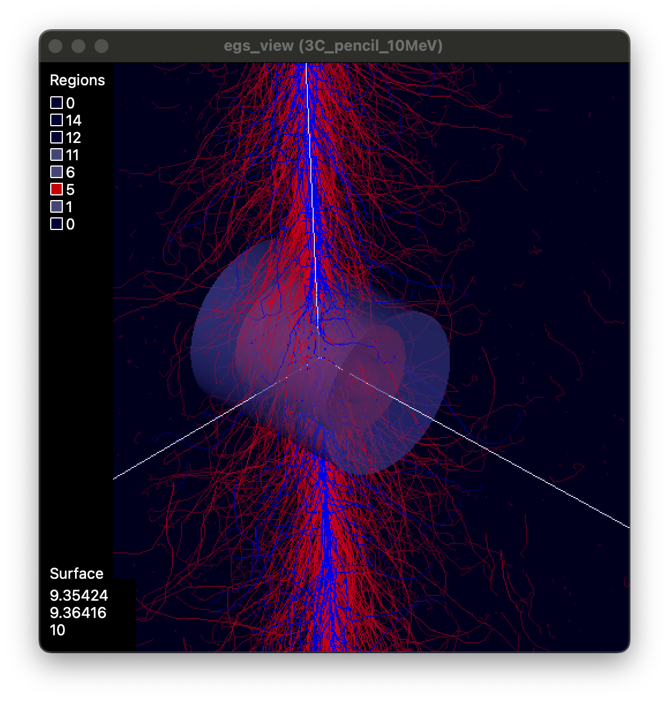

## 18.3. Calculate the dose response functions (DRFs) for the 1  MeV beam

### Answers

1. For the x direction, the water DRF aligns with expectations. For the DRF in
the air cavity, we observe peaks at the edge of the cavity. Due to the central
electrode, peaks also appear at the edge of that component, and at x = 0, the
DRF is a local minimum because of photon attenuation in the thicker part of the
electrode. Where the photon does not cross the electrode, the DRF is lower in
air than in water, as expected.

2. For the y direction, the water DRF aligns with expectations. For the air
cavity, peaks appear near the interfaces between graphite and air, on the side
of the graphite. Where the photon does not cross the electrode, the DRF is lower
in air than in water, as expected.

3. The perturbation function has non-zero values extending within about a 2x2
cm² area.

    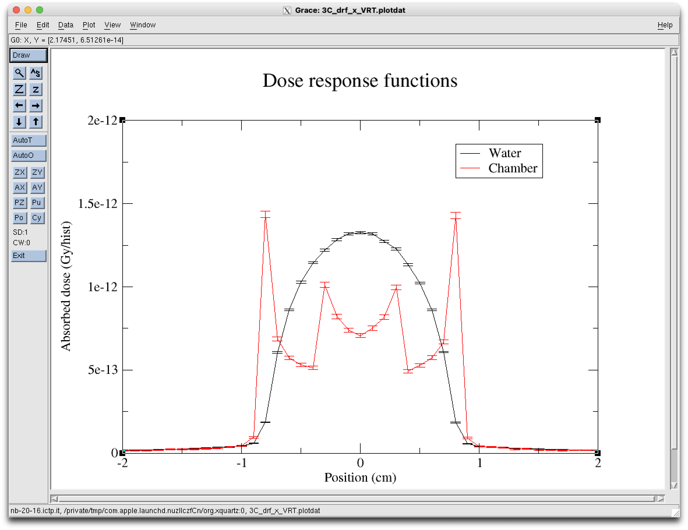
    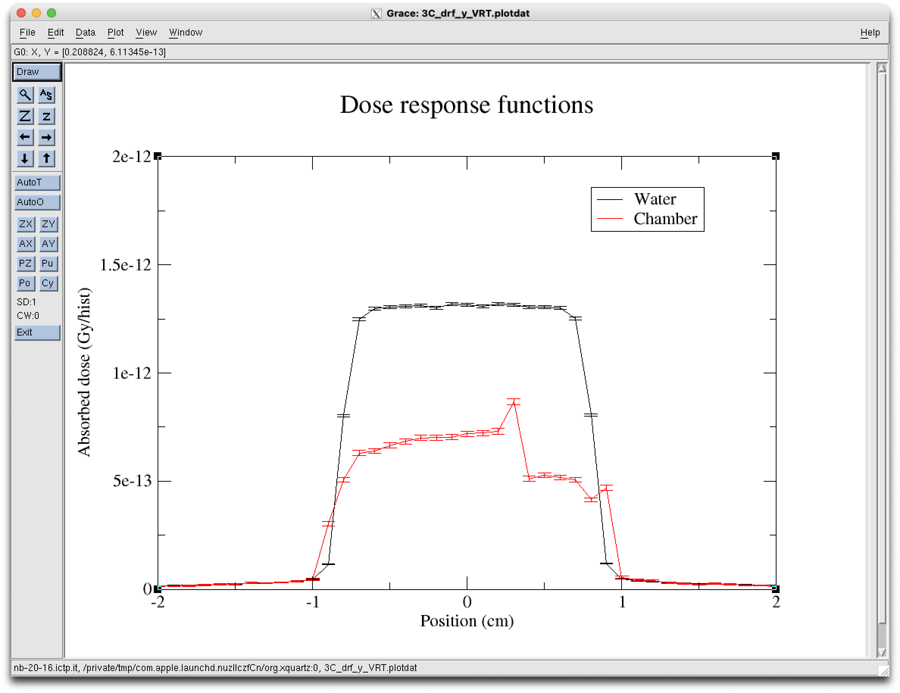

    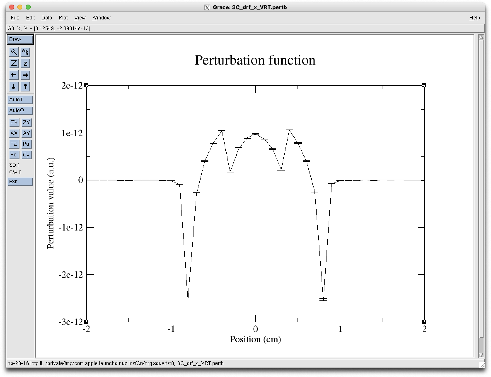
    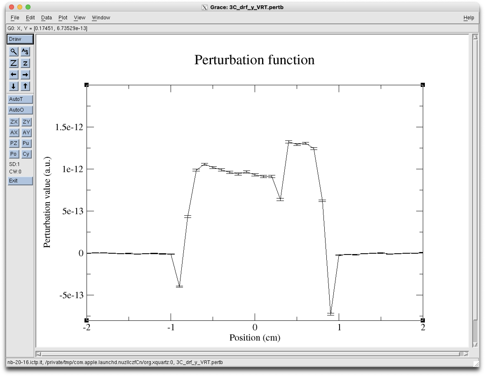

## 18.4. Calculate the dose response functions (DRFs) for the 10  MeV beam

### Answers

1. The differences arise from the higher electron range. The peaks are less
pronounced, and the DRFs are broader. This is consistent with the tracks
observed in Part I. The maximum field size is about 4x4 cm² based on the
perturbation function.

    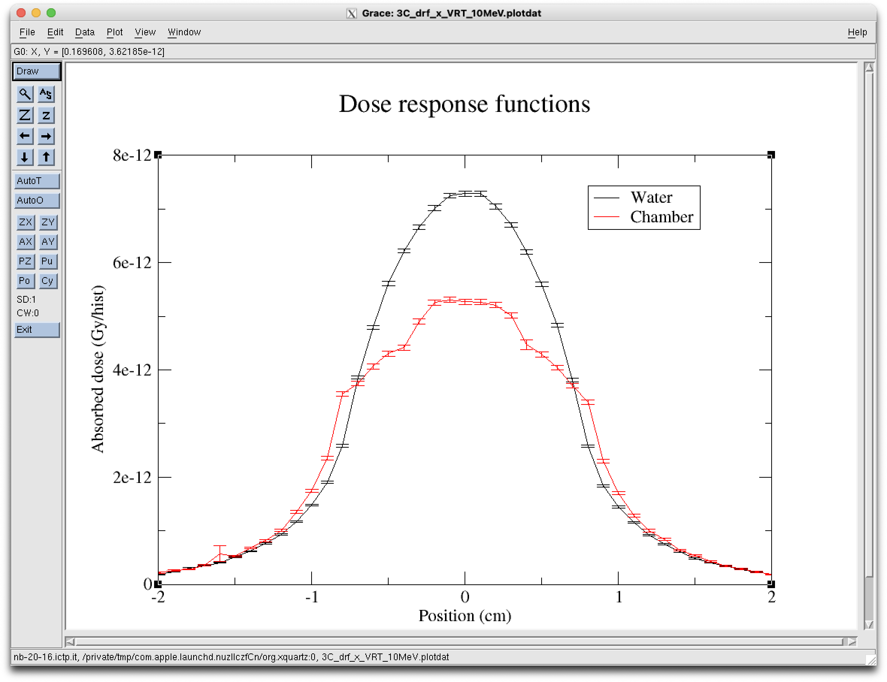
    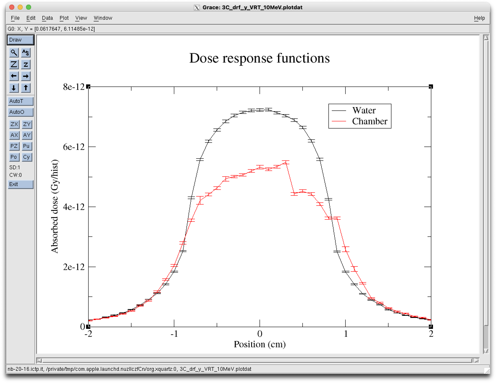

    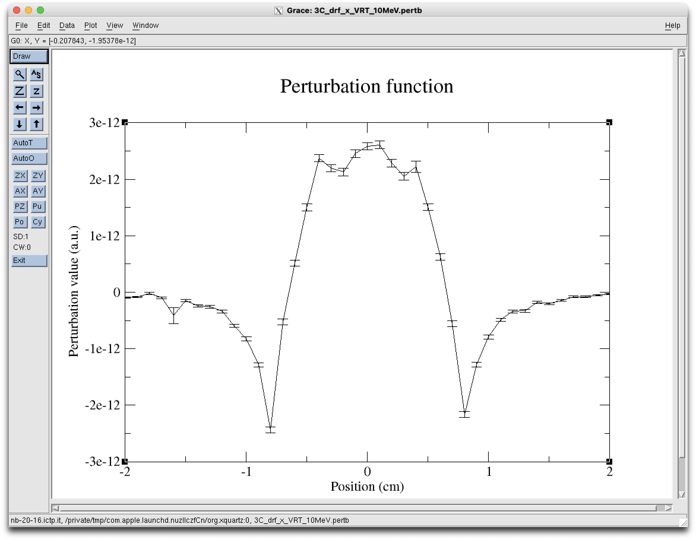
    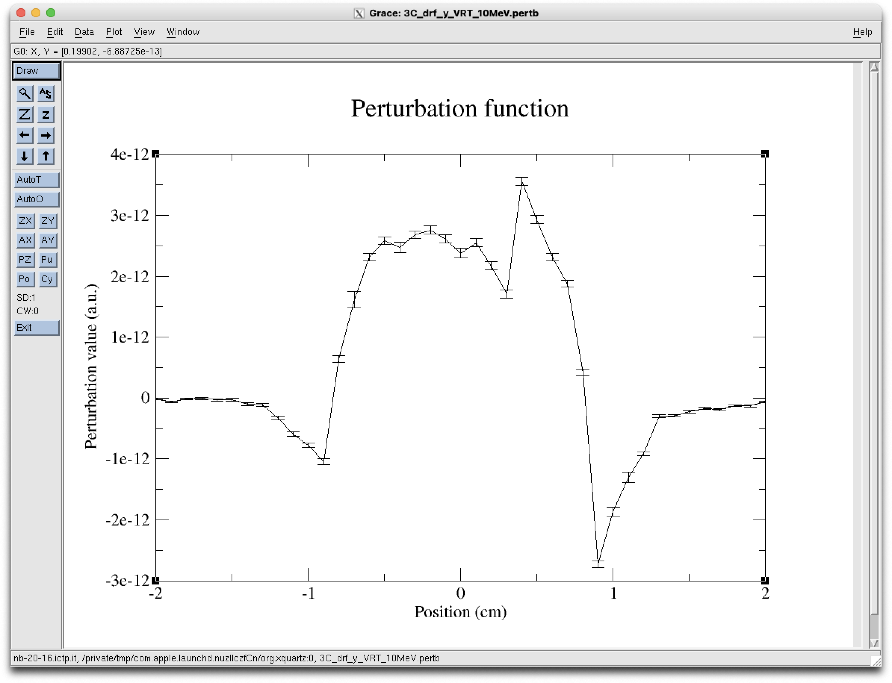

