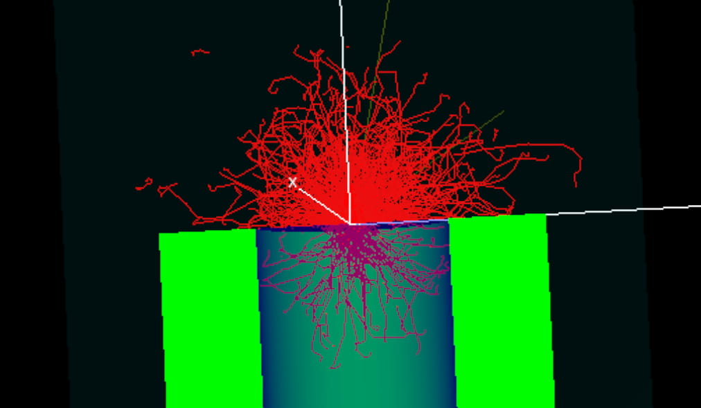

<!-- # 1. -->
<!-- # 2. -->
<!-- # 3. -->
<!-- # 4. -->
<!-- # 5. -->
<!-- # 6. -->
<!-- # 7. -->
<!-- # 8. -->
<!-- # 9. -->
<!-- # 10. -->
<!-- # 11. -->
<!-- # 12. -->
<!-- # 13. -->
<!-- # 14. -->
<!-- # 15. -->
<!-- # 16. -->
<!-- # 17. -->
<!-- # 18. -->

# 19. Model a methane container in egs++ <!-- omit in toc -->

- [19.1. Model the geometry](#191-model-the-geometry)
- [19.2. Complete the input file](#192-complete-the-input-file)
- [19.3. Run the simulation and view results](#193-run-the-simulation-and-view-results)
- [19.4. Use a python script for automation](#194-use-a-python-script-for-automation)
- [19.5. Submit jobs in parallel](#195-submit-jobs-in-parallel)



## 19.1. Model the geometry

Set up the geometry for a container of methane, as per your specifications. Start with a conestack near the origin, with a thin window. In this example, we used a copper window 0.001 cm thick and some approximated dimensions. The inner radius containing a gas is 5 cm, and the outer radius of the lead container is 10 cm (walls 5 cm thick).

Save the .egsinp file in `$EGS_HOME/egs_phd`.

Add another layer that is 1 cm thick with methane gas, followed by a layer of methane 9 cm thick. The reason for dividing this into two layers will become apparent later. The last layer can be lead and 5 cm thick.

```ruby
:start geometry definition:
    # Container
    :start geometry:
        name = container
        library = egs_cones
        type = EGS_ConeStack

        # Detector is positioned so that the top of the window
        # is at the origin, and "down" is in the -z direction
        axis = 0 0 0  0 0 -1

        # Top layer
        :start layer:
            thickness       = 0.001
            # TIP: It's good practice to have the last radius in this list constant for the whole conestack
            top radii       = 5 10
            bottom radii    = 5 10
            media = copper lead
        :stop layer:

        # Add more layers, etc.
```

Remember to set the simulation geometry. Once this is done, view it in `egs_view`. Does it look as expected? Using `egs_view`, determine the region number for the top 1 cm layer of methane. Then add a label to the container geometry (inside the `:start geometry:` tag). Replace `X` in the example below with the number found for the region.

```ruby
    set label = methane-top X
:stop geometry:
```

## 19.2. Complete the input file

Add `run control`, `media definition` and `source definition` input blocks.

For the materials, use `pegsless` mode by defining each material using a density correction file. In practice, you should nearly always create new materials that precisely represent the experiment being modeled. If you'd like to do so now, follow the [instructions](https://github.com/nrc-cnrc/EGSnrc/wiki/Generating-density-effect-correction-files-with-ESTAR) for creating materials using the [ESTAR website](https://physics.nist.gov/PhysRefData/Star/Text/ESTAR.html).

For the source, use `egs_parallel_beam` with a `shape` from `library = egs_circle` and radius `0.05` cm. Set the energy to 100 keV for an electron beam along -z. Inside the `shape` input block, translate the shape away from the origin using:

```ruby
    :start transformation:
        translation = 0 0 2
    :stop transformation:
```

The egs_phd application requires some additional inputs that are unique to it. These allow you to output a spectrum of energy deposited in regions of interest. Use the following to output a 200 bin spectrum for the top layer of methane. `spectrum file` is the name of the output file that will be created.

```ruby
:start scoring options:

    :start spectrum:
        label = methane-top
        Emin  = 0.0
        Emax  = 0.1
        bins  = 200
        spectrum file = Lab-19-methane-spec-top.txt
    :stop spectrum:

:stop scoring options:
```

Set up output options for tracks, dose deposited, and for outputting a phase-space, using the `ausgab object definition` input block. See the [documentation](https://nrc-cnrc.github.io/EGSnrc/doc/pirs898/group__AusgabObjects.html) for the relevant inputs. For the phase-space output, have the scoring plane be positioned just after the window. Do this using the `from regions` and `to regions` inputs, for the region numbers that you determine using `egs_view`.

## 19.3. Run the simulation and view results

Using `egs_phd`, run the simulation. This should output particle tracks (a .ptracks file), phase-space, and spectrum.

```bash
egs_phd -i yourFile.egsinp
```

To view the spectrum, use `xmgrace`.
```bash
xmgrace Lab-19-methane-spec-top.txt
```

To analyze the phase-space file, use `beamdp_gui`.

### Questions

- Plot the energy distribution of electrons in the first phase-space using `beamdp_gui`. How does it compare with the top 1 cm of methane spectrum produced by `egs_phd`? Why are they different?

- Plot the angular distribution of the electrons in the first phase-space. How do you interpret the angles?

- What fraction of electrons are lost from the initial source to just after the window?

- Add a new phase-space scoring plane just before the back plate (after all the methane). What fraction of the initial electrons reach here?

## 19.4. Use a python script for automation

With optimization problems especially, automation is essential. In this section we will work through a simple python script that replaces "tokens" in your input file with variables from your script.

Aside: There is a way to automate loops within input files (see [input loops](https://nrc-cnrc.github.io/EGSnrc/doc/pirs898/common.html)), and sometimes that is best. For example, if you are using `egs_chamber`, there is a way to save an intermediate phase-space and re-use particles at a midpoint of the simulation, leading to great efficiency improvements. However, in other applications this feature may not be available, or you may be looking for more flexibility. This is when scripting comes into play.

In the supplementary material for this lab, we have provided a simple tool called [`egs-rollout`](./assets/egs-rollout) for automating generation of many input files from a single template file.

The `egs-rollout` utility is just one approach, and it's not a feature-complete tool, but it does provide some fundamental capabilities. The script is run by providing it a `python` script that defines parameters that may vary, and automatically generates an array of .egsinp files.

Open [`methane-params.py`](./assets/methane-params.py) in a text editor. Notice that it is set to work from [`Lab-19-methane.template`](./assets/Lab-19-methane.template), and keep in mind that it will search for that template file in the same directory from which you run this script. For this reason, consider moving the script and template file into `egs_home/egs_phd`.

New files that it generates will be named according to parameters that have changed. We have defined this naming scheme using `param['label'] = '_%(windowMaterial)s-%(windowThickness).4fcm'`. This label text will be added to the end of new input files that are generated from the template. The text used is the string that arises from replacing the variables `windowMaterial` and `windowThickness`. Note that `%()s` is used to denote a string, `%()f` a decimal float, `%().4f` a float with 4 decimal places, and `%()d` a digit.

For every parameter defined as an array, a new egsinp file will be made for each value and every combination between the arrays. In this example, we have defined `windowMaterial` and `windowThickness` as arrays, each 2 items long, and this will result in 4 egsinp files being generated.

Open `Lab-19-methane.template`, and search for `windowMaterial`. Note the similar format for replacement tokens as in `param['label']`.

Run `egs-rollout` as follows, from `egs_phd`. First, always test with a dry run. No input files will be created:
```bash
python3 egs-rollout methane-params --dryrun
```

If the output looks good, then run the script for real using:
```bash
python3 egs-rollout methane-params
```

### Questions

- How might you go about programming a parameter dependency into methane-params.py? For example, try to have the n_case parameter set differently depending on the window material. *Hint:* The compute() function is executed inside the loop over parameters.

## 19.5. Submit jobs in parallel

A job can be run in parallel on the local machine using:
```bash
egs-parallel --batch cpu -n4 -v --force -c 'egs_phd -i Lab-19-methane_copper-0.0010cm'
```
where `-n4` denotes 4 local CPU cores for use. The command to run is contained within the '' after `-c`.

Since we only have 4 input files, this is straightforward to do by hand. If you find yourself generating dozens of input files, consider writing a short python script to automate this.


### [Solutions laboratory 19](Lab-19-solutions.md)
