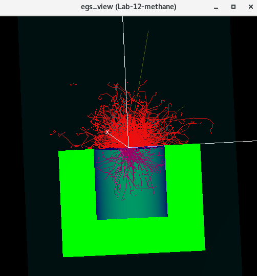
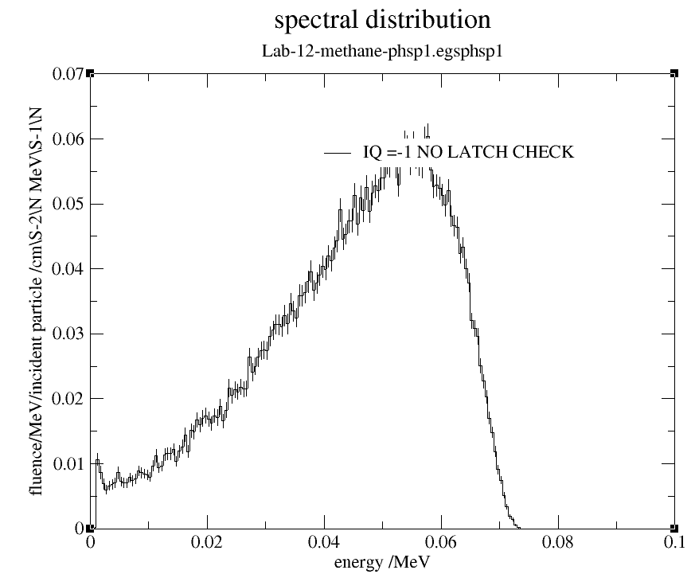
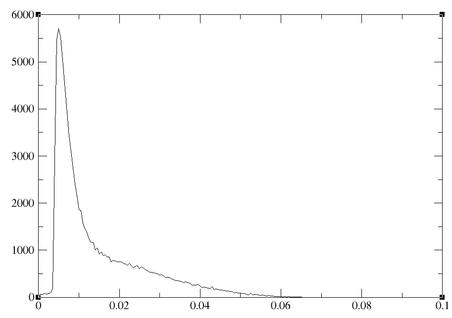
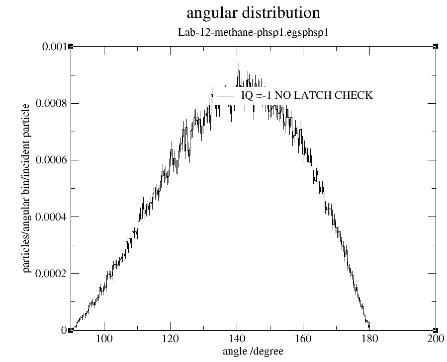

<!-- # 1. -->
<!-- # 2. -->
<!-- # 3. -->
<!-- # 4. -->
<!-- # 5. -->
<!-- # 6. -->
<!-- # 7. -->
<!-- # 8. -->
<!-- # 9. -->
<!-- # 10. -->
<!-- # 11. -->
<!-- # 12. -->
<!-- # 13. -->
<!-- # 14. -->
<!-- # 15. -->
<!-- # 16. -->
<!-- # 17. -->
<!-- # 18. -->

# 19. Model a methane container in egs++: solutions <!-- omit in toc -->

- [19.1. Run the simulation and view results](#191-run-the-simulation-and-view-results)
- [19.2. Use a python script for automation](#192-use-a-python-script-for-automation)
- [19.3. Investigate electric fields](#193-investigate-electric-fields)

## 19.1. Run the simulation and view results

Here is a view of the geometry, see [`Lab-19-methane.egsinp`](./assets/Lab-19-methane.egsinp) for details.



The energy scoring found is as follows. Note that we did not use the correct volumes for this quick calculation, so only the energy deposited is correct, not the dose. We see that the copper absorbs a lot of energy, and the back plate of lead (region 7) very little.

```text
======================================================
Dose Scoring Object(doseScoring)
======================================================
=> last case = 1000000 fluence = 1.27324e+08
==> Summary of region dosimetry (per fluence)
ir   medium  rho (g/cm^3)  Volume (cm^3)   Edep (MeV*cm^2)              D (Gy*cm^2)
-------------------------------------------------------------------------------------------------
 0  air       0.00120479       1.000000    2.5904e-04  +/-  0.100  %    3.4444e-11  +/-  0.100  %
 1  copper    8.96000000       1.000000    4.8948e-04  +/-  0.053  %    8.7517e-15  +/-  0.053  %
 2  lead     11.35000000       1.000000    3.1088e-06  +/-  1.035  %    4.3879e-17  +/-  1.035  %
 3  methane   0.00066790       1.000000    1.0471e-05  +/-  0.406  %    2.5116e-12  +/-  0.406  %
 4  lead     11.35000000       1.000000    2.4408e-07  +/-  3.163  %    3.4451e-18  +/-  3.163  %
 5  methane   0.00066790       1.000000    2.1598e-05  +/-  0.387  %    5.1804e-12  +/-  0.387  %
 6  lead     11.35000000       1.000000    1.1773e-06  +/-  1.394  %    1.6617e-17  +/-  1.394  %
 7  lead     11.35000000       1.000000    4.2679e-08  +/-  8.802  %    6.0240e-19  +/-  8.802  %
-------------------------------------------------------------------------------------------------
```

#### Plot the energy distribution of electrons in the first phase-space using `beamdp_gui`. How does it compare with the top 1 cm of methane spectrum produced by `egs_phd`? Why are they different?

> From the phase-space:
> 

> From egs_phd:
> 
>
> In the phase-space, the energy spectrum has a peak around 55 keV. This energy distribution corresponds to electrons directly after the window. In contrast, the energy spectrum in the first cm of methane has a much lower energy peak, around 5 keV. The lower energy is due to scattering that occurred in the methane.
>
> The normalization of the two curves is also different. From the phase-space, we are looking at estimated real fluence per initial source particle. From `egs_phd`, it is the actual number of counts in each bin. To get closer, we could normalize the results from `egs_phd` by the number of histories, which was 1 million. This would bring the peak to about 0.056 counts per initial history, which is consistent with the results from the phase-space.

#### Plot the angular distribution of the electrons in the first phase-space. How do you interpret the angles?

> 
>
> The angular distribution ranges between 90 and 180 degrees, with a peak at the midpoint. The angles are calculated using `arccos` on the z-direction cosine, to give an angle from the z-axis. For example, if the direction is in the x-y plane, then the z direction cosine is 0, and `arccos(0)=90 degrees`. For a beam along the negative z-axis, the direction cosine is -1, so `arccos(-1)=180 degrees`.
> Why is there a reduction to zero in the angular distribution near the negative z-axis, if you expect most electrons to be heading in that direction? This is in part due to the small bin size. Since most electrons scatter in the window as they continuously interact, there are actually very few still aimed directly along the z-axis. Therefore, the peak angle is slightly off-axis.

### What fraction of electrons are lost from the initial source to just after the window?

> The scored phase-spaces immediately reveal some information in their output text. The first one contains 100823 electrons, of the initial 1 million electrons, so we have lost 90%.
>
> ```text
> ======================================================
> Phase Space Scoring Object(Lab-19-methane-phsp1)
> ======================================================
>
> EGSnrc format phase space output:
> Data file: ./Lab-19-methane-phsp1.egsphsp1
> Summary of scored data:
> => total no. of particles = 100823
> => no. of photons = 0
> => max. k.e. of all particles = 0.0733469 MeV
> => min. k.e. of charged particles = 0.000993051 MeV
> => no. of primary histories represented = 999988
>
> ======================================================
> ```

#### Add a new phase-space scoring plane just before the back plate (after all the methane). What fraction of the initial electrons reach here?

> The second phase-space contains only 1 particle! We could try reducing the thickness of methane until this starts to go up, to see how small it's reasonable to design the container.
>
> ```text
> ======================================================
> Phase Space Scoring Object(Lab-19-methane-phsp2)
> ======================================================
>
> EGSnrc format phase space output:
> Data file: ./Lab-19-methane-phsp2.egsphsp1
> Summary of scored data:
> => total no. of particles = 1
> => no. of photons = 0
> => max. k.e. of all particles = 0.0123646 MeV
> => min. k.e. of charged particles = 0.0123646 MeV
> => no. of primary histories represented = 713725
>
> ======================================================
> ```

## 19.2. Use a python script for automation

#### How might you go about programming a parameter dependency into methane-params.py? For example, try to have the n_case parameter set differently depending on the window material. *Hint:* The compute() function is executed inside the loop over parameters.

> In the compute() section of methane-params.py, add if statements for dependencies, then set the other parameters as desired. For example, to change the number of histories only for the copper window, use:
>
> ```python
>    if param['windowMaterial'] == 'copper':
>        param['n_case'] = '1e6'
> ```


